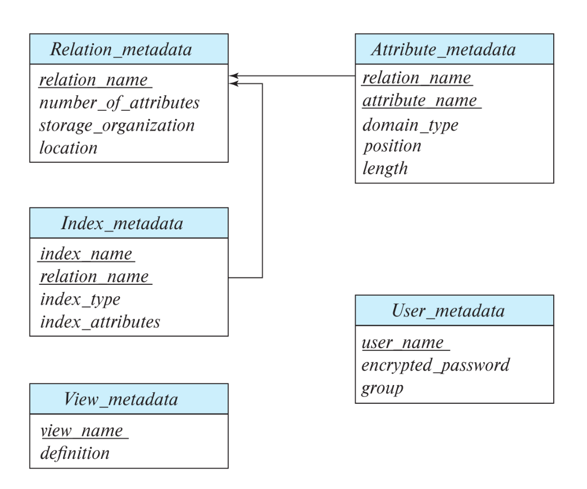

What → Why → Where → When → Who → How → Limit → Compare → Use case

# Chapter 1

### 1.3.1 Data Models
- **Overview**
    + **What:** ways to describe data relationships, data semantics, consistency and constrains, data properties; blueprint when design database
    + **When:** start to design database system

- **4 Categories:**
    + **Relational Model:** represent data and relationship among data. table = relation, row = tuple, column = attribute. relational model is record base model. record base model: data organize in to 'records', record have a fix structure, database contains many record types
    + **Entity Relationship Model:** collection of entities (things or objects) in real world. entities are distinguishable from others
    + **Semi-structured Data Model:** permit that individual data items of same type have different set of attributes
    + **Object-Based Data Model:** integrated in relational db

- **Procedure:**
    + collection of instructions
    + focus on process, not output
- **Function:**
    + logic component that: transform, mapping Input -> Output
    + no side effect
- **Reason database separate function and procedure:**
    + pure function (no side effect) suitable for: optimize query, execution plan and cache data. Cant optimize if function can cause side effect (for example to reorganize query, insert, update, delete, will cause faulty data if not organize in correct order)
    + pure function dont have transaction (reorganize transaction might break ACID)
    + procedure permit to have side effect and transaction control, because it will not be reorganize (cannot be optimize by optimizer as expression)

### 1.3.3 Data Abstraction
There are 3 levels of abstraction:
- **Physical level**
    + the lowest level of abstraction, its describe 'HOW' data stored on physical devices
- **Logical level**
    + next-higher level of abstraction describe 'WHAT' is stored in database, relationship between these data
- **View level**
    + highest level of abstraction show only necessary data for user
    + system may provide many views for the same database

### 1.3.4 Instances and Schemas
- **Instance:** is a collection of information stored in database at particular moment
- **Schema:** overall design of the database
    + there physical schema, logical schema and view level schema (subschemas)

## 1.4 Database Languages
- **Data-definition language (DDL)** -> specify database schema
- **Data-manipulation language (DML)** -> express database queries and updates

### 1.4.1 Data-definition language
DDL provides facility to determine constraints of data. But constrain might costly to test so its only provide constrain can be easy to test (minimal overhead)
- **Domain constraints**
    + include: Data types, Check, NULL, default value
    + basic kind of constraint, easy to determine
- **Referential integrity**
    + ensure value in one relation appear in another relation
    + prevent modification cause violation in referential integrity
- **Authorization**
    + Can assign the user to all, none or a combination of CRUD operation
- Data dictionary is a special table, contain metadata of other data table, could only access via system (not regular user)

### 1.4.3 Data-manipulation language
- **DML** is a programming language that help user to access, manipulate data stored in the database: Retrieval, Insertion, Deletion and Modification
- There are 2 types of DML:
    + **Procedural DMLs:**
        * **What:** user point out "HOW" to get the expected output
        * **When:** logic depend on instruction order, complicated condition, express loop and branching
        * **Why:** when raw SQL cant handle the complicated logic, process data row by row
    + **Declarative DMLs:**
        * **What:** user focus on "WHAT", not "HOW" to get the expected output(data)
        * **When:** when logic can be written in declarative style, highly optimize performance
        * **Why:** remain abstraction, distinct from how data is actually stored in hardware, automatically optimize by DBMS, reduce error

### 1.4.4 The SQL Data-Manipulation Language
- SQL query language is non-procedural
- Takes several tables and output 1

### 1.4.5 Database access from application programs
- SQL is not so powerful so Application programs help database with communication over network, action from user (user input, user output)
- To access database, DML need to be sent from host to the database, through application-program interface
- The reason for calling api as set of procedures is that api contains function (procedures) to do something: 
```text
connect() -> execute() -> close()
```

## 1.5 Database Design 

## 1.6 Database Engine
- Database system can be partitioned into modules, including: storage manager, query processor and transaction management component
- **The storage manager**
    + Data move from disk is slow compare to CPU, its important that the database system organize, structure the data so as to minimize move data between disk and memory
- **The query processor**
    + Allow users to obtain good performance while working at view level
    + Translate queries written in non-procedural at logical level into efficient sequence of operation at physical level
- **The transaction manager**
    + Allow user to treat sequence of database access as if they were a single unit, happen entirely or not at all (atomic)

### 1.6.1 Storage Manager
Responsible with interaction between application program and file manager (low-level data store) 
Storage manager components include: 
- Authorization and integrity manager
- Transaction manager
- File manager
- Buffer manager: responsible for fetching data from the disk into main memory, cache data in main memory...

Several data structures implemented in the storage manager:
- Data files: store the database
- Data dictionary: store metadata about the structure of the database (schema)
- Indices: provide fast access to data item (indexing)

### 1.6.3 Transaction Management
- **Atomicity:** transaction happen all or none
- **Consistency:** correctness of the transaction
- **Durability:** value must persist despite the possibility of system failure

- During execution of transaction, it may necessary to allow inconsistency because nothing is really atomic (1 must happen before the other)

Recovery manager ensure database stored the state before transaction executing, if transaction fail, the database roll back to the previous state (failure recovery)

Transaction manager include concurrency-control manager and recovery manager

## 1.8 Database Users and Administrators

### 1.8.2 Database Administrator
- A database administrator (DBA) can:
    + Schema definition
    + Storage structure and access-method definition: creating indexing
    + Schema and physical-organization modification: update indexing, change schema
    + Granting of authorization for data access: grating authorization for user to access parts of database
    + Routine maintenance: backing up database, checking disk space, monitoring jobs

# Chapter 2

## 2.1 Structure of Relational Databases
- A relation (table) is a set of tuples; each tuple is an ordered list of values and corresponds to a row in the table.
- The domain is set of permitted value for that attribute
- A domain is considered atomic when its elements not divisible, for ex: address can divide to house number, road, city...
- But more important is how we use the domain, don't divide domain too small, for ex: phone number divide to single unit number...
- Null value signifies the missing, absent of value
- We need to consider between strict structure and efficiencies (pros ans cons)

## 2.2 Database Schema
- Relation correspond to instance of an object while Relation schema correspond to the type of the object its self

## 2.3 Keys
- Keys identify tuple uniquely (allow tuple to have same value for all attributes except key)
- Super key is a set of attribute, allow identify tuple uniquely
- Candidate key is super key that don't exist subset also a super key (minimal super key)
- Primary key is a chosen candidate key
- Two individual tuple are prohibited from having the same key attribute at the same time (primary key constraints)

- Foreign key A for each tuple in Relation r1 must also be the value of B (primary key) for some tuple in r2 (foreign-key constraint)

- Foreign Key Constraints is a special case of Referential Integrity Constraint, where referred attribute is a primary key
- Also note that only FK Constraint is support by dbms

## 2.4 Schema Diagrams

## 2.5 Relational Query Languages
- Query language is language user use to request data from the database
- Query language usually on a higher level than standard programming language
- Can be categorized as: Imperative, Functional, Declarative

- **Imperative query language:** user instruct the system to perform specific sequence of operation, in order to achieve the result
- **Functional query language:** can be call a subset of imperative (procedure based) language, include function call which is side effect free to achieve result
- **Declarative query language:** in the other hand, achieve result without the specific instruction, user focus on "WHAT" will be the result and the system DBMS will handle "HOW" result will be obtained

- **Relational Algebra:** will classified as functional language
- **Tuple relational calculus and domain relational calculus:** are classified as declarative

## 2.6 Relational Algebra
- Relational Algebra is a collection of operation, which take 1 or many Relation to produce a new Relation (for simple, math form of query language)
- Its operation can be Unary, Binary
- Database don't allow user to use relational algebra as query language

### 2.6.1 The Select Operation (Sigma)
- The "SELECT" select tuples that satisfy given 
```math
σdept name = “Physics” ∧ salary>90000 (instructor)
```

### 2.6.2 The Project Operation (Pi)
- mapping value input -> output like a function
- The "PROJECT" produce new relation with certain attributes left out
- Any duplicate row is eliminated (use "DISTINCT" in SQL)

### 2.6.3 Composition of Relational Operations
- result of Relational Operation is an another Relation
```math
Πname (σdept name = “Physics” (instructor))
```
- We can, instead given a name as argument of uprojection, we use a relation that evaluate to a relation
- Relational Algebra operations can be composed into a Relational Algebra expression by arithmetic operations (+,-,*,/)

### 2.6.4 The Cartesian Product Operation (Cross)
- `(a1,b1), (a1,b2), (a2,b1), (a2,b2)` from Cartesian product in math evaluate to row (tuple) in database
- `r = r1 x r2`, r in constructed by each possible pair of relation 1 to relation 2
- if r1 have n rows and r2 have m rows, r will have m * n rows

### 2.6.5 The Join Operation
```math
σinstructor.ID = teaches.ID (instructor × teaches)
```
- represent a subset of Cartesian product, satisfies some "Predicate" (a boolean condition) 
```math
r ⋈θ s = σθ (r × s) 
```
- r and s are relation, θ is predicate, ⋈ is join operation

### 2.6.6 Set Operations
- We say that relation is equivalent to function in math, because both is a collection of tuple
```math
Πcourse id (σsemester = “Fall” ∧ year=2017 (section)) ∪ Πcourse id (σsemester = “Spring” ∧ year=2018 (section))
```
- The Union (∪) merge two relation into 1 relation vertically
- To Union relations, realtion must be "compatible" which conditions are:
    + relatations must have the same "arity" (in math, arity refer to number of argument of a function)
    + the type of ith attribute of both relation must be the same for each i

- the "Intersect" (∩) produce a relation containing tuple that appear in r1 as well in r2
- the "Set-difference" (−) produce a relation containing tuple that appear in 1 relation but not the other

### 2.6.7 The Assignment Operation
- Assign result relation into temp relation variable. denoted by (←), work like assignment in programming language
- Allow query can be written in sequential, consisting of a series assignment (CTE, subquery)

### 2.6.8 The Rename Operation (Rho)
```math
ρx (E)
```
- return the result of expression E in name x
- A relation is considered a relational-algebra expression
```math
ρx(A1 ,A2 ,…,An ) (E)
```
- this form of rename operation can be used to give names to attributes in the results of relational algebra

### 2.6.9 Equivalent Queries
- There is often more than one way to write queries, those queries still output the same result. Those are called "Equivalent Queries"
- Query optimizer look what result an expression computes and find efficient way of computing result
- The "Algebraic structure" of relational algebra makes it easy to find efficient but equivalent alternative expressions

# Chapter 3: Introduction to SQL

### 3.2.1 Basic Types
- `char(n)`: fixed-length character string with user specified length n
- `varchar(n)`: variable-length character string with maximum length n
- `int`: an integer (a finite subset of integers, machine dependent CPU architect, ram...) 
- `numeric(p,d)`: a fixed-point number with user-specified precision. the number consist of p digits (plus sign) and d digits are to the right of the decimal point
- `real`, `double precision`: floating point, double precision floating point with machine dependent precision
- `float(n)` floating-point number with precision of at least n digits (n is number of bit of mantissa)
- `Value = (-1)^S × 1.F × 2^(E - Bias)`
    + **S** represent sign (+,-)
    + **F** represent the precision of the number
    + **E** is biased exponent
    + **Bias** `= 2^(k-1) - 1`  (k is the number of bit of exponent, -1 inside is for balance between positive and negative, -1 outside is except 0)

- each ype include special value call "NULL", its indicate the absent of value
- when compare char and varchar, may the database add extra space to varchar type
- Unicode mapping between character -> code point (U+XXXX)
- Encoding (UTF-8, 16, 32) translate code point -> bytes
- ASCII is a subset of Unicode
- `nvarchar`: allow to store unicode value

### 3.2.2 Basic Schema Definition
- **primary-key:** non-null and unique
- **foreign-key:** must correspond to values of the primary key attributes of some tuple in referred relation
- **not null:** exclude the null value from the domain of that attribure
- alter table command is used to add attributes to an existing relation, all tuples in the relation are assigned null as the value for the new attribute
- adding non null attribute without "DEFAULT" will usually fail

## 3.3 Basic Structure of SQL Queries
- duplicate elimination is time-consuming, but we can eliminate them by using "DISTINCT" keyword

### 3.3.2 Queries  Multiple Relations

```sql
select name, instructor.dept name, building
from instructor, department
where instructor.dept name= department.dept name;
```

- above query represent joining two table, base on where clause, it can be cross join or inner join

## 3.4 Additional Basic Operations
**Note 3.1**
- SQL standard define how many copy of each tuple in the output base on duplicate of each tuple in the input
- To model this behavior, SQL use multi-set relational algebra
- Multi-set relational algebra is defined as a set that contain duplicates.
- If there are `c1` copies of `t1` in `r1` and `c2` copies of `t2` in `r2`, there `c1*c2` copies of `t1.t2` in `r1 x r2`
- Lower level representation of SQL queries perform query optimization and query evaluation base on relational-algebra

### 3.4.2 String 
- SQL standard specifies strings in a single quotes, for ex: `'Computer'`
- If in strings contain a quote, the quote can be represent by double quote, for ex: It’s right with `'It''s right'`.
- Strings evaluation is case sensitive, but some DBMS don't distinguish case sensitive (MySQL and SQL Server) but this behavior can be changed in the setting
- `%` charater matches any substring
- `_` character matches any character
- similar to quote, there also a way to express character `%`, using `\`
- for ex: `'ab\%cd%' -> 'ab%cd'`, `'ab\\cd' -> 'ab\cd'` 

### 3.4.4 Ordering the Display of Tuples
- `order by` clause lists item in asc order
- we can wrote `instructor.ID= teaches.ID` and `dept name = 'Biology'` -> `(instructor.ID, dept name) = (teaches.ID, 'Biology')`;

## 3.5 Set Operations
- use `union all` union operation automatically eliminates duplicates
- use `union all` if we want to retain all duplicates
>
### 3.5.2 The Intersect Operation
- intersect operation eliminated duplicate and similar to union, we can use `intersect all` to retain the duplicate
- intersect is similar to join if its meet these condition:
    + use distict keyword
    + both join table have the same schema
    + join condition is the whole tuple

### 3.5.3 The Except Operation
- similar to above operation, except choose tuple that appear in r1 but not in r2, eliminate duplicate, use `except all` to retain duplicate

## 3.6 Null Values
- result of arithmetic expression (+, -, *, /) is null if one of the input is null
- comparison to null treat as unknown
- it's create a third logic, other than true and false
- where clause only select true

- we can use `unknown` and `is not unknown` to test if the result known or unknown
- the null treatment in select distinct clause (null = null is true) is different from predicate (null = null is unknown)
- this approach also used in union, intersect and except

- **and:** The result of true and unknown is unknown, false and unknown is false, while unknown and unknown is unknown.
- **or:** The result of true or unknown is true, false or unknown is unknown, while unknown or unknown is unknown.
- **not:** The result of not unknown is unknown.


## 3.7 Aggregate Functions
- aggregate functions take a collection (a set or multiset) of values as input and return a single value. 
- there are five standard build-in aggregate functions: avg, min, max, sum, count
- sum and avg only operate on numbers
- we can use distinct keyword in aggregation for ex: `count(distinct ID)`
- only attributes that appears in  the select statement without being aggregated are presented in the group by clause

### 3.7.3 The Having Clause
- Having applies to each group constructed by the group by clause and after group have been formed
- we can use aggregate function in having clause cause group have been formed
- any attribute appear in having clause without present in aggregate function or group by clause in erroneous

- the predicate in where clause happen first, the place the result in to group by clause
- if the group by is absent, the whole relation is treated as one big group
- having clause applied to each group, if group not satisfy the having clause, it is removed

### 3.7.4 Aggression with Null and Boolean Values
- "Partial information is still information": dù thiếu 1 phần nhưng thông tin vẫn là thông tin
- all aggregate function except count(*) ignore null values
- count on empty set return 0
- other aggregation function return null 
- some: or(dis junction) on set of boolean value
- every: and(conjunction) on set of boolean value

## 3.8 Nested Sub queries 
- sub query is a select-from-where expression that is nested within another query

### 3.8.1 Set Membership

### 3.8.3 Test for Empty Relations
- correlated sub query is a query that depend on the outer query to use as parameter for where, select of inner query

### 3.8.5 Sub queries on the From 
- rename sub query and its attribute

```sql
select dept name, avg salary
from (select dept name, avg (salary)
from instructor
```

- sub query in the from clause is different from in the select/where clause (scalar)
- in the from clause, it separated from the process, happen first so it don't allow to see other value in the select clause (without "lateral" keyword)
- in the select/where clause, sub query happen each time its iterate though the defined relation ship and return scalar value so it can apply scoping rule

### 3.8.6 The With Clause

### 3.8.7 Scalar Sub queries
- **Scalar sub queries** is defined that return 1 tuple with 1 single attribute
- if a sub query can return more than one tuple in its result, run time error occurs
- SQL simply extract the relation of the scalar sub query and return the value

### 3.8.8 Scalar Without a From Clause
```sql
(select count (*) from teaches) / (select count (*) from instructor);
```

- the expression show a scalar sub query without the top level query
- this is legal in some dbms but not in the other

## 3.9 Modification of the Database

### 3.9.1 Deletion
- both select and delete clause act on a snapshot data from the

### 3.9.2 Insertion
- there are 2 ways to insert data into relation:
    + specify a tuple to be inserted 
    + write a query which result to be a set of tuple to be inserted
- attribute values for inserted tuple must be member of the corresponding attribute's domain
- inserted tuple must have the same number of attributes
- note that similar to delete statement, tuple or relation query result mus be evaluated first (to void looping condition)
- most dbms support bulk loader: a way to insert large set of tuple in to relation without insert statement

### 3.9.3 Update

# Chapter 4: Intermediate SQL

## 4.1 Join Expressions
- **natural join** calculate relation from tables base on attributes that have the same name
- **join using** is a short for join on: instead of defining table alias, both attribute, join using only specify which table to join on. 
- the condition for using keyword is that both table must have the same attribute

### 4.1.2 Join Conditions

### 4.1.3 Outer Joins
- **outer-join** preserve tuples which would be lost in a join by create a tuple in the result containing null values
- **full outer join** preserves tuple in both relation
- step to produce a left outer join:
    + compute inner join
    + for every tuple t in left table that does not match any tuple in the right hand side relation in the inner join, add a tuple r to the result
    + tuple r constructed from: all attribute from the left hand table + null value for attributes from right hand table
- **full outer join** is a union from left outer join and right outer join (note that inner join duplicate will be eliminated)

- on and where behave differently on outer join 
    + **on** added a null padded for tuples that don't match the predicate
    + **where clause** only choose tuple which meet the predicate

### 4.1.4 Join Types and 

## 4.2 Views
- **Views** is used when there is a security concern, or using to visualize higher layer of business instead of table
- the view relation is recomputed whenever we use it

### 4.2.3 Materialized Views
- **materialized views:** certain database systems allow view relation to be stored instead of recomputed each time being use
- the action of keeping the materialized view update to date is call view maintenance
- view maintenance behave differently on different dbms, some will actively recompute the view if relation being change, some lazily recompute, other depend on how db admins configuring
- db admin must consider between the benefit of pre-compute view and its storage cost, overhead for updates

### 4.2.4 Update of a View
- modification on view are not permitted on view relations, except limited case due to data inconsistency problems.
- view can be update-able (but the still problems) when its meet these constraint
    + from clause use 1 relation
    + select clause don't contain expression, aggregates, distinct
    + attribute listed in select are null-able, and not part of primary key
    + query don't contain group by or having clause
- there is an option that view update is reject if tuple inserted not satisfy the where clause conditions
- more preferable way to modify a view is to use "trigger"

## 4.3 Transactions
- **transaction:** contain instruction and begin implicitly when sql statement execute
- transaction must end with: commit work or rollback work
- in case of power outage or system crash, rollback occurs when the system restarts
- if programs terminates without execute any command, its either committed or rollback depend on the implementation
- in many dbms implementation, each sql statement is taken to be a transaction on its own, auto commit of individual sql statement must be turn off if there are many sql statement will executed at given time

## 4.4 Integrity Constraints
- integrity constraints are usually identified as part of db schema when its created as create table command being used
- it can also be defied in alter table add constraint command

### 4.4.1 Constraints on Single Relation

### 4.4.3 Unique Constraint
- **unique** says that no two tuple have the same value on unique attribute
- null = some value is not true

### 4.4.4 The Check Clause
- a check clause is satisfied if its not false, so unknown is evaluate as valid in check
- when a foreign key is violated, instead of rejecting the action, system decide what to do base on associated clause:
    + `on delete cascade`: also delete tuples that referred to the deleted one
    + `on update cascade`: also update tuples that referred to the updated one
    + we can replace cascade with "set null" or "set default" for different behavior

### 4.4.5 Referential Integrity 
- by default, foreign key referenced to primary key
- we can also specified attribure which is refferred to, as long as the the attribute is unique and not null
- we eventually can make foreign key reference a non candidate key(not unique, null allowed), but its not recommended and not supported by many dbms
- forreign key and referenced key must compatible (same domain, same number of attribute)
- if cascading can not be handled(self referenced), the action will be rejected
- attributes of foreign key can be null, if any attribute is null, the foreign key constraint is not enforced (null is not equal to any value, so it can't violate the constraint)

### 4.4.6 Assigning Names to Constraints

### 4.4.7 Integrity Constraints Violation During Transaction
- integrity constraint is checked at the end of the transaction, not during the transaction
- so its possible that during the transaction, the constraint is violated temporarily, but at the end of the transaction, the constraint is satisfied again
- **initial deferred:** constraint is checked at the end of transaction
- **deferable:** constraint can be set to immediate or deferred mode at the start of transaction
- we can walk around the constraint check by using null value if the attribute permit null

### 4.4.8 Complex Check Conditions and Assetions
- not many dbms support subquery in check condition
- if there is subquery in check condition, its evaluated each time the target relation and refferred relation is modified
- **assertion** is a general condition that involve more than one relation
- not many dbms support assertion due to its complexity and cost to evaluate

## 4.5 SQL Data Types and Schemas

### 4.5.1 Date and Time Types
- `date`: store date value (year, month, day)
- `time`: store time value (hour, minute, second, fraction of second, time zone)
- `timestamp`: store both date and time value
- sql define functions to get current date and time: `current_date`, `current_time`, `current_timestamp`
- `interval`: represent a duration of time (difference between 2 date/time/timestamp)

### 4.5.2 Type Conversion and Formatting Functions
- **implicit conversion:** automatic conversion between compatible data type
- **explicit conversion:** user use cast operator to convert data type
- **formatting function:** convert data to string with certain format
- **coalease** indicate that all the value in the argument must be the same type

### 4.5.3 Default Values

### 4.5.4 Large Object Types
- DBMS support `clob`, `blob` for large object storage (photo, video, document...)
- **lob:** large object
- it's costly to process large object, so dbms usually store lob in separate location and only store pointer in the relation

- **temporal validity**
    + there is a need to keep track of time period that a fact is true in the real world
    + the solution is to add 2 attribute: valid time start and valid time end to the relation
    + but this approach also came with problems: the same tuple (same primary key) can appear multiple time with overlapping time period
    + the solution for postgres is to use EXCLUDE constraint to prevent overlapping time period for the same primary key

### 4.5.5 User-Defined Types
- At the system level, some field are just the same (for ex: phone number, id number...), but at the logical level, they have different meaning
- user-defined type help to distinguish those field at the logical level 
- user-defined type also help to prevent accidental mix-up between those field at the system level
- we can create domain by "Create Domain" command
- **type:** define how data is stored
- **domain:** define constrain (range of valid values) on top of type

### 4.5.6 Generating Unique Key Values
- when the always option is used, user cannot specify value for the attribute during insertion, the system will automatically generate value

### 4.5.7 Create Table Expressions
- `create table like`: create a new table with the same structure as an existing table
- `create table as`: create a new table with the structure and data from the result of a select query

### 4.5.8 Schemas, Catalogs and Environments

## 4.6 Index Definition in SQL
- **index** is a data structure that improve the speed of data retrieval operation on a database table at the cost of additional writes and storage space to maintain the index data structure
- `create index` tradeoff between read and write performance, space cost
- when submit a sql query that can benefit from index, the query optimizer will choose to use the index to speed up data retrieval
- the "benefit" is refer to the cost of using index is lower than cost of scanning the whole table

## 4.7 Authorization
- Authorization on data include: select, insert, update, delete. These are called privileges

### 4.7.1 Granting and Revoking Privileges
- A user who creates a relation automatically have all privileges on that relation

### 4.7.2 Roles
- **role** is a named group of related privileges
- role help to manage authorization when there are many users

### 4.7.3 Authorization on Views
- authorization on view is similar to relation
- it is useful when we want to restrict user access to certain attribute or tuple in the relation
- user create view does not receive all privileges on that view
- the excecute privilege is granted on function or procedure
- function and procedure have all the privilege that the creator have
- if function definition contain sql security invoker clause, the function will have the privilege of the user who call the function instead of the creator 
- there are two type of sql security: invoker and definer
    + **invoker:** function run with the privilege of the user who call the function
    + **definer:** function run with the privilege of the user who create the function

### 4.7.4 Authorization on Schemas

### 4.7.5 Transfer of Privileges
- The creattor of a relation/view/role holds all privileges on that object, including the privilege to grant those privileges to other users
- User have privilege if and only if there is a line between root (DBA) to that user in the privilege graph
- the restrict keyword is specified in order to prevent cascading revoke of privilege
- we can use granted by role to indicate that the privilege is granted by a role instead of user

### 4.7.7 Row-Level Authorization
- DBA create a function that generate predicate base on user
- when user query the relation, it will automatically add the predicate to the where clause
- this approach is call **Row-Level Security (RLS)**, in oracle call **Virtual Private Database (VPD)**

# Chapter 5: Advanced SQL

## 5.1 Accessing SQL from a Programming Language
- There are 2 approaches to access database from application program:
    + **Dynamic SQL:** sql statement is constructed as string at runtime and sent to the dbms for execution
    + **Embedded SQL:** sql statement is embedded in the host programming language and precompiled before compilation of the host program
- Embedded SQL is more efficient than dynamic sql because sql statement is precompiled
- Dynamic SQL is more flexible than embedded sql because sql statement can be constructed at runtime base on
- sql return relation, so when we want to use the result in application program, we need to convert it to data structure in the programming language (for ex: array, list, map...)

### 5.1.1 JDBC
- **JDBC** stand for Java Database Connectivity
- JDBC is an api that allow java program to access database
- orm -> api -> driver -> database
- JDBC dynamically load the driver class at runtime base on the database being used
- Driver support protocol that translate JDBC api call to database specific protocol

#### 5.1.1.2 Shipping SQL Statements to the Database system
- **statement object** is used to invoke method that send sql statement to the database

#### 5.1.1.3 Exception and Resource Management

#### 5.1.1.4 Retrieving the Result of a Query
- the **Next() method** of the ResultSet object is used to iterate through the result of a query
- its test whether there is another row in the result

#### 5.1.1.5 Prepared Statements
- We can compile statments, replace real argument with placeholder ($)
- When execute the prepared statement, we provide the real argument 

#### 5.1.1.6 Callable Statements
- **Callable statement** is used to call procedure or function in the database

## 5.2 Functions and Procedures
- Functions are useful with specialized data types such as images and geometric objects
- The pros of using functions and procedures: 
    + allow change in case business without chanigng other parts of application program

### 5.2.1 Declaring and Invoking SQL Functions and Procedures
- despite remain difference, table function can also be thought as parameterized view, because it return a relation base on the input parameter
- sql permits procedure to have the same name as long as their parameter list is different (overloading)
- functions can also be overloaded, as long as they have different parameter list

### 5.2.2 Language Constructs for Procedures and Functions
- **SQL/PSM (Persistent Stored Modules)** is a standard language for writing stored procedure and function in SQL
- Its provides: DECLARE, SET, IF, THEN, ELSE, CASE, LOOP, WHILE, REPEAT, LEAVE, ITERATE, RETURN
- in postgres, we can also use PL/pgSQL, which is similar to SQL/PSM but with some additional feature and different syntax
- its also support signal and exit handler
    + **signal:** raise an exception with a specific sql state and message
    + **exit handler:** specify a block of code to be executed when a specific exception is raised
- SQL allow us define function in programming language
- function defined in programming language can be called from sql statement, but it come with overhead and security concern
- **sandbox** is a security mechanism to restrict the access of function defined in programming language to certain resource (file system, network, environment variable...) 

## 5.3 Triggers
- **trigger** is a statement that automatically execute in response to certain event on a particular table or view
- to define a trigger, we need to specify:
    + the event that will activate the trigger (insert, update, delete)
    + the action that will be executed when the trigger is activated

### 5.3.1 Need for Triggers
- **for each row clause:** trigger will execute for each row that is affected by the event
- **referencing new row as nrow:** create a variable nrow that contain the new value of the row being inserted or updated (iterate through each row being affected)
- a trigger can be disabled or enabled using alter table command
- **referencing table** usually used in statement level trigger, it create a variable that contain the relation of the rows being affected by the event (for ex: all rows being inserted)
- we cannot use referencing table with before trigger because the relation of the rows being affected is not yet available before the event happen
- some problem can also be found with above approach, for ex it will cause infinite loop or memory and performance problem

### 5.3.3 When Not to Use Triggers
- using `on delete cascade` instead of trigger to maintain referential integrity
- using materialized view instead of trigger to maintain summary data
- using replication feature of dbms instead of trigger to maintain data in sub table (delta table)
    + to sync data between two table, when table a is updated, we trigger to write a log to delta table, then we have a process that read the log, delete log table and update table b, this approach is call "**Change Data Capture (CDC)**"
- when there is a used of backup and restore, trigger will be activated and cause data inconsistency, so we need to disable trigger before backup and restore, then enable it again after that
    + or we we can specify not for replication in the trigger definition, so it will not be activated during backup and restore
- many trigger can be replaced by using procedure

## 5.4 Recursive Queries
- **Transitive closure:** the set of all nodes that can be reached from a given node in a graph
- **Recursive query:** a query that refer to itself in its definition
- Recursive query is useful for querying hierarchical data, such as organizational chart, bill of materials,

### 5.4.1 Trasitive Closure Using Iteration
- in postgres, recursive with CTE is a bit different than in programming language
- the result of first part of the query is reutrn to the cte then the second part use cte as input. Then the result is used as input for the second part of the query until there is no new tuple being added to the result

- closure make sure that we can reach all node that can be reached from the given node, nothing more, nothing less
- `create temporary table`: create temp table that only available during the session, it will be automatically dropped at the end of the session
- if there is two "create temporary table" running cocurrently, each get its own copy

### 5.4.2 Recursion in SQL
- **recursive view** must define a relation that is "union" of 2 relation:
    + base query
    + recursive query
- the flow is understood as follow:
    + first, the base query is evaluated and its result is stored in the view relation
    + then, the recursive query is evaluated using the view relation as input, and its result is added to the view relation
    + this process is repeated until no new tuple is added to the view 
    + **fix point:** the point at which the view relation does not change anymore, so the recursion can stop

- the recursive query must be monotonic:
    + result of recursive query must be a superset of the input relation: if r1 is superset of r2 => recursive query result on r1 is superset of recursive query result on r2

- because recursive query depend on the previous result, it can not use non-monotonic operation, for ex:
    + aggregate function: because aggregate function is not monotonic, it can produce result that shrink when the input relation grow
    + not exist
    + except 

## 5.5 Advanced Aggregation Features

### 5.5.1 Ranking
- in postgres, null value is treated as the highest value
- using `nulls first` or `nulls last` to change the default behavior of null value in order to treat it as the lowest value
- `rank()` reset to 1 for each partition
- ranking apply after group by

- `percent_rank()` is defined as 
$$\frac{\text{rank}() - 1}{\text{number of tuples in partition} - 1}$$
- it return a value between 0 and 1, inclusive
    + it represent the relative distance of position of the tuple in the partition, compare to the start and the end -> thats why its domain is [0,1]

- `cume_dist()` is defined as
$$\frac{\text{rank}()}{\text{number of tuple in the partition}}$$
- it represent the relative position of current tuple compare to how many tuple its already pass in the partition, compare to the total number of tuple in the partition -> thats why its domain is (0,1] (include the first tuple)

- `ntile(n)` devide the partition into n group, and assign a number to each tuple to indicate which group it belong to if number of tuple in the partition is not divisible by n, its priority to assign more tuple to the higher group

### 5.5.2 Windowing
- **windowing** is different from partitioning, because it does not divide the relation into group, but it define a "window" of tuples, the window is slide through the relation, and the aggregate function is applied to the tuples in the window
- original windowing compute aggregate base on physical tuple, the window can enxpand and shrink as it slide through the relation
- use **"unbound" keyword** to define window that start from the first tuple or end at the last tuple
- use **"preceding" and "following" keyword** to define window that start from the current tuple and expand to the preceding or following tuple
- use **"range" keyword** to define window take value of the current tuple (not physical tuple) as reference 

### 5.5.3 Pivoting
- **pivoting** is a technique to transform rows value into columns, it is useful for reporting and data visualization

### 5.5.4 Rollup and Cube
- **rollup** is a extension of group by that produce subtotals and grand total in the result
- its create many group by using the same group by attribute, but with different level of aggregation
- **cube** is a extension of rollup that produce subtotals for all combination of group by attribute
- use **"grouping set"** to specify which combination of group by attribute to be included in the result
- **grouping() function** is used to determine whether a tuple in the result of grouping (1) or part of the original relation (0)

# Part 2: Database Design

## 6.1 Overview of the Design Process

### 6.1.1 Design Phases
- **initial phase:** interact wih domain expert to understand the requirement and the domain. 
    + the outcome is specification of user requirement
- **conceptual design phase:** translate user requirement into conceptual schema. It should provide a detailed overview of the enterprise (detail of bussiness, overview of the technical aspect)
    + entity relationship model should contain the following: entites, their relationship and constraints 
    + the outcome is ERD (Entity Relationship Diagram): a graphical representation of the conceptual schema
    + focus on describing the data and its relationship, not on how to implement it in database
- **specification of functional requirement phase:** describe kinds of operation (transaction) that will be performed. Ensure the schema can support the required operation on data
- **logical design phase:** translate the conceptual schema into implementation data model (a genetal logical structure, use to talk to computer, to manipulate data by sql statement)
    + relational model is the most common logical design: it use relation (table) to represent entity and relationship, and use attribute (column) to represent property of entity and relationship

### 6.1.2 Design Alternative
- in design database schema, we must avoid two pitfalls:
    + **redundancy:** the same information is stored in more than one place, which can lead to inconsistency and update anomaly
    + **incompleteness:** the schema does not capture all the necessary information, which can lead to loss of information and inability to support required operation

### 6.2.1 Entity Sets
- **entity:** a thing or object in the real world that is distinguishable from other objects (for ex: student a, student b, course a, course b...)
- **entity set:** a collection of entity (abstract, not refer to paticular entities) that share the same attributes (for ex: student, course...)
- **extension of an entity set:** actual collection of entites belonging to the entity set
- **enity set:** represent by a rectangle, with the name of the entity set inside

### 6.2.2 Relationship Sets
- **relationship set:** represent by a diamond, with the name of the relationship set inside
- **relationship:** an association among two or more entities (for ex: student a take course a, student b take course b...)
- **relationship set:** a collection of relationship (abstract, not refer to particular relationship) that share
- **relationship instance:** actual collection of relationship belonging to the relationship set
- theoretically, relationship set is a subset of the cartesian product of the entity set that participate in the relationship
- **recursive relationship set:** a entity paticipate in the relationship more than once (for ex: employee a is the manager of employee b, employee b is the manager of employee c...). In this case we need to use role name to distinguish the different participation of the same entity set in the relationship
- **descriptive attribute:** an attribute that describe the relationship itself, not the participating entity (for ex: grade in the relationship "take" between student and course)
- attribute of relationship set is represented by an undevided rectangle, link with a dashed line to the relationship set
- attrubutes of entity should only appear on the first time the entity appear in the ERD
- it is possible for the same entities sets to have more than one relationship set
- problems: if we wish students can have multiple grade for the same course, we can consider to have grade as multivalued attribute 
- **binary relationship set:** relationship set that involve only two entity set
- **ternary relationship set:** relationship set that involve three entity set
- **value set or domain:** is the set of possible value for an attribute, it can be specified by a set of value or by a data type (for ex: integer, string...)

- attributes can be categorized into:
    + **simple attribute:** an attribute that cannot be divided into smaller subpart (for ex: name, age...)
    + **composite attribute:** an attribute that can be divided into smaller subpart (for ex: name can be divided into first name and last name)
    + **single-valued attribute:** an attribute that have a single value for a particular entity
    + **multi-valued attribute:** entity can have multiple value for an attribures(for ex: having multiple phone numbers) by using data type like array
    + **derived attributes:** the value of this attribute type can be calculated from other attribute, (for ex: age can be calculated from birth year and current year)

## 6.4 Mapping Cardinalities
- **mapping cadinalities:** express the number of entities to which another entity can be associated in a relationship set
- there are: one to one, one to many, many to one, many to many
    + undirected line between two entity set indicate this relation is many to many
    + directed line from a to b (a --> b) indicate b can have many a but a can only have one b

- **participation of E in relationship set R** is said to be total if every entity in E in at least one relationship R (for ex: every employee must be under one dept)
- it is said to be partial if it is not necessary for every entity in E to paticipate in R 
- we use double line to indicate total, and single line for partial
- for further more complex constraint about participation's in the relationship set we use form l..h. where l is the minimum and h is the maximum carnality

## 6.5 Primary Key

### 6.5.1 Entity Sets

### 6.5.2 Relationship Sets
- **Many to many relationship set:** primary key is the combination of the primary key of the participating entity set
- **One to many relationship set:** primary key of the many side is the minimal primary key 
- **weak entity set:** an entity set that its primary key is partially or totally derived from the primary key of another entity set (for ex: section entity set, its primary key is derived from the course entity set and the section number)
- **One to one relationship:** primary key can be either the primary key of one of the participating entity set
- **Non-binary relationship set:**
    + no cardinality constraint: primary key is the combination of the primary key of all participating entity set
    + with cardinality constraint: (depenend on the constraint and semantic of the relationship set)

- **ERD for weak entity set** follow these rules:
    + weak entity set is represented by a double rectangle
    + discriminator is underlined dashed
    + identifying relationship set is represented by a double diamond
    + double line from weak entity set to identifying relationship set
    + arrow from identifying relationship set to the strong entity set

## 6.6 Removing Redudant Attributes in Entity Sets
- we should not have add attribute that represent relatioship while doing ERD, we should focus on describing the data and its attribute to avoid assumption and redundancy

## 6.7 Reducing E-R Diagrams to Relational Schemas

### 6.7.1 Representation of Strong Entity Sets

### 6.7.2 Representation of Strong Entity Sets with Complex Attributes
- **flattening composite attribute** by separate it into simple attribute
- **flattening multi-valued attribute** by creating a new entity set and a relationship set between the new entity set and the original entity set

### 6.7.3 Representation of Weak Entity Sets
- combine the primary key of the strong entity set and the discriminator to form the primary key of the weak entity set

### 6.7.4 Representation of Relationship Sets
- for many to many relationship set, we create a new relation with the primary key is the combination of the primary key of the participating entity set
- for one to many relationship set, the primary key is the many side, and we add a foreign key to each entity participate in the relationship

### 6.7.6 Combination of Schemas
- representation of relationship set between strong and weak entity is not necessary

# Chapter 7: Relational Database Design

## 7.1 Features of a Good Relational Design

### 7.1.1 Decomposition
- **decomposition:** the process of breaking down a relation into smaller relation to eliminate redundancy and update anomaly
- a good decomposition should be lossless and dependency preserving
- **lessless decompossion** ensure that we can reconstruct the original relation from the decomposed relation by using natural join
- to obtain lossless decomposition we must ensure that the common attribute between the decomposed relation is a super key for at least one of the decomposed relation

### 7.1.3 Normalization Theory
- **normalization:** the process of organizing the attributes and relation of a database to minimize redundancy and dependency
- **normal form:** a property of a relation that indicate the level of normalization
- there are several normal form: 1NF, 2NF, 3NF

## 7.2 Decomposition Using Functional Dependencies

### 7.2.1 Notational Conventions

### 7.2.2 Keys and Functional Dependencies
- it is called "**Functional Dependency a -> b**" (a uniquely determine b) if for any two tuple in any legal instance of r(R), if they have the same value on attribute a (t1[a] = t2[a]), then they must have the same value on attribute b (t1[b] = t2[b])

- value on attribute Y (f(x) = y, the same x must have the same y)
- instance of r(R) equal to r (R is the schema, r is the relation (actual data))
- functional dependency is holds (được giữ quy tắc) when every "legal" instance of r(R) satisfy the functional dependency

- **K is superkey** of r(R) if K -> R holds on r(R): t1[K] = t2[K] => t1[R] = t2[R] (t1 = t2(the same tuple))

- we use functional dependency to:
    + to test whether a relation is "satisfy" a given set F of functional dependency (static checking)
    + to specify whether a relation is "holds" a given set F of functional dependency (not only satisfy but also that, from this point on, it will always satisfy the functional dependency) (dynamic checking)
- functional dependency is said to be "trivial" (tầm thường, hiển nhiên) if a->b and b is a subset of a (for ex: a->a, a b -> a)

- we can also inference new functional dependency from a given set of functional dependency (for ex: if a->b and b->c, then we can inference a->c)
- we use notation F+ to denote the closure of a set F of functional dependency(the set of all functional dependency that can be inference from F)

### 7.2.3 Lossless Decomposition and Functional Dependencies
- we obtain lossless decomposition if R1 ∩ R2 → R1 or R1 ∩ R2 → R2
- in other word, R1 ∩ R2 must be a superkey for at least one of the decomposed relation

- but to ensure that the decomposition is actually lossless we need to impose that:
    + R1 ∩ R2 is primary key for R1 (superkey only ensure theoretically, but primary key is the acctual implementation that ensure the lossless decomposition)
    + R1 ∩ R2 is foreign key for R2 referencing R1 (foreign key also ensure the lossless decomposition because it ensure that the value of R1 ∩ R2 in R2 must exist in R1)

## 7.3 Normal Forms

#### 7.3.3.1 Definition
- **BCNF (Boyce-Codd Normal Form):** a relation is in BCNF mean it is eliminate all redundancy and anomoly
- relation can archieve BCNF if it satisfy the following condition, for all functional dependencies in F+ at least one must holds:
    + a -> b is trivial: 
    + a is superkey for R: at least one the FD of form a->b must have a as superkey or there will be redundancy and anomaly

# Part 3: Application Design and Development

# Chapter 8: Complex Data Types
- key requirement for relational model is that the value of an attribute must be atomic (indivisible), but in real world, there are many data that are not atomic, for ex: phone number, address, name, etc.
- to represent those data, we can use complex data type, which allow us to store multiple value in a single attribute, or to store structured data in a single attribute

## 8.1 Semi-structured Data

#### 8.1.1.1 Flexible Schema
- Some database allow tuple to have different set of attribute (called wide coulumn)
- a more stricted way to archieve flexible is to have fixed but larger number of attribute, and allow null value for attribute that are not used in a particular tuple

#### 8.1.1.2 Multivalued Data Types
- for specialized support for arrays(spatial, raster data), postgres need extension like PostGIS

#### 8.1.1.3 Nested Data Types

#### 8.1.1.4 Knowledge Representation
- we use RDF (Resource Description Format) to represent knowledge in a graph form

### 8.1.2 JSON
- **BSON (Binary JSON)** is a binary representation of JSON, it is more efficient to store and query than JSON, but it is not human readable
- use `json_build_object` to create json object from key value pairs (key1, value1, key2, value2...)
- use `jso_agg` to aggregate, create a single json object from multiple json object
- `obj -> key`: get the value of the key in the json object
- `obj ->> key`: get the value of the key in the json object as text
- `obj -> index`: get the value of the index in the json array
- `obj #>> {key1, key2...}`: get the value of the nested key in the json object: key1.key2

### 8.1.4 RDF and Knowledge Graphs

#### 8.1.4.1 Triple Representation
- **RDF (Resource Description Framework)** represent knowledge in a graph form, it use triple to represent the relationship between entities, a triple form is `(subject, predicate, object)`, for ex: (Alice, knows, Bob)
- we use the keyword "resource" to indicate any thing in the real world that can be identified, it can be a person, a place, a thing, an idea...
- Uniform Resource Identifier only focus on identifying the resource, to connect a resource to another resource we also care about network system
- RDF only support binary relationship

#### 8.1.4.2 Graph Representation of RDF
- in graph, entities and attribute value are represented as node, and relationship and atribute names is represented as edge
- object show as oval, attribute value show as rectangle
- represent of RDF graph model is called knowledge graph
- while erd focus on storing and retrieving data efficiently, knowledge graph focus on connecting and semantic of data through semantic labels

#### 8.1.4.4 Representing N-ary Relationships
- in RDF predicate is not only a attribute name, it also a resource that can have its own attribute, semantic and relationship. By that its help reasoning

## 8.2 Object Orientation
- There are three main way to approach integrating object-oriented with the database:
    + **Object-Relational Mapping (ORM):** a technique to map object-oriented data model to relational data model
    + **Object-Oriented Database (OODB):** a database that support object-oriented data model natively (due to its complexity and lack of standardization, OODB is not widely used in practice)
    + **Object-Relational Database (ORDB):** a database that support both object-oriented and relational

### 8.2.1 Object-Relational Database Systems

#### 8.2.1.3 Type Inheritance
- **Type and Table Schema** is similar in concept, but different in level of abstraction
- Table Schema ~ Composite Type + Metadata + storage 
- In postgres dont support type inheritance, but we can use table inheritance to achieve similar effect
- about table inheritance in postgres, is is a "Structural Inheritance", which mean that the child table inherit the structure of the parent table, but not the data:
    + when query a parent table, it will also return the tuple in the child table (use "only" keyword to query only the parent table)
    + child table inherit all column from parent table, but it can also have its own column
    + check constraint, not null is inherited by child table
    + "default" is inherited by child table, but it can be override by child table
    + select, update, delete on parent table will also affect the child table
    + primary key, foreign key, unique constraint, index, trigger, rule, sequence, serial insert  is not inherited by child table
- if not effect global state (only on record, structural level) -> inherit, if effect global state -> not inherit
- in case of update, delete: careful with the cascade effect, because it can affect the child table, which can cause data inconsistency if not handle properly

#### 8.2.1.4 Reference Types in SQL

### 8.2.2 Object-Relational Mapping (ORM)

## 8.3 Textual Data
- **information retrieval:** the process of retrieving relevant information from a large collection of data, it is different from data retrieval because it focus on relevance rather than exact match
- **document:** a logical unit of information that can be retrieved, it can be a web page, a news article, a research paper, etc.

### 8.3.1 Keyword Queries
- in simplest form, an **IR (Information Retrieval)** use keyword to retrieve document which contain the keyword
- more advanced system estimate the relevance of a document to a query using occurences, hyperlink information, etc.
- keyword-based can also use with other type of data, such as image, video, audio, etc., that have descriptive keyword associated with them
- web search engine at core is an IR system that use keyword. To retrieve and store web page, it use web crawler to crawl the web and index the web page based on the keyword in the web page

### 8.3.2 Relevance Ranking

#### 8.3.2.1 Ranking Using TF-IDF
- **term:** is the result of tokenization, normalization
- term is a similar concept to keyword:
    + keyword focus on semantic of the word, use by human
    + term focus on transform keyword into a form that can be processed by computer, use by IR system by processof tokenization -> normalization -> stemming, lemmatization...
- **TF(d, t):** the relevance of a term t to a document d
- a way to measure TF(d, t): `log(1 + (n(d,t) / n(d)))`
    + `n(d)`: the total number of term in document d
    + `n(d,t)`: the number of term t in document d
    + `+1` is added for smoothing to ensure in (0,1]
    + `log` is used to dampen the effect of term frequency, because the relevance of a term does not increase linearly with its frequency in a document
- some term are more important than other term
- **IDF(t) = 1 / n(t):** `n(t)` is the number of document that contain term t (the higher, the less important the term is)

$$r(d, Q) = \sum_{t \in Q} TF(d,t) \times IDF(t)$$

- $r(d, Q)$: the relevance of a document d to a query Q
- $\sum_{t \in Q}$: the sum of the relevance of each term in the query Q to the document d
- if user can specify the importance of each term in the query, we can use $r(d, Q) = \sum_{t \in Q} w(t) \times TF(d,t) \times IDF(t)$, where w(t) is the weight of term t in the query Q
- combine TF and IDF we get **TF-IDF**
- **stop-word:** a term that is very common and does not carry much meaning, ex: "the", "is", "and", etc. We can remove them from the document and query to improve the relevance of the search result
- we also take account of proximity of the term in the document, because the closer the term is to each other, the more relevant they are to each other

#### 8.3.2.2 Ranking Using Hyperlinks
- the more hyperlink point to a document, the more relevant it is
- page that are pointed from a high rank page are more relevant than page that are pointed from a low rank page

$$\frac{\text{delta}}{N} + (1-\text{delta}) \times \sum_{i=1..N} T[i,j] \times P[i]$$

- `T[i,j]`: the probability of following the hyperlink from page i to page j.
- `T[i,j] = 1 / Ni`, where Ni is the number of hyperlink in page i
- $\sum_{i=1..N}$: for each page i that point to page j, we sum the contribution of page i to the relevance of page j
- `delta/N`: the probability of randomly jump to any page
- `(1-delta)`: the probability of following the hyperlink

### 8.3.3 Measuring Retrieval Effectiveness
- **precision:** the fraction of retrieved document that are relevant to the query
- **recall:** the fraction of relevant document that are retrieved by the query
- we use @k to denote the precision and recall at k, which is the precision and recall of the top k retrieved document

### 8.3.4 Keyword Querying on Structured Data and Knowledge Graphs

## 8.4 Spatial Data
- **geographic Information System (GIS):** a system that capture, store, manipulate, analyze, manage, and present spatial or geographic data
- **geometric data type:** a data type that represent geometric object, such as point, line, polygon, etc.

### 8.4.1 Representation of Geometric Information
- **line segment:** a line segment is defined by two point (x1, y1) and (x2, y2)
- **polyline:** a polyline is defined by a sequence of point (x1, y1), (x2, y2), ..., (xn, yn)
- **circular arc:** a circular arc is defined by three point factor: the center of the circle (cx, cy), the radius r, and the start and end angle (theta1, theta2) -> more optimal than using many polyline to approximate a circular arc
- **polygon:** a polygon is defined by a sequence of point (x1, y1),
    + polygon can devided into triangle (triangulation)

#### 8.4.3.2 Representation of Geographic Data
- **raster data:** a raster data is a grid of cell, each cell have a value that represent the attribute of the area covered by the cell (for ex: elevation, temperature, land use, etc.)
- **vector data:** a vector data is a collection of geometric object, such as point, line, polygon, etc. that represent the geographic feature (for ex: road, river, building, etc.)
- **topological data:** represent information in form of raster or vector data
    + it can also be triangulated to represent the geographic feature, called Triangulated Irregular Network (TIN)

### 8.4.4 Spatial Queries
- **spatial query:** a query that involve spatial data, it can be used to retrieve, manipulate, and analyze spatial data
- spatial query can be classified into: 
    + region queries
    + nearest queries
    + nearest neighbor queries
    + spatial graph queries
    + spatial join

# Chapter 9: Application Developments

### 9.9.1 Encryption Techniques
- **encryption:** the process of encryption denpend heavily on the encription key
- **symmetric encryption:** the same key is used for encryption and decryption, it is faster than asymmetric encryption but less secure
- **asymmetric encryption:** use a pair of key, one for encryption (public key) and one for decryption (private key) 

- symetric encryption: work base on the key mechanism, a value xor with encrtyption twice will return the original value
- **dictionary attack:** an attack that try to guess the encryption key by trying all possible value in a dictionary of common key

### 9.9.3 Encryptiong and Authentication
- **challenge-response:** a server send a random value (challenge) to the client, the client encrypt the challenge with encrypted key and send it back to the server, the server decrypt the response with the same key and compare it with the original challenge
    + challenge-response can also be used with asymmetric encryption
- **digital certificate:** a digital certificate is a electronic document that use to prove the ownership of a public key, it is issued by a trusted third party called Certificate Authority (CA)
- authenticating a server through only a CA is create burden for the CA. To solve this problem, we can use a chain of trust, where a CA can issue a certificate for another CA, and the client can verify the server's certificate by following the chain of trust up to a trusted CA
- to reduce encryption cost, HTTPS actually create aone time symmetric key after authenticating and use it to encrypt data (Diffie-Hellman key exchange)

# Chapter 10: Big Data
- **big data:** a term used to describe the large volume of data that is generated and collected by organizations, it is characterized by the 3Vs: volume, velocity, and variety

- company use big data for multiple purpose such as:
    + decision making: big data can provide insights and support decision making by analyzing large volume of data (post making, news, advertisement, etc.)
    + optimize user experience
    + measuring and improving the impact of decision

- there are some source of big data:
    + user interaction data: data generated from user interaction with website, mobile app, social media, etc.
    + transaction data: data generated from transaction such as purchase, payment, etc.
    + sensor data: data generated from sensor of the devices connected to the internet (IoT)
    + metadata: data that describe other data

### 10.1.2 Querying Big Data
- building a big data system is hard because of the scale and complexity of big data, it require a different approach than traditional database system
- there are two categories of big data system:

- **transaction-processing system (high scalability):** focus on handling high volume of transaction
    + for it to do that, the system need to be fast and scalable (trade off with feature that normal database system have)
    + one approach is to use a key value store
    + join problem can be solved by using view materialization (precompute the join result) or by using applicaltion level join (join in the application code instead of in the database)

- **query-processing system (high scalability, need to support non relational data)** 
    + 1st: it need to support store large volume of data
    + 2nd: it need to support query on non relational data

- Big Data application often require processing data that is non-relational, such as text, image, video, etc. 
- with the rapid growth of big data, there is a need for processing being done in parallel across multiple machine, which require a different approach and is not easy to archieve

## 10.2 Big Data Storage Systems
- to handle such large volume of data, big data storage system need to be distributed across multiple computing and storage node
- such a system includes:
    + distributed file system: a layer of abstraction that allow us to store and access files across multiple machine as if they were stored on a single machine, run above the local file system (for ex: HDFS)
    + sharding accros multiple databases: sharding is a technique to partition a large database into smaller
    + key-value storage systems: sometimes call NoSQL because they dont support sql and not a full feature database system
    + parallel and distributed databases: provide a database interface but store data accross multiple machine, query processing in parallel across multiple machine

### 10.2.1 Distributed File Systems
- **distributed file system** design to store and access files, whose size can be from megabyte to hundred gigabytes, across multiple machine
- file are broken into block and stored across multiple machine, each block is replicated (typically 3) to ensure fault tolerance and availability
- DFS contain:
    + directory system: allow us to organize files into dir ans subdir
    + a mapping system: map file name to sequence of identifier of the block that store the file
    + ability to store and retrieve with specified identifier, its provide block identifier to store and retrieve file, in case of distributed and replicated file system, each block identifier will also provide a set of machine identifier
- **NameNode:** a master node that manage the metadata of the file system contain directory system, for each file, it store a list block id and the machine id that store the block and its copies
- **DataNode:** a worker node that store the actual data blocks
- to read a file, client call NameNode to get the block id and the machine id that store the block, then call assigned DataNode to retrieve the block
- to write a file, the call NameNode to get the block id and the machine id that will store the block, then client send the block id and block to the assign machine to store the block 
- hdfs can also be connected as local file system

### 10.2.2 Sharding
- **sharding** is a technique to partition a large database into smaller, more manageable pieces called shard
- patition can be done by range of value, by hash of the value
- sharding can be done at the application
    + this approach is simple way to scale application, but it require the application to handle the complexity of sharding, such as routing query to the correct shard, handling data consistency across shard, etc.

### 10.2.3 Key-Value Storage Systems
- As application grow, the amount of files that need to be stored also grow. Its pose problem such as metadata overhead and optimization for small file
- a relational database is ideal for those above problem, but designing a relational database that can handle dbms features in a distributed environment is hard
- serveral key-value storage system require to stored data in a specific format (called document store)
- **key-value storage system** is not a full feature database system, it only provide basic operations such as put, get, delete, etc.
- some document store additionally support limited forms of query on data values
- key-value system also not support transaction, which can lead to data inconsistency if not handle properly
- partitioning can be done base on the value of specified attribute

- **Bigtable** is a key value storage system:
    + it require key to be follow a specific format: `(RowKey, ColumnFamily:ColumnQualifier, Timestamp) → Value`
    + the reason for this format is to: Sparse, distributed, persistent multi-dimensional sorted map

### 10.2.4 Parallel and Distributed Databases
- **parallel database system** can be classified into two categories:
    + using for transaction processing: suported only a few machine in a cluster
    + using for analytical processing: support a large number of machine in a cluster from 10 to 100 machine
- in such system, if a query failed, we can retry the query on the same node machine with data from the replica since the probability of failure is low
- in case of extreme system with large number of machine, retrying the query on the same machine may not be effective. In such case, we must "partial recovery" which will be discussed later
- however doing so cause significant overhead

### 10.2.5 Replication and Consistency
- there a serveral problems with replication:
    + how to justify the point of transaction commit: transaction is said to be commit all when all replica have commit the transaction
    + how to handle update: if the machine contain the replica failed, how can we update the replica

## 10.3 The MapReduce Paradigm
- **MapReduce** is a programming model and an associated implementation for processing and generating large data sets with a parallel, distributed algorithm on a cluster
- The MapReduce model consists of two main functions: 
    + **Map:** takes a set of input key-value pairs and produces a set of intermediate key-value pairs. 
    + **Reduce:** takes the intermediate key-value pairs produced by the Map function and merges them together to produce a smaller set of output key-value pairs. 

- for pair of `(mapKey, mapValue)` in the input data, map function will produce a list of `-> (reduceKey, reduceValue)` pairs
- then the system will group, shuffle and sort the intermediate key-value pairs by reduceKey `-> (reduceKey, [reduceValue1, reduceValue2, ...])`
- finally, for each reduceKey, the reduce function will take the list of reduceValue and produce a list of output key-value pairs `-> (outputKey, outputValue)`

### 10.3.4 Parralel Processing of MapReduce Tasks
- Part i: input partion i 
- Map i: the node that process the map function for Part i
- Reduce i: the node that process the reduce function for output of Map i

- Step 1: Master Node send copy of map() and reduce() function to each worker node
- Step 2: Map i start processing Part i `-> (reduceKey, reduceValue)` pairs
- Step 3: `(reduceKey, reduceValue)` going through a filter called "Partitione Function" to determine which Reduce i will process the reduceKey
    + common partition function: `Reducer_ID = hash(reduceKey) mod R`, where R is the number of reduce node
    + `mod R` ensure that R_ID is in the range of 0 to R-1, which is the index of the reduce node
- Reduce i will actively fetch the output of Map i
- Step 4: Reduce i start apply merge and sort on the intermediate key-value pairs
- Step 5: Reduce i apply reduce() function on the intermediate key-value pairs to produce the final output

### 10.3.5 Mapreduce in Hadoop
- **combine():** also called "combiner" or "semi-reducer", it is an optimization technique that allow us to perform a local reduce on the output of the map function before sending through network it to the reduce function 
    + it can significantly reduce the amount of data that need to be sent through network
    + but it is not always possible to use combine function, it only work for certain type of reduce function that is commutative and associative (for ex: sum, count, max, min, etc.)

### 10.3.6 SQL on MapReduce
- **select:** can be implemented as a map function that filter the input data based on the condition in the select statement

- **aggregate function:** can be implemented as follows:
    + map function: for each input record, emit a key-value pair where the key is the group by attribute and the value is the value of the aggregate function for that record
    + reduce function: for each key, apply the aggregate function to the list of values and emit a key-value pair

- **join:** can be implemented as follows:
    + map function: for each input record, emit a key-value pair where the key is the join attribute and the value is the record itself
    + reduce function: for each key, apply the join condition to the list of records and emit the joined record if the condition is satisfied

## 10.4 Beyond MapReduce: Algebraic Operations
- modern data system processing data reuse the same idea of take data input, apply a series of algebraic operation on the data, and produce output data
- but the algebraic operation is not limited columns with atomic data types as in relational algebra, it can also operate on complex data and more complex expression

### 10.4.2 Algebraic Operations in Spark
- **Resilient Distributed Dataset (RDD):** is a equivalent of a relation in relational algebra

## 10.5 Streaming Data

### 10.5.1 Applications of Streaming Data

### 10.5.2 Querying Streaming Data
- **window** is a way to deal with unbound nature of streaming data, it allow us to compute with a finite amount of data at a time
- another is instead of re quering data from the beginning, we can add the arriving data to the previous query result, this is called incremental processing

- base on the two above approach, we develop to serveral approaches:
    + **continuous query:** a query that is continuously running and produce output as new data arrive
    + **streaming query languages:** extesion of sql that support querying streaming data using window 
    + **algegraic operators on the streams:** define "user functions" to apply to a stream of data, great on maintain internal state of the stream
    + **pattern matching:** define a pattern of "events" that we want to detect in the stream, and the system will emit an "action" when the pattern is detected

- stream-processing system may not guarantee for persistence data storage
    + we approach this problem by using machanism such as copy data, separate storage and query processing
    + this approach consequently lead to 2 problems: we have to write a data twice, streaming query may not have access to all data

#### 10.5.2.1 Stream Extensions to SQL
- instead of a "work-around" to query streaming data by adding a timestamp to the data and use window function, we can approach this problem by streaming query language:
    + **tumbling window:** window that is non-overlapping and contiguous, it is defined by a fixed "size"
    + **hopping window:** after a "hop", create a new window with "size", for smoothing data 
    + **sliding window:** define a new window for each new data arrive
    + **session window:** define using first time user is active and a "gap" of inactivity. When user is active, the window keep expanding, when user is inactive for a "gap" time, the window is closed and a new window will be created when user is active again

- we must defferentiate between stream and relation
    + **stream:** unbounded sequence of data, implicit timestamp
    + **relation:** data is fixed at any point

- join a relatin with a stream
- join a stream with a stream create a new stream, (but we have to specify the window for the join, avoiding the unbound nature of the stream)

### 10.5.3 Algebraic Operations on Streams
- we approach streaming process with a Algebraic operations model
- the model provide: 
    + user defined function
    + predefined algebraic operations

- the key task of operating a model like this is to create a fault-tolerance system

- the logical routing can be represented by a directed acyclic graph (DAG), where each node represent an operation and each edge represent the data flow between the operation, the exist point is sink node where data can be store elsewhere
- Apache Storm use topology config file to define the DAG
    + data source node is called "spout"
    + data processing node is called "bolt"

- in algebra operations system, we use publish-subscribe mechanism to handle the data flow between the operation
    + **pub-sub system** can decouple operators
    + **fan-out:** the output of an operator can be sent to multiple downstream operator, which can be use for other purpose such as backup, monitoring, etc.
    + create a "buffer" between operators which allow fault-tolerance
- data entry considered as "document" and tagged with "topic", operators can subscribe to topics to receive the data, and publish to topic to send data to other operator
- published document are retained for retention period

- there is issue when dealing with stream, some operaters only process until the stream is consume which lead to unbounded time.
    + spark approach this problem by using discretized stream which treat the stream asfile or relation
    + out put of these operations in treated as a stream again

## 10.6 Graph Databases
- there are two approaches when come to parallel processing of graph data:
    1. Map-reduce and algebraic framework: basically represent the graph data as a relation and use map-reduce or algebraic operation to process the graph data, but this approach is not efficient
    2. Bulk synchronous processing frameworks
- we focus on three things:
    + **mind set:** focus only on a single vertex (node) and its neighbor, interact through message passing, and do not have global view of the graph
    + **superstep:** follow these step rules:
        * receive message from previous superstep
        * compute new value for the vertex and send message to neighbor
        * synchronize with other vertex (wait until all vertex have finish the superstep)
    + **halting condition:** the computation will halt when all vertex have halt, and there is no message in transit

# Chapter 11: Data Analytics
- **dataware house** might collect data from multiple source, and store it in a central repository, under unified schema which efficient for analysis and reporting
- datawarehouse facing with
    + non-relational data: today warehouse also collect and store data from non-relational source 
    + data source error: data source have error data can be detected
    + data duplication: data source may have duplicate data since they are collected from multiple source

- **online analytical processing (OLAP):** a category of software tools that provide analysis of data stored in a data warehouse, it allow users to perform complex queries and analysis on the data, such as aggregation, slicing and dicing in small amount of time
- **decision support:** use SQL to query large amounts of data to support decision making, it is different from transaction processing because it focus on analysis rather than data manipulation

## 11.2 Data Warehousing

### 11.2.1 Component of Data Warehouse
- there are issue when building a warehouse
- **when and how to gather data:** 
    + **source-driven architecture:** data is send to the warehouse continuously or periodically
    + **destination-driven architecture:** warehouse will send request to the source to gather data
    + usually "yesterday's data" is good enough for analysis, but for some case we also need for real-time data, which use stream processing to gather data
- **what schema to use:** data schema in the warehouse is different from the schema in the source, can be thought as a "view" of the source schema
- **data transformation and cleaning:** 
    + **data cleansing, fuzzy lookup:** the process of detecting and correcting, removing inconsistent, inaccurate, incomplete, or irrelevant data from the data source
    + **deduplication, merge-purge operation:** the process of identifying and removing duplicate data from the data source
    + **householding:** a technique to group together records that belong to the same entity (for ex: grouping individuals have the same address into a household)
    + **transformed:** a process of converting data from one format or structure to another, it can be used to standardize data from different source
- **how to propagate updates:** update in the source can be propagated to the warehouse in different way, we focus on "view-maintenance" problem
- **what data to summarize:** instead of storing all data in the warehouse, we can also store aggregation of the data 

- modern generation of data warehouse support user defined function, mapreduce so the step are **ELT (Extract, Load, Transform)** instead of **ETL (Extract, Transform, Load)**

### 11.2.2 Multidimensional Data and Warehouse Schemas
- **fact table:** a table record information about a individual event
    + **measure attribute:** a attribute that contain the value of the event (ex: quantity, price, etc.)
    + **dimension attribute:** a attribute that contain the context of the event (ex: time, location, product, etc.)
- **dimension table:** a table that contain the values of the dimension attributes

- schema with fact table reference to dimension table is called **star schema**
- if dimension table reference to another dimension table (giving layer detail), it is called **snowflake schema**

### 11.2.3 Database Support for Data Warehouses
- key difference between data warehouse (OLAP) and traditional database system (OLTP) is that OLTP focus on transaction processing, involve updates in addition to reads, OLAP need to process fewer queries but larger amount of data
- reasons for data warehouse can perform better at read and store large amount of data:
    + never update data: only insert and delete, data never updated once in the warehouse 
    + no concurrency control: since there is no update, there is no need for concurrency control, which can significantly improve the performance of the warehouse

- **row-oriented storage:** store all attribute of a tuple together and tuples are stored sequentially in a file
    + its provide fast insert and update since all attribute of a tuple are stored together, but it is not efficient for read because irrelevant attribute of a tuple are also fetch, cause waiting cache space and memory
- **column-oriented storage:** each attribute of a relation is stored in a separate file, attribute of a tuple i can be read by (i-1) * size of attribute i (m), we read m space for each attribute
    + it provide fast read since require attribute all store in the same place
    + storing value of the same type together increase the compression -> reduce the storage space and improve the performance of read
    + suitable for aggregate query

### 11.2.4 Data Lakes
- **data lake:** a repository that allow to store unstructured data, it do not require up-front effort but it require more effort to creating queries

## 11.3 Online Analytical Processing 

### 11.3.1 Aggregation on Multidimensional Data
- **cross-tabulation(cross-tab):** a table that show the aggregation of data based on two or more dimension attribute, it is also called pivot table
- **data cube:** is a generalization of cross-tab which can present n-dimension 
    + each cell in data cube is identified by values for three dimension
- with a set of n dimensions, we can have 2^n subset
- **pivoting:** the process of transforming a cross-tab to another cross-tab by swapping the row and column dimension
- **slicing, dicing:** the process of selecting a subset of the data cube by fixing the value of one or more dimension
- when cross tab is use for viewing multidimensional cube, the value that are not show in the cross-tab is show above the cross-tab. Dicing and Slicing simply is just adjusting those value

- **rollup** aggregate data by level of aggregation instead of each subset of dimension
- **drill down:** the process of going from a higher level of aggregation to a lower level of aggregation

### 11.3.2 Relational Representation of Cross-Tab
- **cube:** generate all possible combination of dimension
- **rollup:** generate combination base on the level of aggregation -> hierarchy of dimension
- **grouping sets:** generate specific combination of dimension

### 11.3.4 Reporting and Visualization Tools
- **report generators** support the creation of reports (formatted text, graphical), query database
- **data visualization** go beyond basic chart, it can help examine large data and detect pattern by combining:
    + compactly visual display 
    + encoded data with visual attributes such as position, size, color, density, etc.
    -> help create hypothesis, link data together, overview of data

- there also development of web based visualization tool, which allow to display data in multiple device and platform
- interaction is also important for data visualization

## 11.4 Data Mining
- **data mining:** the process of discovering patterns and data relationship
- **statistical analysis:** analyze data, find out if the pattern, relationship is "correct" or just a coincidence, and make inference about the data
- **machine learning:** learn from data, make prediction about the future data
- **rules:** a rule is a statement that describe a relationship between two or more attribute
- **model:** knowledge discover from machine learning, it can be used to make prediction about future data

### 11.4.1 Types of Data Mining Tasks
- **prediction:** the task is to carry out a prediction about future data base on attributes, for ex: predict the wehther a person will repay a loan...
- **descriptive pattern:** the task is to find out a pattern in the data, it sub categories are:
    + **clustering:** group of data share the same attribute value together -> help find out pattern in the data, for ex: group of civilization share the same disease
    + **association:** find out relationship between attributes, for ex: find out that people who buy bread also buy butter, new realease medicine raise a strange pattern of disease, etc.

### 11.4.2 Classification
- **classification** is a sub set of prediction, where the task is to predict a categorical value (class) base on the value of other attribute

#### 11.4.2.1 Decision-Tree Classifiers
- we create a tree, each leaf node associated with a class and internal node has a predicate (function) that test the value of an attribute

#### 11.4.2.2 Bayesian Classifiers
$$P(C|X) = \frac{P(X|C) \times P(C)}{P(X)}$$

- $P(C|X)$: the probability of instance with attribute value X belong to class C
- $P(X|C)$: the probability of instance with class C have attribute value X
- $P(C)$: the past probability of appearance of class C
- $P(X)$: the past probability of appearance of instance that have attribute value X

- in general, a instance can have multiple attribute, there for calculating all posibility of attribute value combination p(d|cj) can be very expensive
    + there for we make an assumption that all attribute are independent, which is called "**naive Bayesian classifier**"
    + $p(d|cj) = p(d1|cj) \times p(d2|cj) \times ... \times p(dn|cj)$
    + to deal with range value attribute, we devide the range into interval and calulate the probability base on the interval

### 11.4.3 Support Vector Machine Classifiers
- to classify a instance, we can find a "maximum margin line" that separate the instance from the other class
- more generally, we can find a "dividing plane" that separate the instance from the other class in higher dimension space
- using kernel function, we can also find a "non-linear curve" that separate the instance from the other class in higher dimension space

#### 11.4.2.4 Neural Network Classifiers
- **neural network** contain multiple layer of "neuron", each neuron is a function that take a weighted sum of its input and apply an activation function to produce an output
- initially, the weight of each neuron is set randomly, if the prediction of the neural network is not correct, we can adjust the weight of each neuron using a technique called "backpropagation"
- **deep learning:** a machine learning technique that use multiple layer of neural network and large amount of instance to learn

### 11.4.3 Regression
- **regression** is a sub set of prediction, where the task is to predict a continuous value base on the value of other attribute
- **linear regression:** is a regression technique that assume a linear relationship between the independent variable and the dependent variable

$$Y = a_0 + a_1 \times X_1 + a_2 \times X_2 + ... + a_n \times X_n$$

- $Y$: the dependent variable (the value we want to predict)
- $X_1, X_2, ..., X_n$: the independent variable (the attribute that we use to predict Y)
- $a_0, a_1, a_2, ..., a_n$: the coefficient that we need to learn from the data
- **curve fitting:** is a task of finding a curve that best fit the data

### 11.4.4 Association Rules
- **population:** the set of all instance in the data
- **instance:** a individual data record in the population
    * choosing population and instance is important, because it can affect the result of the analysis
    * each analysis target a specific population and instance

- **support:** the chance of having the antecedent and the consequent happen together in the population
- **confidence:** the chance of having the consequent if the antecedent happened

### 11.4.5 Clustering
- **clustering:** the task is finding clusters of points in the given data
    + clustering gather group of instance that share the same attribute value together, it help find out pattern in the data, predict the value of an instance

### 11.4.5 Text Mining
- **sentiment analysis:** the task is to determine the sentiment of a text, such as positive, negative, or neutral base on the words and phrases in the text
- **information extraction:** the task is to extract structured information from unstructured text, such as extracting entities, relationships, and events from a text
- **entity recognition:** the task is to identify and classify named entities in a text
- **disambiguation:** the task is to determine the correct meaning of a word or phrase in a text using the context of the text
- information extraction can be use for analyze customer review, extract information about a specific aspect of a product, etc.
- extracted information can be represented in a graph, called "**knowledge graph**"

# Part 5: Storage Management and Indexing

# Chapter 12: Physical Storage Systems

## 12.1 Overview of Physical Storage Media
- **medium:** a physical material, environment which store, transfer data
- **drive:** the part that control, read and write data to the medium
- **cache:** the fastest and most expensive storage
- **main memory:** the second fastest and second most expensive storage, it is volatile, which means that the data will be lost when the power is off
- **flash memory:** a non-volatile storage, widely used for storage in devices such as cellphones, cameras. SSD use flash internally.
    + flash provide a interface similar to magnetic disk called block oriented interface
- **magnetic-disk storage:** also a non-volatile storage, it is used for long-term storage of data, it is slower than flash but cheaper. Also refer to as "hard disk drive" (HDD)
    + to read or write data to a magnetic disk, the system must first move data to the main memory, after performing operations, data is written back to the disk
- **optical storage:** a DVD is an example of optical storage, it is a non-volatile storage, using laser light to read and write data
    + some DVD can be read only, some can be write once, WORM (write once read many)  
    + suitable for large amount of data that need to be stored for a long time but not need to be updated, such as backup
    + **jukebox:** a system contain multiple DVD and a robotic arm to load DVD to the drive
- **tape storage:** refer to sequential storage which data must be read at the beginning of the tape <> direct access storage which data can be read at any point (SSD, HDD)

- **magnetic tape and optical disk jukeboxes** are referred to as tertiary storage, or offline storage.

## 12.2 Storage Interfaces
- **Serial ATA (SATA):** a common interface for connecting storage devices such as SSD and HDD to a computer, it use AHCI protocal, usually used for personal devices and half-duplex (only write or read at a time)
- **AHCI protocal** run on SATA interface
- **Serial Attached SCSI (SAS):** a high-speed interface for connecting storage devices, it faster and usually used for enterprise storage systems, it support full-duplex (write and read at the same time)

- **Non-Volatile Memory Express (NVMe):** a high-performance  protocal for accessing non-volatile storage media, it run on PCIe bus, it provide low latency and high throughput

- disk can also be connected to the computer through a high-speed network, such as Storage Area Network (SAN)
- **RAID (Redundant Array of Independent Disks):** a storage organization technique to give server a logical view of a large, reliable disk

- **SCSI:** a protocal for connecting and transferring data between computers and peripheral devices
- **iSCSI:** a protocal that allow to use SCSI over a network, it is commonly used for SAN

- **Network attached storage (NAS):** its like SAN but instead of network storage appear to be a large disk, it provide file system interface instead of access through block of data
    + it use network file system (NFS) or Common Internet File System (CIFS)
    + **DFS** is an abstract layer of NFS and CIFS protocols, it allow us to store and access files across multiple machine as if they were stored on a single machine

## 12.3 Magnetic Disks

### 12.3.1 Physical Characteristics of Disks
- **platter:** made from metal or glass, a flat, circular shape, 2 surfaces are coated with magnetic device
- drive motor can rotate the platter at a constant high speed
- read/write head place just above the surface of the platter
- platter is logically divided into "tracks" and subdivided into "sectors"
- **sector:** the smallest unit of data that can be read or written to a disk, typically 512 bytes
- disk can contain 2-24 bilion sectors
- inner track has smaller circumference than outer track, so it can store less data than outer track (less sector per track)
- disk contain multiple platters
- read/write head is attached to an "disk arm" and move together
- **cylinder:** a set of tracks that are vertically aligned across multiple platters, it form a cylinder 
- read write a kept as close as possible to the surface of the platter to maximize the "storage density"
- spinning platter create "air cushion" that keep the read/write head from touching the surface of the platter
- **disk controller:** the interface to interact disk, implemented within the disk drive unit
- when write data to each sector, the disk controller also write "checksum" (computed value from data written) to the sector, when read data from the sector, the disk controller will compute the checksum and compare it with the checksum stored in the sector to detect if there is an error in the data
- if there is error, the disk controller will try to read the sector serveral times, if it still fail, it will signal as read failure
- **remapping of bad sector:** when the disk controller detect a bad sector while formatting the disk, write to a sector fail:
    + mark the sector as bad
    + remap the sector to a spare sector that is reserved for this purpose
    + remapping is transparent to the user -> redirect the read/write request to the remapped sector
    + save the mapping information in a non-volatile memory within the disk drive unit

### 12.3.2 Performance Measures of Disks
- **access time:** the time from read/write request is issued -> data transfer begin

- **seek time:** the time to move the read/write head to the track where the data is located 
- **average seek time:** the average time to move the read/write head to a random track, it is typically one-half of worst-case seek time (around 4-10 ms) depending on the disk model

- **rotational latency:** the time to rotate the disk to the position the desired sector is under the read/write head.
- on average its is one-half of the time for a full rotation

- `access time = seek time + rotational latency`

- **data-transer rate:** is the rate at which data can be retrieved from or written to the disk in an amount of time
- transfer rate in the inner track are lower than the outer track since theu have less sector

- request for disk I/O mainly generated by the file system, some generated by the database system
- request species address called "disk number"
- **disk block:** a logical unit of data that is read/written to the disk, size range from 4 -> 16 kilo byte
- data transfer to main memory is done in unit of disk block (often called "page" in database system)

- **sequential access:** successive (liên tục) request for sucessive block number (which are likely to be stored in the same track or adjacent (liền kề) track) 
    + not require block seek except for the first block and adjacent block (faster seek time)

- **I/O operations per second (IOPS):** the number of random block access that can be performed in one second
- data transfer rate in random access is much lower than sequential access since it require seek time and rotational latency for each block access

- **mean time to failure (MTTF):** the average time until a disk fail

## 12.4 Flash Memory
- There are two types of flash memory:
- **NOR flash:** it is faster for read and random access, but it is slower for write and erase, it is more expensive than NAND flash, it is commonly used for code storage and execution in embedded systems

- **NAND flash:** it is faster for write and erase, but it is slower for read and random access, it is cheaper than NOR flash, it is commonly used for data storage in devices such as SSD, USB flash drive, etc.
    + reading and writing data to NAND flash is done in unit of "page" (typically 4096 bytes)
    + to erase data from NAND flash, it must be done in unit of "erase block" (typically 128-256 pages)
    + there also a limit on the number of write/erase cycle for each block, after that error on storing bit are likely to happen

- to minimize the impact of both slow erase and update, flash memory use mapping called "translation table to" map logical page number to physical page number
    + when a logical page is updated, the new data is written to already erased physical page and the original physical page is mark as deleted and erased later
    + each physical page have a small section of storage to store the logical page number

- if block having multiple deleted pagesm it will be set up for a garbage collection process
    + first, the valid page in the block will be copied to another block
    + then the block will be erased and all page in the block will be marked as free
    + translation table will be updated to reflect the new mapping of logical page number to physical page number

- **cold data:** data that is rarely updated
- **hot data:** data that is frequently updated
- **wear leveling:** a technique to distribute write and erase cycles evenly across the flash memory by: assign cold data to block have been updated many times, and assign hot data to block have been updated few times

- all above action are carried out in **flash translation layer (FTL)**
- above FTL, flash storage provide identical interface to magnetic disk

- **SSD performance:**
    + support 10,000 IOPS with 4 kb blocks
    + 32 parallel channel to read/write data (100,000 random with SATA, 350,000 random with NVMe PCIe)
    - data transfer rate 400-500 mb/s for SATA, 2000-3000 mb/s for NVMe PCIe

## 12.5 RAID

### 12.5.1 Improvement of Reliability via Redundancy
- **redurdency:** the use of additional disk to store redundant data
    + **mirroring:** a logical disk consist of two physical disk, write data to both disk, if one disk fail, the other disk can still provide the data

- **mean time to failure (MTTF):** the average time until a disk fail
- **mean time to repair (MTTR):** the average time to repair a failed disk
- **mean time to data loss (MTTDL):** `(2 * delta) "probility of 2 disk failure" * (delta * MTTR) "the other disk fail during the repair time of the first disk"`
    + `(delta = 1/MTTF)`

- if power fail befor both disk finish writing block, it can cause data inconsistency
    + to deal with this problem, we can write one copy first, then write the other copy

### 12.5.2 Improvement of Performance via Parallelism
- **block level stripping:** this technique is similar to partitioning data, it divide data into block and distribute the block across multiple disk
    + improve performance by allowing multiple disk to read/write data in parallel

### 12.5.3 RAID Levels
- **parity block:** a block that store the parity information, computed by applying XOR operation to the data block, it can be used to recover data in case of disk failure
- the best way to update parity block is: `P(new) = P(old) XOR A(old) XOR A(new)`

- **RAID levels:**
    + **RAID 0:** block level stripping without redundancy (mirroring or parity)
    + **RAID 1:** mirroring with block level stripping
    + some vendors use the term "RAID 10" to refer to what RAID 1 actually is (they use RAID 1 to refer to mirroring without block level stripping, write data to disk until it is full, then write to the other disk)
    + **RAID 5:** block level stripping with distributed parity, it use N + 1 disk to store data and parity for each set of N data block
    + parity is at disk k mod 5 
    + where k is a stripe number
    + a stripe is a set of block that are stored across multiple disk, it consist of N data block and 1 parity block
    + dont store parity block and its data on the same disk, it can cause data loss if the disk fail
    + **RAID 6:** block level stripping with double distributed parity, it can tolerate two disk failure using Reed Solomon containing two parity block (P, Q) for each set of N data block

### 12.5.4 Hardware Issues
- **software RAID:** implemented with no change in hardware level, using only software modification
- **hardware RAID:** specialized hardware to support RAID
- **scrubbing:** a process of periodically reading all data and parity block to detect and correct any error in the data
- **hot swapping:** the ability to replace a failed disk without shutting down the system, it can significantly reduce the MTTR

- RAID system might also have a hot spare disk, which is a disk that is not used for storing data but can be automatically used to replace a failed disk
- we also should implement power supplies in case of power failure

### 12.5.5 Choice of RAID Level
- there are factors to consider when choosing a RAID level:
    + monetary cost
    + performance in I/O operation
    + performance when a disk fail
    + performance during the repair of a failed disk

- RAID 0 is suitable for applications that require high performance but can tolerate data lossS
- RAID 1 provide best write performance 
- RAID 5 is suitable for applications where high read and written rarely (except for sequential write)
- RAID 6 is similar to RAID 5 but with better fault tolerance, it is important to notice that latent sector error can happen during the repair of a failed disk, which can cause data loss in RAID 5 but not in RAID 6

- mirroring 3 copies of data is commonly used in large scale distributed storage system but not in single machine storage system since chance of a machine failure is much higher than chance of a disk failure

## 12.6 Disk-Block Access
- request for disk I/O are generated by the database system
    + case direct access to disk: request specify disk id and logical block number
    + case access through file system: specify file identifier and block number

- there are some techniques to improve the random access performance of disk:
    + **buffering:** the use of main memory to store recently accessed data

    + **read-ahead:** block on the same track are likely to be accessed together in case of sequential access, so we pre-read the consecutive block

    + **scheduling:** attempt to reorder the disk I/O request to minimize the seek time and rotational latency, for ex: elevator algorithm

    + **file organization:** we expect block in a way correspond to the way data is accessed, for ex: store a file data in the same track or adjacent track
        * but it is not always possible to store data in the same track or adjacent track, for ex: when the file is larger, its hard to find a large enough contiguous space on the disk, or when the file is updated and grow in size, it may need to be moved to another location on the disk, which can cause fragmentation
        * because the unknown nature of the file size and update, we can use "extent", a consecutive block of disk
        * over time, a sequential file has multiple small append can become fragmented, to reduce fragmentation, we can use "backup & restore" or utilities, basically it re-organize the file on the disk

    + **non-volatile write buffers:** for heavily write application, we can use non-volatile write buffer to store the data and immediatly notifies the OS before writing to the disk and 

- reordering disk I/O request can become inconsistent,

# Chapter 13: Data Storage Structures
## 13.1 Database Storage Architecture
## 13.2 File Organization

- **file:** organized logically as a sequence of records, records are mapped onto disk blocks
- file also logically partitioned into "blocks", most dbms use fixed size block of 4KB or 8KB
- block may contain multiple record, in this case, we assume that is no bigger than a block, in reality, record can be larger if it is special type of record such as image

- one way to organize file is to store records that have the same length 
- another way to organize file is to store records that have different length

### 13.2.1 Fixed-Length Records
- to store fixed-length record, we first devide the block with record length, any remaining space are left unused
- it is undesirable to move records to occupy the unused space since it involve block I/O
    + to deal with problem of unused space, we create a link list of free space
    + file header contain a pointer to the first block of the free space, the first block of the free space contain a pointer to the next block of the free space, and so on
    + on insertion, we use the pointed block by the header to write the new record, and update the header to point to the next block of the free space
    + if head pointed to null, it means that there is no free space, we append record to the end of the file
    + this approach is simple is available for fix-length record, but it is not suitable for variable-length record since the size of the record can change

### 13.2.2 Variable-Length Records
- to store variable-length record, we must solve 2 problems:
    + how to extract individual record in block  
    + how to extract individual attribute in record

- the layout of a record can be divided into:
- initial part + variable-length attribute data
    + initial part: 
        * variable-length attributes are represented as "inital part" which contain the offset and length
    + offset is the distance from the beginning of the record to the beginning of the variable-length attribute
    + followed initial parts are the fixed-length attributes

- **null bitmap:** a part of the record that indicate whether an attribute is null or not: 
    + for ex: if there are 8 attribute, we can use 1 byte to indicate whether each attribute is null or not, if the first bit is 1, it means that the first attribute is null
    + in some representtion, null bitmap is set at the start of the record which can eliminate spare space 
    + the tradeoff is that we have to constantly check the null bitmap to determine whether an attribute is null or not, which can cause performance overhead 

- **slotted page structure:** a common way to organize variable-length record in a block, it consist of:
    + header: located at begining of the block, it contain the number of record entries, end of free space, array of location + size of each record 
    + records are allocated contiguously start from the end of the block
    + inserted record is allocated at the end of free space and the header add entries for the new record
    + when a record is deleted, its entry is set to deleted and the space is reclaimed by free space, other records are moved so that free space is between the header array and the first record again, end of free space is updated

### 13.2.3 Storing Large Objects
- $B^+$ tree fie organization allow us to efficiently store and access large objects 
- storing BLOB data internal coming with many problems such as efficiency or size for backup> 
    + one solution is to store BLOB data in file system and store the pointer to the BLOB data in the database, but it can cause consistency problem since the pointer in the database can point to a non-existing file in the file system
    + some database support file system integration such as constraint when delete a file 

## 13.3 Organization of Records in Files
- there are serveral ways to organize records in files:
    + heap file organization: records are stored anywhere in the file where there is space, no particular order
    + sequential file organization: store in sequential order based on "search key"
    + multitable file organization: records of differents relation are stored in the same file or even in the same block to reduce cost of certain join operations
    + $B^+$ tree file organization: records are stored in a $B^+$ tree structure, it allow efficient search, insertion, deletion of records based on the search key
    + hashing file organization: hash function is computed on some attribute of the record, then it will determine the block where the record is stored

### 13.3.1 Heap File Organization
- record is stored anywhere in the file, once placed, it is not usually moved
- one option is to insert record at the end of the file
- it important to use the for db to use the freed space from deleted record and to find block with enough space without sequential scan the whole file

- **free space map:** contains array of entries, each store 1 byte, each entry represent a fraction f if the block is free, to calculate the f 
    + for ex: if the block have 1000 byte space 
        * first we calculate the scale fmax = 1000 / 256 = 3.9 byte/unit
        * then we calculate the fraction f, for example if there is 400 byte free space, f = 400 / 3.9 = 102.5 unit
        * so the fraction f is 102.5 / 256 = 0.4
- free space map can still be slow for large file, there for we create a seconf layer of free space map for each 100 entries
- for evean larger file, we continue to create higher layer of free space map
- calculate free space on any updated would be expensive, so we can update the free space map periodically
    + such approach can cause outdated free space map, error can happen but further process is taken to deal with the error so it is acceptable

### 13.3.2 Sequential File Organization
- **sequential file:** processing of records in sorted order base on some "search key"
    + **search key:** an attribute or a set of attributes that determine the order of the records in the file, it is not necessarily be a primary key or super key
- we chain record together by pointer
- to minimize block access, we can physically store records that are close in order of search key

- to delete a record, we simply mark the record as free and update the pointer of the previous record to point to the next record
- to insert a record, we first find the position to insert
    + if there is enough free space in the block, we insert the record to **overflow block**
    + then we locate the record which came before and after the inserted record by using search key and update its pointer

- sequential file organization allow fast insertion but it force to read record in sequential order which does not match the physical order of the record on the disk
- after a while, the correspondence between the logical order of the record and the physical order of the record can become very bad, which can cause performance 
    + the file should be reorganized periodically 

### 13.3.3 Multitable Clustering File Organization
- **clustering** is a technique to store records of different relation in the same file or even in the same block by using "cluster key" to reduce cost of certain join operations
- it can also store cluste key as "header" to reduce storage overhead
- but it can slow other operations >

### 13.3.4 Partitioning
- **partitioning:** the process of dividing a large relation into smaller relations
    + provide a universal interface to access the data and translate the query into operations on the smaller relations
    + partition must not overlap
    + partition using lexicographical order so write a sub-partitioning if needed

## 13.4 Data Dictionary Storage
- dbms also store about info about relations, attributes, indexes, etc. called "metadata" in a special file called **data dictionary** or **system catalog**


> illustration of the data dictionary

- when a dbms need to retrieve records, it first access ***Relation_metadata*** to get location and storage organization of the relation
-  but ***Relation_metadata*** must be store elsewhere, might be in **database code** or **fixed location**
- system metadata is frequently accessed, so it is usually stored **in main memory** for fast access

## 13.5 Database Buffer
- a major goal of database is to **minimize** the number of disk I/O
- one way to achieve this goal is to keep as many block as possible in main memory 
- **buffer** is a part of main memory that is used to store block read from disk, we also need a **buffer manager** to manage if the buffer is outdated as the block is recently updated

### 13.5.1 Buffer Manager
- if `block is in buffer` -> **return** the block's pointer to requester
- if `block is not in buffer`:
    + **allocate** space for new block
    + **thown-out** other block if there is no free space in the buffer, **writen to disk** if the block is **modified**
    + **request** the needed block from disk and store it in the buffer
    + **return** the block's pointer to requester

#### 13.5.1.1 Buffer replacement strategy
- **Buffer manager** specifies which block is **least recently used (LRU)** to be **evicted** 

#### 13.5.1.2 Pinned blocks
- for a process to read data from a block it first must:
    + `pin` the block in the buffer to prevent it from being evicted 
    + `unpin` the block after it is done with the block
- multiple process can pin the same block for read, when a process pin a block, it also increase **pin count**
- block can only be evicted when its **pin count = 0**

#### 13.5.1.3 Shared and Exclusive Locks on Buffer
- database system provide **two types** of lock on buffer to prevent inconsistency when multiple process access the same block:
    + `shared lock` allow multiple process having shared lock to read on the same block
    + `exclusive lock` allow only one process to exclusively access to the block, and not allow any process to access to the block until the exclusive lock is released
- when a process want to **access** a block while another process have an exclusive lock, the request is **pending** until the exclusive lock is released
- process must **pin** block before acquiring **lock** and release it before **unpin**

#### 13.5.1.4 Output of blocks
- we should not wait until the buffer space is needed to to **output** block to disk
- instead, we can **output** block to disk periodically or when the block is modified, the process to **output** block must acquire **shared lock**

#### 13.5.1.5 Forced output of blocks
- **forced output** is the process of writing modified block to the disk to esure consistency of the data on disk
- before write actual block to disk, we write **log** to disk first to ensure transaction have enough information to recover the data in case of failure

### 13.5.2 Buffer-Replacement Strategy
- database is able to predict partern of block access accurate than general purpose OS, base one information about the **data** and **query** being processed
- an example is **toss-immediately** strategy: given the following SQL
```sql
select *
from instructor natural join department;
```
- the block of **instructor** relation is read once and not needed anymore, so we can **toss** the block immediately after reading it, which can free up buffer space for other block
- another example is **most recently used (MRU)** strategy: for each **instructor**, we need to read the corresponding **department** record as follow
$$ R1 -> R2 -> R3 -> R4 -> R5 $$
- we about to read **R6**, but buffer is full, we should not evict **R1 (LRU)**, instead, we should evict **R5 (MRU)** since it is most likely the last one to be accessed in the next loop
- buffer manager can use **statistical information** to know which block is likely to be accessed in the future
- **statistical information** can be collected by:
    + `ANALYZE` command: it collect information about record count, block count, selectivity
    + **monitoring & query history**
    + **system catalogs**
- ***index*** for a file may be accessed more frequently than the file itself, so we can give higher priority to index block than data block
- use `EXPLAIN (ANALYZE, BUFFERS)` to see the buffer usage of a query
    + `Shared Hit`: number of blocks is already in the buffer
    + `Shared Read`: number of blocks is read from disk
    + `Shared Dirtied`: number of blocks is modified in the buffer
    + `Shared Written`: number of blocks is written to disk for to free up buffer space
$$CacheRatio = \frac{\text{ShareHit}}{\text{ShareHit} + \text{SharedRead}} \times 100\$$
- in **concurrency environment**: if a **request is delayed** cause other block is **locked** by another transaction, **buffer manager** can consider **evicting the other non-locked** block of the needed by the **delayed request**

### 13.5.3 Reordering of Writes and Recovery
- ***log disk***: a separate disk to store log, log is written before the actual block is written to disk in sequential order, not re-ordered (source of truth for recovery)
- ***journaling file systems***:  a file system that keep a log of changes to the file system, can be implemented without separate log disk
- ***systemd journaling***: a service that provide a logging for kernal, service and applications
- file write by application are not ussually written to log disk, DBMS instead implement its **own logging mechanism**

## 13.6 Column-Oriented Storage
- **column-oriented** is suitable for analytical query which process **many rows** but only access **few attribute**:
    + **reduced I/O**: only read the column that are needed for the query, not the whole row
    + **improved CPU cache performance**
        * `cache line`: a unit of data that is transferred between main memory and CPU cache, it typically contain 64 bytes
        * when a **CPU** need data, it will read form L1 if `Cache Miss`, it continue to read from L2, L3, until `Cache Hit`
        * if even L3 miss, it will read from main memory, which is much slower than reading from cache
        * when using `row-oriented`, adjacent byte contain attribute that are not needed for the query
        * in contrast, when using `column-oriented`, CPU cache line contain byte of the same attribute, which can improve cache performance
    + **better compression** `compression` can significantly reduce the storage space and time taken to to retrieve data. Storing same type of data together in column-oriented storage can improve compression ratio
    + **vector processing**: a technique that allow CPU to process multiple data element in a single instruction using larger register size 125-512 bit (to be continue Vector Processing)
- **indexing** and **query processing** in column-oriented storage can be more complex than row-oriented storage and must be designed carefully to achieve good performance
- **column-oriented storage** also have some drawbacks:
    + **Cost of tuple reconstruction**: reconstructing a tuple from column-oriented storage can be expensive since it multiple I/O
    + **cost of tuple deletion and update**: 
        * deleting or updating a tuple in column-oriented storage can result in **recalculating** the compressed data for the column, which can be expensive
        * in data warehouse, old tuple is **bulk deleted** and new tuple **appended** to the end of relation
    + **cost of decompression**: in ***simplest compression representations*** (without indexing,...) fetching a record need to **read** all the data **from the beginning** of the file. Which un-suitable for transaction processing query since it only need to **fetch a few record**, but it can be suitable for analytical query since it need to **fetch many record**
- even analytical query dont need to **access all records** which are not selected by the query
    + the solution is to use **skipping technique**, where we keep track group of records for example 1000 record
    + for example, we need to find record at 2400, we can skip the first 2 group of record and read the third group of record
- ***ORC***: a technique of organizing records in file into **stripes**
    + a file contain serveral stripes, each stripe is up to about 250mb
    + **row data** contain compressions for each attribute of records and place it consecutively space 
    + **index data** **ORC*** offen store recors into **row group**, for example 10000 records
        * **index data** contain the **minimum** and **maximum** value of each attribute for each row group, it allow us to skip stripe that do not contain the record we need
        * it also contain **pointer** to the row group in the row data
- some columnar storage allow to store **group of columns** that often accessed together to be stored together
- there also some **hybrid storage** that allow collumn-oriented storage without using compression within a block and block contains set of tuples        
    + it allow retrieving a tuple **without multiple disk accesses**, while provide **effient** memory access, cache and vector processing
    + it's drawback is that, when we need to access only a few attribute of a tuple, we still need to read the **whole block** which 
    + another drawback is that it can't archive benefits of **compression**

## 13.7 Storage Organization in Main-Memory Databases
 - ***main-memory database*** is that store all data in main memory, remove entirely the **buffer manager**
 - it can significantly improve performance since it remove the cpu cycle needed of **check** if the record in the block, **finding** where is it located in the block and if not **read** the block from disk
- **slotted memory** structure is not suitable for main-memory database since it require **2 layer of indirection** to access a record and **locking** the block to ensure **not reading** records when its **moving arround** due to **update** and **delete**
- **direct access** to record is **not allow moving record** around since doing it, we must update all pointer to the record, which can be expensive
- the db must ensore that main-memory is not **fragmented over time** either by using **suitably** designed memory or performing **compaction** periodically 
- column-oriented can store all value of an attribute in consecutive memory location. But if we need to append new record, existing record may need to be moved which can be expensive, so we can use **indirection table** to store the pointer to the physical array location of the attribute value

# Chapter 14: Indexing
## 14.1 Basic Concepts
-  we should not implement `index` on the relation in a sorted order of `id` directly like in book index since:
    + the `index` it self would be too large
    + `sorted index` reduce search time but it can still be rather time consuming
    + **update** sorted index can cause overhead since we need to **reorder** the index after each update
- there are two main type of index:
    1. `ordered indices` based sorted ordering values
    2. `hash indices` 
        + `hash function` mapping input key -> output to determine the location of the record in the index.
            * **deterministic** the same input alway provide the same output
            * if there are multiple input key mapping to the same output, it is called `collision`
            * **fix-length** output
            * **uniform distribution** the output should be equally distributed across the output space, minimize the chance of collision
            * **diffusion** small change in the input key should cause large change in the output
            * **one-way** (security) it hard to reverse the hash function to get the input key from the output
            * **efficieny** the hash function should be fast to compute
        + **bucket** storage unit which assgined to a hash function output, it can contain multiple value in case of collision
- there are serveral techniques for ordered indexing, each suited for serveral applacations and must be considered though these factors:
    + ***access types*** access types can fall into two categories, **point query** and **range query**
    + ***access time*** time to find a particular data items
    + ***insertion time*** time take to insert new data, includes time to **find** correct location to insert and time to **reorder** the index if needed
    + ***deletetion time*** time take to delete data, includes time to **find** the data to delete and time to **reorder** the index if needed
    + ***space overhead*** space take to occupied by index structure, it is worthwhile to sacrifice the space to achieve improved performance
- an attribute or set of attribute can define as a `search key` 

## 14.2 Ordered Indices
- in **ordered index**, **search key** is stored in **sorted** order, each search key value is associated with records that contain it
- `clustering index` or `primary index` is refer to index on the search key that is also a the define the physical order of the record in the file
- `non-clustering index` or `secondary index` is refer to index on the search key that is not the define the physical order of the record in the file
- in `postgres`, using 
```sql
CLUSTER users USING idx_user_created_at;
```
- to clustering index base on `created_at` index but it is **not automatically** maintain the clustering index and its access exclusive lock on the table
- file with clustering index on search key are called ***index-sequential files***

### 14.2.1 Dense and Sparse Indices
- `index entry` or `index record` consist of **search key** and **pointer** to a or set of record that contain the search key value
- **pointer** consist of **block identifier** and **offset** of the record in the block
- there are two type of index:
    + `dense index`: **index entry** appear for every **search key** value in the file
        * in `dense clustering index` **pointer** point to the first record with the **search key**, the rest same **search key** value record would be stored sequentially in the file, sorted 
        * in `dense non-clustering index` index must store pointer to all record with the same search key value
    + `sparse index`: **index entry** appear for only some **search key** value in the file, the index must be **clustering index** since it can only be use when the relation is stored in sorted order of the **search key**
    - `dense index` faster when lookup for a a record but with higher space, insertio, deletion overhead compared to `sparse index`
    - to balance out the tradeoff, we can use `spare index` with one index entry per block to minimize the **dominant cost** of bringing a block into memory but also reduce the **space overhead**

### 14.2.2 Multilevel Indices
- if data grow large, access time and space of the index it self can become a problem, to deal with this problem, we can use `multilevel index` which is an **index** on the **index**
- we create an `outer index` which is spare and `inner index` must be sorted by search key value

### 14.2.3 Index Update
- whenever there is an update, inser or delete, index must be **updated correspondingly**

#### 14.2.3.1 Insertion
1. **dense indices**:
    - if the search key not appear in the index, system insert an index entry with the search key value in the index
    - if it **non-clustering** index, system also add new pointer to the new record in the index entry
    - if it **clustering** index, system place the new record after other record with the same search key value
2. **sparse indices**: 
    - if system **create new block**, it insert the first search key value of the block into the index
    - if inserted in **existing block**, it **compare** and if inserted record have smaller search key value, then the index entry update to point to the new record. Otheriwse, there is no change in the index entry

#### 14.2.3.2 Deletion
1. **dense indices**:
    - if deleted record is the only record with the search key, then the system delete the corresponding index entry 
    - if in **non-clustering**, the index entry must be updated to remove the pointer to the deleted record
    - if in **clustering**, the system must update the index entry to point to the next record with the same search key value
2. **sparse indices**: 
    - if the index not contain the search key value of the deleted record, there is no change in the index
    - if there was only one record with the **same** search key and have records with **coresponding** search key, the system update the index entry to point to the next record in search key order
    - if there is no record with **corresponding** search key, the system delete the index entry
    - if there are multiple record with the **same** search key, the system update the index entry to point to the next record with the same search key value

### 14.2.4 Secondary Indices
- **secondary index** must be **dense** since it not describe the physical order of the record in the file
- if the **search key** of clustering index is not unique, we can point the index entry to the first record with the search key value since the rest of the record with the same search key value are stored sequentially in the file
- if `candidate key` and `clustering` 
    + `spare` reduce space overhead, write perfomance but it can cause read performance
    + `dense` can provide better read performance
- if `candidate key` and `non-clustering` -> must be `dense` 
- if `non-candidate key` and `clustering` 
    + `spare` reduce space overhead, write perfomance, and read performance since all record with the same search key value are stored sequentially in the file
    + `dense` should not be choosen
- if `non-candidate key` and `non-clustering` -> must be `dense`
- **non-clustering** index improve performance of query that dont use the search key of the clustering index, but it can cause performance overhead on modification

### 14.2.5 
- `composite search key`: search key that contain multiple attribute and is ***lexicographic ordering***

## 14.3 $B^+$ Tree Index Files
- `balanced tree`: the tree which every leaf have the same ***depth***

### 14.3.1 Structure of $B^+$ Tree
- $B^+$ tree, takes the form of `balanced tree`
- $n$ can be calculate by the following formula:
$$n = \frac{\text{block size}}{\text{size of search key} + \text{size of pointer}}$$
- average $n \approx 255$ 
- a typical $B^+$ node contain up to **$n-1$** search key value ***K*** and **$n$** pointer ***P***
- search key value are kept **sorted**
1) `leaf node`
    - contain contain such amount of search key value $K$ that
    $$\frac{n-1}{2} \le K \le n-1$$
    - and contain $P$ pointer that
    $$\frac{n-1}{2}+1 \le K \le n$$
    - $B^+$ tree is usually **dense index**, so each search key value in the leaf node is associated with a pointer to the record with the search key value
    - The $P_n$ pointer in the leaf node is used to point to the **next leaf node**, which allow us to efficiently find record with range of search key value
2) `internal node` also known as `non-leaf node`
    - contain the search key value $K$ that
    $$\frac{n}{2}-1 \le K \le n-1$$
    - contain the number of pointer $P$ that
    $$\frac{n}{2} \le P \le n$$
    - the reason for the different range of search key value and pointer in leaf node and internal node is that leaf node $P_n$ is used to point to the next leaf node
    - so calculation of $P_{min}$ in leaf node is different: there are max $n-1$ search key value so $P_{min} = \frac{n-1}{2}$ then $+ 1$ for the pointer to the next leaf node 
    - for example a node contain **$m$** pointers ($m \le n$)
        + the node contain up to $m-1$ search key value
        $$(P_1, K_1, P_2, K_2,..., P_{m-1}, K_{m-1}, P_m)$$
        + most left pointer $P_1$ point to the subtree with search key value less than $K_1$
        $$V < K_1$$
        + middle pointer $P_i$ point to the subtree with search key value greater than or equal to $K_{i-1}$ and less than $K_i$
        $$K_{i-1} \le V < K_i$$
        + most right pointer $P_m$ point to the subtree with search key value greater than or equal to $K_{m-1}$
        $$V \ge K_{m-1}$$
3) `root node` have the number of pointer $P$ can go lower than $\frac{n}{2}$, but it must have at least 2 pointer (1 reason is I/O optimization)
- $B$ in $B^+$ tree refer to ***balanced***
- $B^+$ require being ***balanced***, meaning every path from root to a leaf is the same to ensure good performance for search, insertion, deletion (continued Bottom growth up )
- there are ways to handle non-unique search key value in $B^+$ tree:
    + we can **store duplication** of search key value in the leaf node, but it can create duplication of search key value in the internal node which can cause performance overhead on insertion and deletion
    + another way is to use **bucket** but it can cause performance overhead on search key which have many duplication
    + most database implement do the following: internally, **add extra attribute** (which guarantee uniqueness) to the search key

### 14.3.2 Queries on $B^+$ Tree
- at **leaf level**, if there are $K_i = v$, $P_i$ is return as pointer to the record with search key value $v$ 
- if there are no such condition found, it return **null**, which indicate that there is no record with the search key value in the tree
- **$B^+$ tree** can also be used to find records with range $[lb, ub]$ (lb: lower bound, ub: upper bound)
    + we first travel down the tree to find the leaf node that may or may not contain the search key value $lb$
    + it then scan the leaf node and subsequent leaf node to find which search key value satisfy the condition $lb \le K_i \le ub$ and colect the pointers
    + the scan top of it meet the condition $K_i > ub$ or there are no more keys in tree
