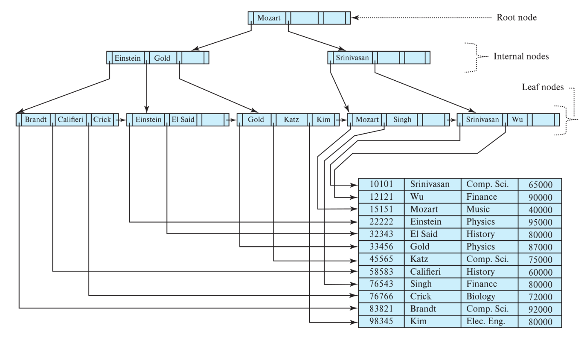
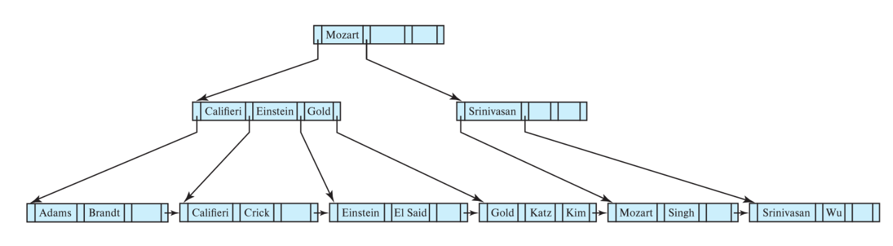
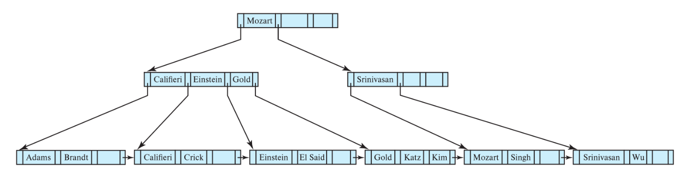
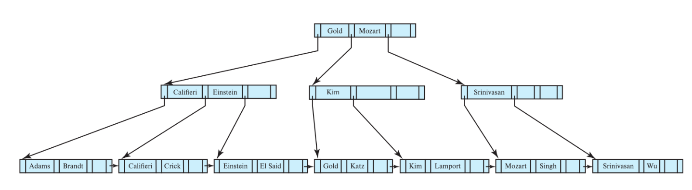
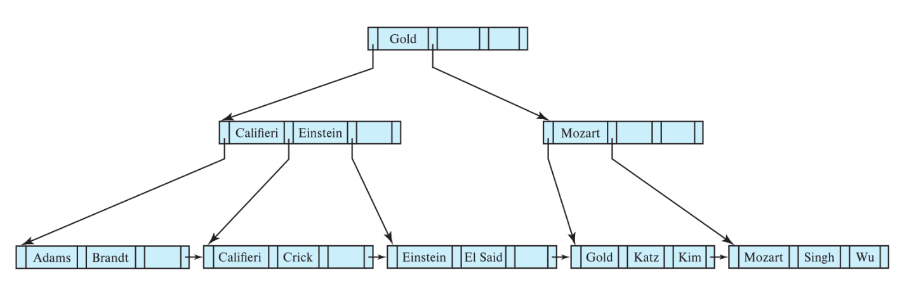
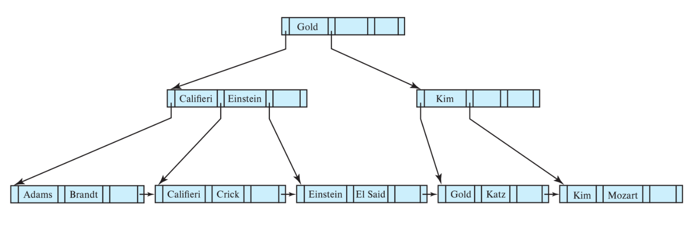
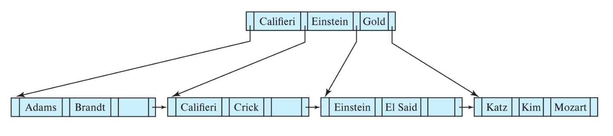
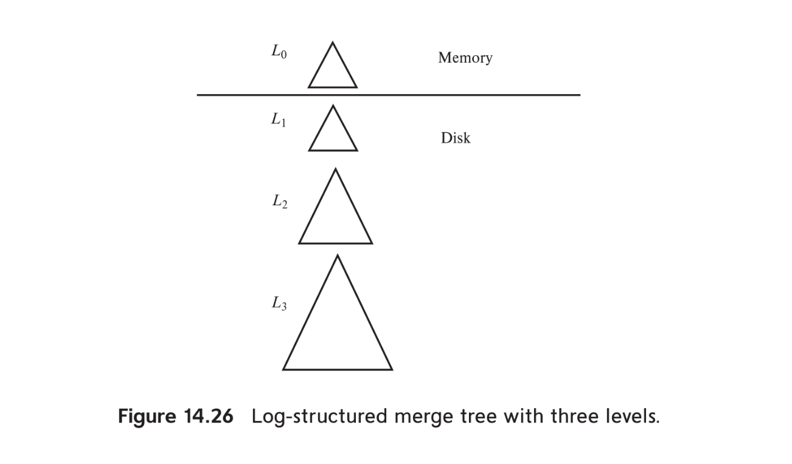

# Chapter 14: Indexing
## 14.1 Basic Concepts
-  we should not implement `index` on the relation in a sorted order of `id` directly like in book index since:
    + the `index` it self would be too large
    + `sorted index` reduce search time but it can still be rather time consuming
    + **update** sorted index can cause overhead since we need to **reorder** the index after each update
- there are two main type of index:
    1. `ordered indices` based sorted ordering values
    2. `hash indices` 
        + `hash function` mapping input key -> output to determine the location of the record in the index.
            * **deterministic** the same input alway provide the same output
            * if there are multiple input key mapping to the same output, it is called `collision`
            * **fix-length** output
            * **uniform distribution** the output should be equally distributed across the output space, minimize the chance of collision
            * **diffusion** small change in the input key should cause large change in the output
            * **one-way** (security) it hard to reverse the hash function to get the input key from the output
            * **efficieny** the hash function should be fast to compute
        + **bucket** storage unit which assgined to a hash function output, it can contain multiple value in case of collision
- there are serveral techniques for ordered indexing, each suited for serveral applacations and must be considered though these factors:
    + ***access types*** access types can fall into two categories, **point query** and **range query**
    + ***access time*** time to find a particular data items
    + ***insertion time*** time take to insert new data, includes time to **find** correct location to insert and time to **reorder** the index if needed
    + ***deletetion time*** time take to delete data, includes time to **find** the data to delete and time to **reorder** the index if needed
    + ***space overhead*** space take to occupied by index structure, it is worthwhile to sacrifice the space to achieve improved performance
- an attribute or set of attribute can define as a `search key` 

## 14.2 Ordered Indices
- in **ordered index**, **search key** is stored in **sorted** order, each search key value is associated with records that contain it
- `clustering index` or `primary index` is refer to index on the search key that is also a the define the physical order of the record in the file
- `non-clustering index` or `secondary index` is refer to index on the search key that is not the define the physical order of the record in the file
- in `postgres`, using 
```sql
CLUSTER users USING idx_user_created_at;
```
- to clustering index base on `created_at` index but it is **not automatically** maintain the clustering index and its access exclusive lock on the table
- file with clustering index on search key are called ***index-sequential files***

### 14.2.1 Dense and Sparse Indices
- `index entry` or `index record` consist of **search key** and **pointer** to a or set of record that contain the search key value
- **pointer** consist of **block identifier** and **offset** of the record in the block
- there are two type of index:
    + `dense index`: **index entry** appear for every **search key** value in the file
        * in `dense clustering index` **pointer** point to the first record with the **search key**, the rest same **search key** value record would be stored sequentially in the file, sorted 
        * in `dense non-clustering index` index must store pointer to all record with successive search key value
    + `sparse index`: **index entry** appear for only some **search key** value in the file, the index must be **clustering index** since it can only be use when the relation is stored in sorted order of the **search key**
    - `dense index` faster when lookup for a a record but with higher space, insertio, deletion overhead compared to `sparse index`
    - to balance out the tradeoff, we can use `spare index` with one index entry per block to minimize the **dominant cost** of bringing a block into memory but also reduce the **space overhead**

### 14.2.2 Multilevel Indices
- if data grow large, access time and space of the index it self can become a problem, to deal with this problem, we can use `multilevel index` which is an **index** on the **index**
- we create an `outer index` which is spare and `inner index` must be sorted by search key value

### 14.2.3 Index Update
- whenever there is an update, inser or delete, index must be **updated correspondingly**

#### 14.2.3.1 Insertion
1. **dense indices**:
    - if the search key not appear in the index, system insert an index entry with the search key value in the index
    - if it **non-clustering** index, system also add new pointer to the new record in the index entry
    - if it **clustering** index, system place the new record after other record with the same search key value
2. **sparse indices**: 
    - if system **create new block**, it insert the first search key value of the block into the index
    - if inserted in **existing block**, it **compare** and if inserted record have smaller search key value, then the index entry update to point to the new record. Otheriwse, there is no change in the index entry

#### 14.2.3.2 Deletion
1. **dense indices**:
    - if deleted record is the only record with the search key, then the system delete the corresponding index entry 
    - if in **non-clustering**, the index entry must be updated to remove the pointer to the deleted record
    - if in **clustering**, the system must update the index entry to point to the next record with the same search key value
2. **sparse indices**: 
    - if the index not contain the search key value of the deleted record, there is no change in the index
    - if there was only one record with the **same** search key and have records with **coresponding** search key, the system update the index entry to point to the next record in search key order
    - if there is no record with **corresponding** search key, the system delete the index entry
    - if there are multiple record with the **same** search key, the system update the index entry to point to the next record with the same search key value

### 14.2.4 Secondary Indices
- **secondary index** must be **dense** since it not describe the physical order of the record in the file
- if the **search key** of clustering index is not unique, we can point the index entry to the first record with the search key value since the rest of the record with the same search key value are stored sequentially in the file
- if `candidate key` and `clustering` 
    + `spare` reduce space overhead, write perfomance but it can cause read performance
    + `dense` can provide better read performance
- if `candidate key` and `non-clustering` -> must be `dense` 
- if `non-candidate key` and `clustering` 
    + `spare` reduce space overhead, write perfomance, and read performance since all record with the same search key value are stored sequentially in the file
    + `dense` should not be choosen
- if `non-candidate key` and `non-clustering` -> must be `dense`
- **non-clustering** index improve performance of query using attribute other than search key of the clustering index, but it can cause performance overhead on modification

### 14.2.5 Indices on Multiple Keys
- `composite search key`: search key that contain multiple attribute and is ***lexicographic ordering***

## 14.3 $B^+$ Tree Index Files
- `balanced tree`: the tree which every leaf have the same ***depth***

### 14.3.1 Structure of $B^+$ Tree
- $B^+$ tree, takes the form of `balanced tree`
- $n$ can be calculate by the following formula:
$$n = \frac{\text{block size}}{\text{size of search key} + \text{size of pointer}}$$
- average $n \approx 200$ with 
- a typical $B^+$ node contain up to **$n-1$** search key value ***K*** and **$n$** pointer ***P***
- search key value are kept **sorted**
1) `leaf node`
    - contain contain such amount of search key value $K$ that
    $$\frac{n-1}{2} \le K \le n-1$$
    - and contain $P$ pointer that
    $$\frac{n-1}{2}+1 \le K \le n$$
    - $B^+$ tree is usually **dense index**, so each search key value in the leaf node is associated with a pointer to the record with the search key value
    - The $P_n$ pointer in the leaf node is used to point to the **next leaf node**, which allow us to efficiently find record with range of search key value
2) `internal node` also known as `non-leaf node`
    - contain the search key value $K$ that
    $$\frac{n}{2}-1 \le K \le n-1$$
    - contain the number of pointer $P$ that
    $$\frac{n}{2} \le P \le n$$
    - the reason for the different range of search key value and pointer in leaf node and internal node is that leaf node $P_n$ is used to point to the next leaf node
    - so calculation of $P_{min}$ in leaf node is different: there are max $n-1$ search key value so $P_{min} = \frac{n-1}{2}$ then $+ 1$ for the pointer to the next leaf node 
    - for example a node contain **$m$** pointers ($m \le n$)
        + the node contain up to $m-1$ search key value
        $$(P_1, K_1, P_2, K_2,..., P_{m-1}, K_{m-1}, P_m)$$
        + most left pointer $P_1$ point to the subtree with search key value less than $K_1$
        $$V < K_1$$
        + middle pointer $P_i$ point to the subtree with search key value greater than or equal to $K_{i-1}$ and less than $K_i$
        $$K_{i-1} \le V < K_i$$
        + most right pointer $P_m$ point to the subtree with search key value greater than or equal to $K_{m-1}$
        $$V \ge K_{m-1}$$
3) `root node` have the number of pointer $P$ can go lower than $\frac{n}{2}$, but it must have at least 2 pointer (1 reason is I/O optimization)
- $B$ in $B^+$ tree refer to ***balanced***
- $B^+$ require being ***balanced***, meaning every path from root to a leaf is the same to ensure good performance for search, insertion, deletion (continued Bottom growth up )
- there are ways to handle non-unique search key value in $B^+$ tree:
    + we can **store duplication** of search key value in the leaf node, but it can create duplication of search key value in the internal node which can cause performance overhead on insertion and deletion
    + another way is to use **bucket** but it can cause performance overhead on search key which have many duplication
    + most database implement do the following: internally, **add extra attribute** (which guarantee uniqueness) to the search key

### 14.3.2 Queries on $B^+$ Tree
- consider how query to find record with search key value **$v$** is processed in $B^+$ tree:
    - the current node is examinated
        - we finding the smallest $i$ such that $v \le K_i$
        - if $v = K_i$ then the current is now node pointed by $P_{i+1}$
        - if $v < K_i$ then the current node is now node pointed by $P_i$
        - if there is no such $K_i$ found, mean that $v > K_{m-1}$, so the current node is now node pointed by $P_m$
    - at **leaf level**, if there are $K_i = v$, $P_i$ is return as pointer to the record with search key value $v$ 
    - if there are no such condition found, it return **null**, which indicate that there is no record with the search key value in the tree
- **$B^+$ tree** can also be used to find records with range $[lb, ub]$ (lb: lower bound, ub: upper bound)
    + we first travel down the tree to find the leaf node that may or may not contain the search key value $lb$
    + it then scan the leaf node and subsequent leaf node to find which search key value satisfy the condition $lb \le K_i \le ub$ and colect the pointers
    + the scan top of it meet the condition $K_i > ub$ or there are no more keys in tree
- after traverse down to the leaf, there also I/O cost to **access the record** through pointer
- especially for range query, for M pointer need to be retrieved, we need to access at most the amount of leaf node that:
$$\frac{M}{(n/2)}+1$$
- there also the cost to **fetch** the actual record with M random I/O needed in the worst case
- **clustering index** can significantly reduce the cost of fetching the actual record since record with similar search key value are stored together

### 14.3.3 Updates on $B^+$ Tree
- **insertion** and **deletion** is more complex than **search** since it require while also maintaining the properties of $B^+$ tree such as being **balanced**
    - ***split*** a node when it become too large
    - ***coalesce*** when number of pointers become $\le \frac{n}{2}$
- assuming that no node is too large or too small, the insertion and deletion is performed as follow:
    + for **insertion**, we first **find** the leaf node where the new record should be inserted, then we **insert** the new record into the leaf node such that search key are still **in order**
    + for **deletion**, we lookup where all the entries with the associated search key value are located, then we **delete** the entries and shift the remaining entries to fill the gap

#### 14.3.3.1 Insertion
- we take $n$ (n-1 search key value plus inserted search key value)
and and put $\frac{n}{2}$ search key value in the original node other $\frac{n}{2}$ search key value in the newly created node
- the newly created node also need an entry in the parent node, we follow beblow procedure to insert the new entry in the parent node:
    - we copy the smallest search key value in the newly created node **insert** into the parent node as the new entry, place at the correct position to maintain the order of search key value in the parent node
    - it's left pointer **point** to the original node
    - it's right pointer (old pointer) **updated** to pointed to the newly created node


> illustration of $B^+$ tree before insertion


> illustration of $B^+$ tree after insertion

- splitting on **internal node** is a little bit different from **leaf node**, below is the illustrations
- a node child need to be splitted and insert a new entry to the parent node, but the parrent node is currently full
    - the parent node conceptually expanded temporarily, added the entry and become ***overfull***
    - the node then **splitted immediately**
    - the **original node** take pointers $P_1...P_m$ where $m = \frac{n+1}{2}$
    - the **newly created node** take pointers $P_{m+1}...P_{n+1}$
    - key value between those pointer is separated accordingly
    - the **key value** between $P_m$ and $P_{m+1}$, $K_m$ is **pushed up** to the parent node as the new entry, it is important to note that this key value is **not duplicated** 


> illustration of $B^+$ tree before internal node insertion


> illustration of $B^+$ tree after internal node insertion

#### 14.3.3.2 Deletion
- when delete an entry and cause the tree nodes to contain too few entries, we can either merge or **redistribute** the entries in the nodes
    - we first look up for the entry to delete, then we delete the entry and its **search key value** from the leaf node
    - if the leaf node became **underfull** ($n_{pointers} < min_{pointers}$)
    - we try either merge or redistribute the entries in the leaf node with its sibling node
    - in example, we can merge with the left sibling since $sum_{pointers}$ of two nodes $< max_{pointers}$
    - we then move the entries and its pointer to the left sibling node, and delete the empty node
    - in example, the **parent internal node** entry with search key value "Srinivasan" is also deleted
- the **internal node** now also become underfull, then we continue to either merge or redistribute the entries in the internal node with its sibling node
    - such that the $sum_{pointers}$ of two nodes $> max_{pointers}$, we perform redistribution 
    - we perform a **rotation** of the **internal node** and its **parent**
    1) we move the **most left pointer** to the **underfull node**, the **underfull** now contain 2 pointers with no search key value
    2) we move down the **separator** search key value in the **parent** between the two **pointers**
    3) the **correct separator** of the two nodes is now the **most right search key value**, we move up the **most right search key value** to the **parent** as the new separator and update its pointer correspondingly


> illustration of $B^+$ tree before internal node deletion


> illustration of $B^+$ tree after deletion of entry “Srinivasan”

- we next consider the case of redistribution with the **leaf node** 
    - the visualization show that after deletion of "Singh" and "Wu", the leaf node become **underfull** 
    - we then redistribute the entries by moving the most right entry of the left sibling 
    - the moved entry now is the **smallest search key value** in the leaf node, so we update the parent node entry to point to the moved entry and its value


> illustration of $B^+$ tree before and after deletion of "Singh" and "Wu"

- we then perform deletion of "Gold" entry:
    - the deletion make leaf node **underfull**, but borrow from the right sibling will also make the right sibling **underfull**, so we perform merge instead of redistribution
    - after merge, the **parent separator** "Kim" is now not needed, so we delete the "Kim" entry from the parent node and its right pointer
    - now, the parent node now also become **underfull** since having 1 **most left pointer** and having **no key** (not useful and violationg root must have 2 children) so we **rotate** by push down the root node
    - still after the **rotation** parent node is **underfull** since it only have 1 pointer, so we merge the parent node with its sibling node, and delete the empty node 
    > bring tree height down by 1 


> illustration of $B^+$ tree after deletion of "Gold"

### 14.3.4 Complexity of $B^+$ Tree Updates
- the cost of insertion and deletion is **proportional** to height of $B^+$ tree since it vert expensive
- in worst case, the cost of insertion and deletion is $log_{\frac{n}{2}}(N)$
- even in the worst case, average updated will require **little more than 1** I/O since most of internal node is in the buffer likely already in the buffer if $B^+$ tree is frequently accessed
- with fanout $n = 100$, given the table with 5 million records

$$\frac{5000000}{100} + \frac{50000}{100} + \frac{500}{100}= 50505 \text{ pointers in internal node}$$

- assume with each 100 pointers, we can fit in one block size of 4kb, space needed for contain all internal node is about 
$$\frac{50505}{100} \times 4 \text{ KB} \approx 2 \text{ MB}$$

- modern storage system with gigabytes of memory can easily keep 2MB in the buffer, so most of the internal node is likely already in the buffer

- node can be expected to be mote than $2/3$ full with random insertions since node are more likely to be access again when randomly inserted (with sequential insertion, inserted node are not likely to be access again)

### 14.3.5 Nonunique Search Keys
- in previous example, we assume that search key value is unique by adding extra attribute to the search key
- extra attribute which in unique between record is called **uniquifier** 
- if we wish to support non-unique search key value without adding extra attribute, we can use **bucket** approach, this maintain space efficiency but also come with disavantage:
    - need extra management with bucket, variable size, bucket that too large for block and store in another block
- another option is to store search key value for each record, however, this solution make handling split and merge significantly more complex and have higher space overhead
- the complexity of deletion have major increase,
    - suppose wish to delete a particular record with search key value $v$
    - but there may be multiple leaf node that contain the search key value $v$
    - we need to scan through all the leaf node that contain the search key value $v$ to find the record to delete
    - in the worst case, we may need to scan through all the leaf node that contain the search key value $v$, which result to O(N) time complexity 

## 14.4 $B^+$ Tree Extensions
### 14.4.1 $B^+$ Tree File Organization
- the main drawback of `index-sequential file organization` is that performance degradation as the file grow since index and actual record order become out of sync
- by using `B+ tree file organization`, where the actual record is stored in the leaf node of the $B^+$ tree
    - in insertion, if the node is full, we attempt to redistribute the record with its sibling node, if redistribution is not possible since sibling node is also full:
    - we take node and adjacent node which are full, split them into 3 node 
    - now each of the 3 node is about 2/3 full
    - the deletion is basically the reverse of insertion, each node guaranted to having atleast $\frac{(m-1) \times n}{m}$ entries
- an index rebuild is needed as the file grow and logical order and physical order become missmatch
- reindex might use bulk loading technique to guarantee OS to find contiguous space for the index

### 14.4.2 Secondary Indices and Record Relocation
- a record may change location even if its do not having any update (merge, split,...)
- secondary index must lookup and update to reflect the new location of the record which need for many I/O operation
- to avoid this problem, we can use **indirection** by storing primary key value in the leaf node of the secondary index instead of pointer to the record
    - to find list of `ids` with search key value $v$ in the secondary index
    - then using `ids` to lookup the record in the primary index
    - the drawback of this approach is that it require extra I/O to lookup the record in the primary index

### 14.4.3 Indexing Strings
- creating index on string attribute raise 2 problems:
    1. string can be of variable length -> more complex to manage node's operation such as split and merge since the number of search key value in a node can vary
    2. string can be very long -> lower fanout and higher height of the tree
- to deal with the problem of variable length, we can use **prefix compression**: store only the prefix of the string that is needed to distinguish it from other string in the non-leaf node

### 14.4.4 Bulk Loading of $B^+$ Tree Indices
- when building a index which larger than main memory, random insertion can cause database to repeatedly fetching and evicting data block (page thrashing)
- **bulk loading** is an efficient method to perform large insertion of an index as follows:
    - create a temporary file containing index entries
    - sort file base on seach key 
    - sequentially insert entries from file into the index
- benefit of **sort** before insertion:
    - each leaf node involve in only one I/O operation
    - if succesive leaf node are located in successive disk block, we can minimize time taken for I/O operation
- if B+ tree is empty, we can directly build the tree **bottom up**, called `bottem-up B+ tree construction`
    - we first sort entries 
    - then break sorted entries into blocks, keep as much as possible entries in each block -> result in leaf level 
    - the least search key value in each block is then used to build the internal node level, we repeat the process until we reach the root node
- it is recommended to use **drop** the index before large insertion and **recreate** the index to take advantage of **bulk loading**

### 14.4.5 $B$ Tree Index Files
- a $B$ tree is similar to $B^+$ tree but with the following difference:
    - $B$ tree eliminates redundancy of search key, reduce space overhead
    - $B^+$ tree store every search key value in the leaf node, and some duplication stored in the internal node
    - to archive this, $B$ tree store addition pointer in the internal node for each search key value to point to the record corresponding 
- $B$ tree can help to reduce time finding specific record but increase the time to find most number of record as number of pointer in the internal node is reduced, which can increase the height of the tree
- deletion and insertion in $B$ tree are more complicated than $B^+$ tree

### 14.4.5 Indexing on Flash Storage
- write operation on flash storage is more expensive since it it dont permit to `in-place update`
- instead, every update require turn to be a combination of **copy** old page, read and modified its data and **write** back to another page on the flash storage, old page is marked as invalid
- old page need to be **erased**, but erase operation is done at level `block`, which is 256-512 pages, so we need to **copy** all valid page in the block to another block before erasing the block
- a `block` is the smallest nit of data that hardware can interact with, block size can varries bettween different hardware (storage/file system)
- a `page` is the smallest unit of data which OS can interact with, page size is **fixed** and typically 4KB (memory management)
- `page` is used as a **middleman** to interact with hardware easily
- **bulk loading** still improve insertion significantly, it minimize `write amplification` when writing to leaf node, also internal node splitting reduce when **bottom-up construction**
- to minimize erase operation there are several approach:
    - add `buffer` at higher level and apply update in batch to minimize write amplification
    - `log-structured merge tree`, the idea is create multiple tree and merge them (to be continued)

### 14.4.7 Indexing in Main Memory
- unlike disk-based storage, main-memory is costlier, so that data structure being used is design to reduce space even if its trade off with I/O operation or dept of the tree
- the relation ship between cache and main memory is similar to the relationship between main memory and disk, problem and optimization solution is also similar, but its is configered for different scale
- $B^+$ tree with node fit in cache line perform better than binary tree and ordinary $B^+$ tree
- a tree-structured **within** node is also use to minimize linearly scan or binary search, and reduce cache misses

## 14.5 Hash Indices
- bucker: a unit of storage that can store on or more record
    - in memory base, bucket can be implemented as a linked list of index entries or records
    - in disk base, bucket can be linked list of disk block
- hash file organization: buckets store **actual records** instead of pointer
- to insert a record with search key value $K_i$ we first calculate the hash function:
$$h(K_i) = i$$
- with $i$ is the bucket number at offset $i$, $h$ is the hash function
- then we add index entry to list at the bucket $i$ 
- note that in this example, we use linked list (overflow chaining) as **colission** handling but there many other data structure can be used
- hash using use **overflow chaining** are called **closed addressing** which is different from **open addressing**
    - in **closed addressing**, when a collision occur, we store the colliding record in a linked list (or other data structure) at the bucket, 1 hash value map to 1 addres (bucket) and not changing its address
- hash index is efficient for **point query** but not for **range query** 
- to insert, we first need to identify **bucket**, if bucket is not full, we can insert the record into the bucket, otherwise system provide *overflow buckets** and insert the record into it
- **skew** might happen as some bucket might be more **popular** than other, to minimize skew, we must choose hash function that provide **uniform distribution** 
- to calculate number of bucket needed, we can use the following formula:
$$\text{number of bucket} = (\frac{\text{$n_r$}}{\text{$f_r$}}) * (1 + \text{d})$$
- with $n_r$ is the number of record, $f_r$ is the number of record that can fit in a bucket, and $d$ is the desired **load factor**, about 0.2 to reduce the chance of bucket overflow
- hash index which number of bucket is fixed is called **static hashing**, it can cause performance when number of record grow and cause more bucket overflow
- hash index can be rebuild to reduce bucket overflow, but it can be very expensive
- some technique is use to archive **dynamic hashing** such as **linear hashing** and **extendible hashing**

## 14.6 Multiple-Key Access
### 14.6.2 Indices on Multiple Keys
- example with relation ***instructor(ID, dept_name, salary)***, we wish to create index on both ***dept_name*** and ***salary***, with the following query:
```sql
select ID
from instructor
where dept name = 'Finance';
```
- is equivalant to a range query on range with lower bound ('Finance', -$\infty$) and upper bound ('Finance', +$\infty$)
- the use of orderd index also having a few shortcoming, consider the following query:
```sql
select ID
from instructor
where dept name < 'Finance' and salary < 80000;
```
- this query first scan for record with ***dept_name*** < 'Finance' and then filter out record with ***salary*** < 80000
- how ever if there are many `dept_name`, this query will likely to access many block -> many I/O operation
- to fix this problem, we could use ***bitmap indices*** or ***R-tree*** to handle indexing on multi-dimensional

### 14.6.3 Covering Indices
- a **covering index** is an index that contain all attributes other than the search key, so that query can be answered by only accessing the index without accessing the actual record
- it reduce the nonleaf node size and potentially reduce the height of the tree in contrast of indexing on multiple keys

## 14.7 Creation of Indices
- use `create unique index` to explicitly create index on candidate key
- performance problem are sometimes, apparently during testing
- some database (include Postgres) create index implicitly for **primary key** and **unique** constraint to increase performance when checking constraint violation 
- many database also provide tools (***hypopg***, ***pg_qualstats & PoWA***) to help DBA track queries excuted on the system to recommend creation of indices
- some cloud system also support **automatic index creation** by tracking query and automatically create index without DBA intervention

## 14.8 Write-Optimized Index Structures
- random write operation on $B^+$ tree is poor on performance
    - each random write likely to contain I/O of: read the block from the disk + write the block back to the disk
    - on SSD, random write I/O perform faster but each write still have a significant cost since it require a block to be erased before writing in (remapping logical and physical block + erase block in background)
- LSM tree (log-structured merge tree) and its variants are widely adopt as a **write-optimized** index structure

### 14.8.1 LSM Trees
- LSM tree consist of several $B^+$ tree starting with an in-memory tree $L_0$ and on-disk trees $L_1, L_2,...,L_k$S


> illustration LSM tree

- in case of index look up: separated look ups are performed on each trees and then merge the result 
- in case of insertion:
    - records are first inserted in $L_0$ tree
    - if located memory for $L_0$ tree is used up, we move data to $B^+$ structure on disk
        - if $L_1$ is empty, entire $L_0$ is written to disk to create $L_1$
        - if $L_1$ is not empty:
            - we first scan $L_0$ and $L_1$ leaf level in increasing key order
            - then merge the result and ***bottom-up build process*** to create new $L_1$
            - replace the new $L_1$ with the current one
        - in both case, all $L_0$ entries are delete
- note that all the entries in $L_1$, include those done have any update will be copied to the new $L_1$ tree instead of performing update on old tree, this will gives the following benefits
    - avoid random I/O during insertion
    - avoid spare leaf which cause by page split -> increase data density at physical level  
- in contrast with the benefit, there is some drawback with LSM structure approach, one is that it require to copied entire of tree content each time $L_0$ are copied into $L_1$
- to reduce this cost, they use 1 of these 2 techniques
    - ***multi-level system***
        - use a multi-level system $L_0$..$L_i$ with size that
        $$L_{i+1} = L_i * k$$
        - with $k$ ussually be $10$ in system like **Cassandra** or **RocksDB**
        - this reduce maximum number of time an entries have to be **rewrite** in a level to $k$
        - with n being the number of level needed to contain I amount of entries, M is the amount of entries contain in $L_0$ we have that:
        $$M * k^n = I$$
        - to calculate the number of level, we modify the formula:
        $$log_k(\frac{I}{M}) = n$$
    - ***stepped-merge index***
        - each level other than $L_0$ can have up to $b$ number of tree
        - when $L_0$ write to the disk, it dont ***compaction*** with the current $L_1$, $L_1$ dont need to be bigger than $L_0$
        - instead, it create a new $L_1$ and write data into the new one
        - when the number of $L_1$ trees are up to $b$, the compaction begin and write to a $L_2$ tree which size is about $b * L_1$ size
        - this approach decrease the insertion cost significantly but to trade off, increase the query cost because multiple tree at 1 level need to be search
        - ***bloom filters*** are then use to detect that a search key are not present in particular tree
- in case of insertion:
    - LSM tree using ***tombstone*** machanism to delete entry 
    - we **insert** a tombstone entry indicate that: evevy entry with the same search key appear in LSM tree before the tombstone arrival will be filter out when query
    - when merge tree, tombstone entry matched other entries on search key, both getting discarded  
    - original LSM tree dont support ***range tombstone*** with non-search key attribute filter 
- update are handled similar to deletion
- LSM tree initially design to reduce the overhead of random I/O on HDD, those benefit is not particularly important on flash based storage
- however, each write on SSD require a whole page to be rewritten, original page needs to be erased eventually in block. LSM tree reduce write amplification by insert entries in bulk

### 14.8.2 Buffer Tree
- ***buffer tree*** is an alternative to LSM tree, key idea is associate a buffer wih each internal node of $B^+ tree$ and root node
- in case of insertion:
    - entry are first inserted at root's buffer
    - if root's buffer is full, entry are then sorted and push down to the correspondingly child level's buffer base on its search key
    - this process continue when entry meet leaf node, it then inserted in leaf node in the usual $B^+$ manner
    - when splitting happen on internal node, the extra step is to also split the buffer based on the entries search key
- search for entries are done in usual way, an extra step is for each non-leaf node access, we must also look for entries that match the look up key in the buffer
- range look up must also examine th buffers of all parent node which its leaf node are accessed during range scan
- buffer tree transfer the cost of insertion from linear on number of records to the number of $k$ records to be pushed down to children at a time
