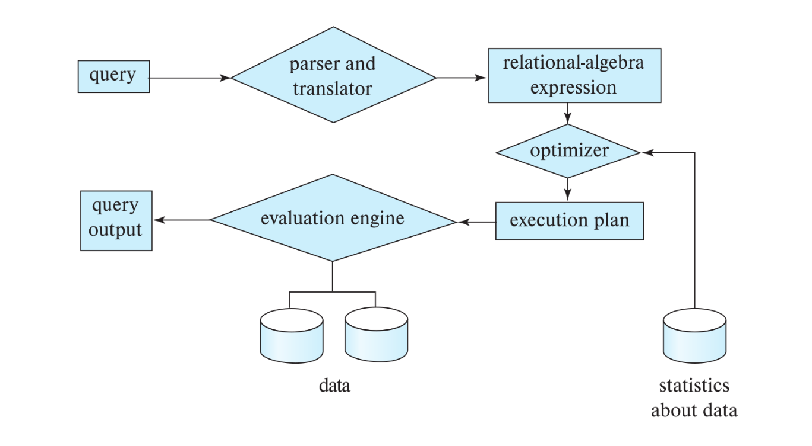
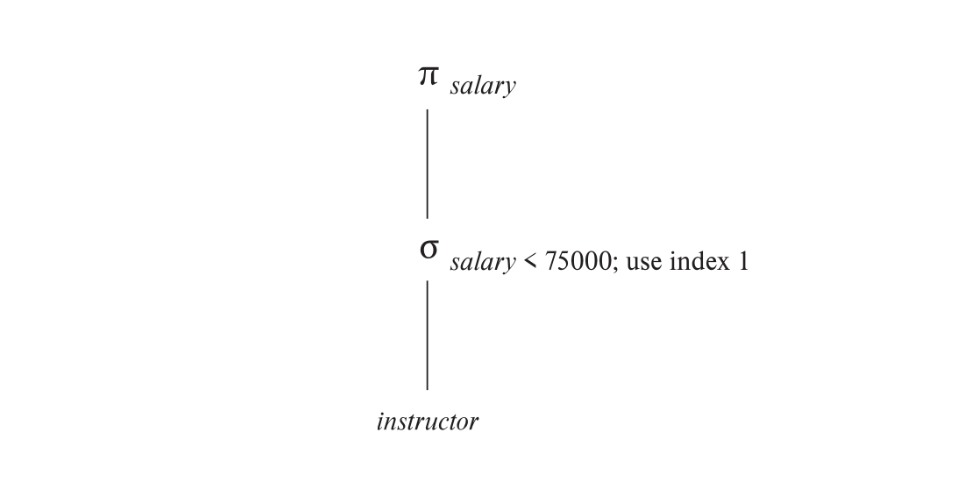

# Part 6: Query Processing and Optimization
# Chapter 15: Query Processing
- `Query processing` includes these activities:
    - parse and tranlation of queries from high level languages to expression (ussually an extention of relational-algebra) that can be used at physical level of file system
    - query optimizing transformations
    - query evaluation

## 15.1 Overview

- for a query, there many ways to represent them as relational-algebra expression as well as execute and query them
- take example on the followwing query
```sql
select salary
from instructor
where salary < 75000;
```
- the query can be express as
  - $\Pi_{salary}(\sigma_{salary < 75000}(instructor))$
  - $\sigma_{salary<75000}(\Pi_{salary}(instructor))$
- after tranformation, query can be excuted in serveral ways. If there are $B^+$ index on the salary we'll use them for faster execution, otherwise we'll scan each tuple to find out if there any tuple math the predicate
- to specify how to evaluate query, not only we look at relational-algebra expression but we also look at `annotation`, an instruction to specify which algorithm is use, specific operation or which indexes is use
- `evaluation primitive` a evaluation primitive is a basic physical (or execution) unit that cannot be further divided during query planning; it specifies a relational-algebra operation annotated with instructions on how to evaluate it.
- a sequence of evaluation primitive called a `query-execution plan` or `query-evaluation plan`
- The `query-execution engine` takes a query-evaluation plan, executes
that plan, and returns the answers to the query.

> a query evaluation plan with "index 1" being used
- a different evaluation plan can have different `cost` and its is a job of system, not of the user to construct a query-evaluation plan that minimize the cost. This task called `query optimization`
- not all database follow exactly the same step, for example, some database use parse-tree representation instead of relational-algebra expression
- query optimization need to know the cost of each operation, although cost can depend on outside parameter such as memory available, a rough estimation can still get to calculated
- `pipeline` a evaluation where operations are grouped, instead of awaiting operation to fully completed before execute the next one, operation perform `overlapping execution` as consumer operation execute as the producer operation output tuples or block of tuples

## 15.2 Measure of Query Cost
- the (estimated) cost of query evaluation can be measures interm of these following resource:
  - number of disk I/O
  - CPU time to execute a query
  - cost of cimmunication (in distributed system)
- for database use magnetic disk, I/O cost from disk ussually dominate other costs
- for database use SSD, we must include CPU costs when computing cost of query evalation
- CPU costs includes: cpu_tuple_cost, cpu_index_tuple_cost, cpu_operator_cost
- database have default value for each of these cost and can be changed as configuration params
- the total time to I/O for in query evaluation can be calculated as follow
  $$ \text{Total Time} = b * t_T + S * t_S $$
  - $b$ number of blocks transfer
  - $t_T$ average time to transer a block of data
  - $S$ number of random I/O access
  - $t_S$ average block access-time (disk seek + rotational latency)
  
  |$(4\ kb/\text{block})$|HDD|SSD (SATA)|SSD (PCIe)|Main Memory|
  |-|-|-|-|-|
  |$t_T$|$0.1\ ms$|$10\ \mu s$|$2\ \mu s$|$<1\ \mu s$|
  |$t_S$|$4\ ms$|$90\ \mu s$|$20-60\ \mu s$|$<100\ ns$|
  |transfer rate|$40\ mb/s$|$400\ mb/s$|$2\ gb/s$|$>4\ gb/s$|
  |block reads per second|$250$|$10,000$|$50,000-15,000$|$>10,000,000$|
  > base on data of 2018 model
- database ideally perform a test to estimate $t_T$ and $t_S$ for specific system/storage device as part of software installation
- alternatively, user can input sprcific number in configration files
- to further refine cost estimation we can separate the cost of write and read operation
  - on HDD, write usually double the cost of read since disk read the sector back after write to verify write was succesfull
  - on SSD PCIe write through put is 50% less than read throughput due to physical limited
  - this different is masked with SATA interface because of the limited speed
  - the cost of wrting data back to disk when disk spill or materialized temp table,.. are not take into account when cost estimation and are calculated separately when required
- the cost of all algorithms depend on the size of the buffer in main memory, cost estimate use the ammount of memory available to an operator, $M$ as a parameter `work_mem`
- total memory available query called `effective_cache_size`, in postgres, this value is default to $4\ gb$
- the estimated cost can less than the actual one since block may already present in the memory buffer
- to calculate the cost of memory buffer, the cost of random page read is set to $1/10$ of the actual random page read to simulate the situation where 90% read are resident in cache
- most database also assume that all of the internal node of $B^+$ tree are presented in memory buffer
- `response time` (wall-clock time) is the actual time require to evaluate the query and could be use to measure the cost of the plan but its hard to estimate withour actually execute the query for reasons
  - the actual evaluation time repend on content of memory buffer at the time the query is actually evaluated
  - database are abstracted from actual hardware device and hard to estimate withour the detail knowledge of data layout
  - a plan may get better response time at the cost of extra resource compsumtion (parallel processing,...)
- instead of try to minimize response time, the optimizer generally try to minimize `resource consumption` of the query plan 
  
## 15.3 Selection Operation
- `file scan` is the lowest-level operation to access data
  
### Selections Using File Scans and Indices
- **A1** (`linear search`): perform an initial seek and start scanning each block  in a file and test records in block if it match the selection condition
  - in case blocks of the file are not store sequentially, extra seek is required but we ignore it for simplicity
  - linear search algorithm can be applied to any file for implementing selection, regardless of file's ordering, index availability or selection operation's nature
  - other algorithms may not applicable in all cases
  - linear search generally slower than other algorithms