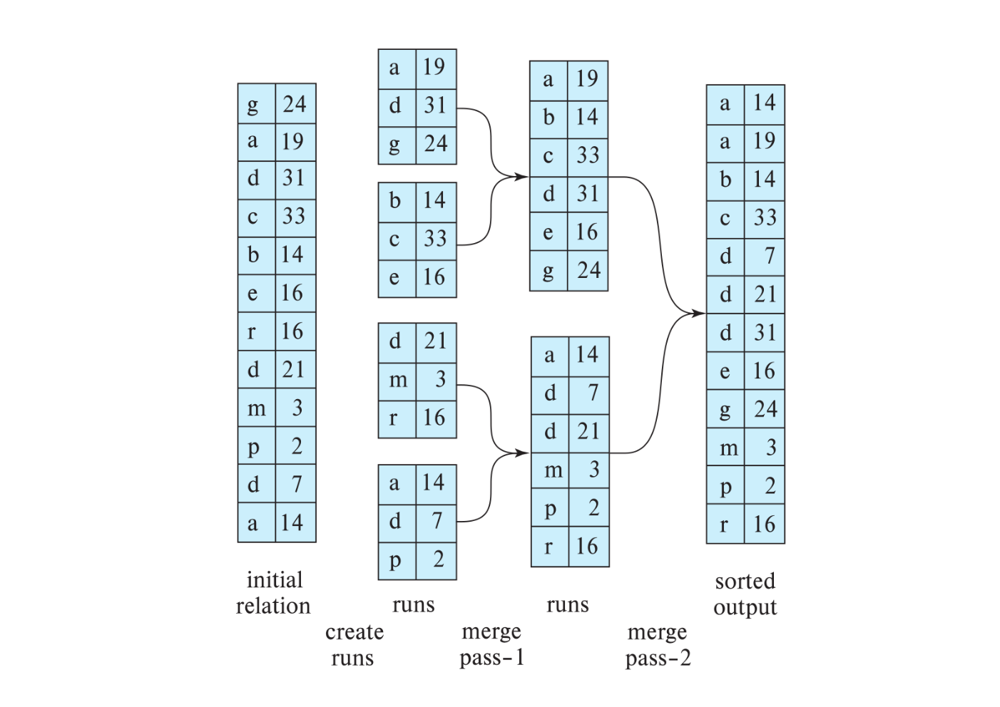
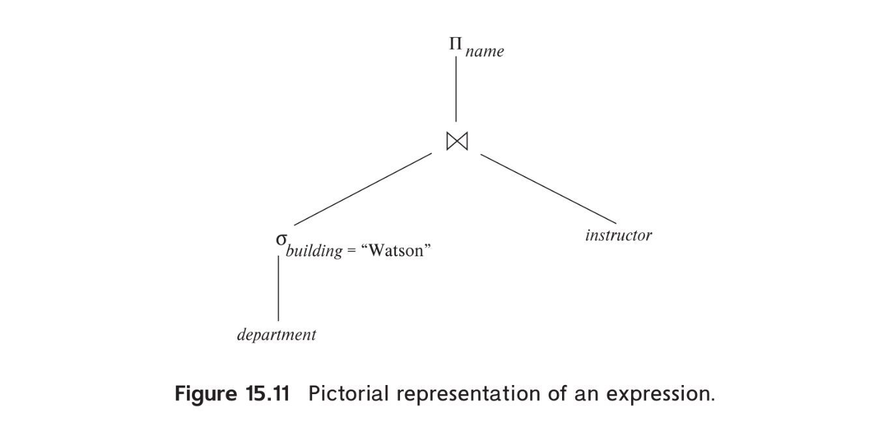

# Part 6: Query Processing and Optimization
# Chapter 15: Query Processing
- `Query processing` includes these activities:
    - parse and tranlation of queries from high level languages to expression (ussually an extention of relational-algebra) that can be used at physical level of file system
    - query optimizing transformations
    - query evaluation

## 15.1 Overview

- for a query, there many ways to represent them as relational-algebra expression as well as execute and query them
- take example on the followwing query
```sql
select salary
from instructor
where salary < 75000;
```
- the query can be express as
  - $\Pi_{salary}(\sigma_{salary < 75000}(instructor))$
  - $\sigma_{salary<75000}(\Pi_{salary}(instructor))$
- after transformation, query can be executed in several ways. If there are $B^+$ index on the salary we'll use them for faster execution, otherwise we'll scan each tuple to find out if there any tuple math the predicate
- to specify how to evaluate query, not only we look at relational-algebra expression but we also look at `annotation`, an instruction to specify which algorithm is use, specific operation or which indexes is use
- `evaluation primitive` a evaluation primitive is a basic physical (or execution) unit that cannot be further divided during query planning; it specifies a relational-algebra operation annotated with instructions on how to evaluate it.
- a sequence of evaluation primitive called a `query-execution plan` or `query-evaluation plan`
- The `query-execution engine` takes a query-evaluation plan, executes
that plan, and returns the answers to the query.

> a query evaluation plan with "index 1" being used
- a different evaluation plan can have different `cost` and its is a job of system, not of the user to construct a query-evaluation plan that minimize the cost. This task called `query optimization`
- not all database follow exactly the same step, for example, some database use parse-tree representation instead of relational-algebra expression
- query optimization need to know the cost of each operation, although cost can depend on outside parameter such as memory available, a rough estimation can still get to calculated
- `pipeline` a evaluation where operations are grouped, instead of awaiting operation to fully completed before execute the next one, operation perform `overlapping execution` as consumer operation execute as the producer operation output tuples or block of tuples

## 15.2 Measure of Query Cost
- the (estimated) cost of query evaluation can be measures interm of these following resource:
  - number of disk I/O
  - CPU time to execute a query
  - cost of cimmunication (in distributed system)
- for database use magnetic disk, I/O cost from disk ussually dominate other costs
- for database use SSD, we must include CPU costs when computing cost of query evalation
- CPU costs includes: cpu_tuple_cost, cpu_index_tuple_cost, cpu_operator_cost
- database have default value for each of these cost and can be changed as configuration params
- the total time to I/O for in query evaluation can be calculated as follow
  $$ \text{Total Time} = b * t_T + S * t_S $$
  - $b$ number of blocks transfer
  - $t_T$ average time to transer a block of data
  - $S$ number of random I/O access
  - $t_S$ average block access-time (disk seek + rotational latency)
  
  | $(4\ kb/\text{block})$ | HDD        | SSD (SATA)  | SSD (PCIe)      | Main Memory   |
  | ---------------------- | ---------- | ----------- | --------------- | ------------- |
  | $t_T$                  | $0.1\ ms$  | $10\ \mu s$ | $2\ \mu s$      | $<1\ \mu s$   |
  | $t_S$                  | $4\ ms$    | $90\ \mu s$ | $20-60\ \mu s$  | $<100\ ns$    |
  | transfer rate          | $40\ mb/s$ | $400\ mb/s$ | $2\ gb/s$       | $>4\ gb/s$    |
  | block reads per second | $250$      | $10,000$    | $50,000-15,000$ | $>10,000,000$ |
  > base on data of 2018 model
- database ideally perform a test to estimate $t_T$ and $t_S$ for specific system/storage device as part of software installation
- alternatively, user can input sprcific number in configration files
- to further refine cost estimation we can separate the cost of write and read operation
  - on HDD, write usually double the cost of read since disk read the sector back after write to verify write was succesfull
  - on SSD PCIe write through put is 50% less than read throughput due to physical limited
  - this different is masked with SATA interface because of the limited speed
  - the cost of wrting data back to disk when disk spill or materialized temp table,.. are not take into account when cost estimation and are calculated separately when required
- the cost of all algorithms depend on the size of the buffer in main memory, cost estimate use the ammount of memory available to an operator, $M$ as a parameter `work_mem`
- total memory available query called `effective_cache_size`, in postgres, this value is default to $4\ gb$
- the estimated cost can less than the actual one since block may already present in the memory buffer
- to calculate the cost of memory buffer, the cost of random page read is set to $1/10$ of the actual random page read to simulate the situation where 90% read are resident in cache
- most database also assume that all of the internal node of $B^+$ tree are presented in memory buffer
- `response time` (wall-clock time) is the actual time require to evaluate the query and could be use to measure the cost of the plan but its hard to estimate withour actually execute the query for reasons
  - the actual evaluation time repend on content of memory buffer at the time the query is actually evaluated
  - database are abstracted from actual hardware device and hard to estimate withour the detail knowledge of data layout
  - a plan may get better response time at the cost of extra resource compsumtion (parallel processing,...)
- instead of try to minimize response time, the optimizer generally try to minimize `resource consumption` of the query plan 
  
## 15.3 Selection Operation
- `file scan` is the lowest-level operation to access data
- file scans are ***search algorithm***, use to retrieve records which fulfill a selection condition
  
### 15.3.1 Selections Using File Scans and Indices
- **A1** (`linear search`): perform an initial seek and start scanning each block  in a file and test records in block if it match the selection condition
  - in case blocks of the file are not store sequentially, extra seek is required but we ignore it for simplicity
  - linear search algorithm can be applied to any file for implementing selection, regardless of file's ordering, index availability or selection operation's nature
  - other algorithms may not applicable in all cases
  - linear search generally slower than other algorithms
- cost estimate for linear scan and other algorithm are shown below

|     | Algorithm                                        | Cost                                       | Reason                                                                                                                                                                          |
| --- | ------------------------------------------------ | ------------------------------------------ | ------------------------------------------------------------------------------------------------------------------------------------------------------------------------------- |
| A1  | Linear Search                                    | $t_S + b_r * t_T$                          | initial seek plus number of blocks in the file multiply by time to transfer a block                                                                                             |
| A1  | Linear Search, Equality on Key                   | Average case $t_S + (\frac{b_r}{2}) * t_T$ | scan can be terminated ass soon as required record is found, but in the worst case, $b_r$ block transfer is still required                                                      |
| A2  | Clustering $B^+$ tree Index, Equality on Key     | $(h_i + 1) * (t_T + t_S)$                  | $h_i$ denote the height of index, plus $1$ I/O to fetch the record, each of the I/O operation require a block seek + block transfer                                             |
| A3  | Clustering $B^+$ tree Index, Equality on Non-key | $h_i * (t_T + t_S) + t_S + b * t_T$        | each levle of tree require a block seek and transfer, at leaf node level, we 1 more seek to find the first block, then sequentially transfer block since its a clustering index |
| A4  | Secondary $B^+$ tree Index, Equality on Key      | $(h_i + 1) * (t_T + t_S)$                  | similar to clustering index                                                                                                                                                     |
| A4  | Secondary $B^+$ tree Index, Equality on Non-key  | $(h_i + n) * (t_T + t_S)$                  | the part for tree height is similar to other algorithms, for each entry found, a seak and transfer is required since each entry is may located in different block               |
| A5  | Clustering $B^+$ tree Index, Comparison          | $h_i * (t_T + t_S) + t_S + b * t_T$        | similar to A3, equality on non-key                                                                                                                                              |
| A6  | Secondary $B^+$ tree Index, Comparison           | $(h_i + n) * (t_T + t_S)$                  | similar to A4, equality on non-key                                                                                                                                              |

- $h_i$ represent the height of the $B^+$ tree, most optimizer assume that all non-leaf node is already in the buffer since ussually, less than 1% of the nodes in the $B^+$ tree are non-leaf node 
- this assumption can be simplify by setting $h_i = 1$
- index structures are referred to as `access paths` beucause it provide a path (root $\rightarrow$ internal node $\rightarrow$ leaf) to locate and access the data
- search algorithms which use index are called `index scans`
- we use `selection predicate` for choosing which index to be used in query evaluation
- here aresome index scans:
  - A2 (clustering index, equality on key)
  - A3 (clustering index, equality on non-key)
  - A4 (secondary index, equality): 
    - in the worst case, each record needed to be fetched rely on different block and large number of record need to be fetched
    - if the in-memory buffer is large, we could expected estimation to also take account of a probability of the block containing record already in the buffer
    - the larger the buffer, the more cost are reduced
- in algorithm A2, using $B^+$ tree file organization can reduce the I/O access by 1 since records are store at leaf level
- this approach affect how secondary store and retrieving data
- secondary indices now store the search key values using in $B^+$ tree file organization and use it to find the records
- since it's more complex, we must modified the cost formulae for secondary indices approriatedly if such indices are used

### 15.3.2 Selections Involving Comparisons
- selection with the form $\sigma_{A \le v}(r)$ we can implement the selection either by by using linear search or using indices: 
  - A5 (clusteting index, comparison) for example, a clustering order index on attribute A:
    - when a selection inform of $A > v$ or $A \ge v$, this case is identical to A3, we start seaching for first tuple that match the condition, then linear scan consecutive block until value A dont match the above condition or end of file
    - when a selection inform of $A < v$ or $A \le v$, the index look up is not required, instead it scan file from the start to select out the tuple that met the predicate, it stop when met a tuple that dont match the condition or end of file
  - A6 (secondary index, comparison) 
    - we use the secondary index to find the lowest-level index block, either it contain smallest value ($<$, $\le$) or maximum value ($>$, $\ge$)
    - if there are meny record to be fetched, index scan might be more expensive than linear scan, therefore secondary index shoul be used if only a few record are selected
- to list out an *selectivity estimation* or *cardinality estimation* number of record that will be selected, database use *system catalog* and *statistics technique*
- when mathching tuples can not known accurately at compile time, this could lead query optimizer choosing an un-optimize access path $\rightarrow$ higher cost and bad performance
- `bitmap index scan` is a *hybrid algorithm* which postgres using to deal with above situation by doing the following
  - the bitmap index scan create a bitmap with number of bits as the number of blocks in the relation, all bit are set to 0
  - it then using the secondary index to indentify which tuple will be fetched
  - instead of immediately fetching it, we get the block number from the index entry and sets the corresponding bit in the bit map to 1
  - once all index entries are processed, the relation is then scanned linealy, if the correspond block is set to 1 in bit map $\rightarrow$ get fetched, if block is set to 0 in bitmap $\rightarrow$ skipped
- in the worst case (all block in the files need to be fetched + index bitmap overhead), bitmap index scan is slightly more expensive than linear scan and secondary index scan but in the best case, it is much cheaper
- a varient of algorithm is instead of using bitmap, we first:
  -  fetch all the entry of all record need to be fetched
  -  sort them by block id
  -  perform a linear scan and skip block which do not having matching entries
- using bitmap can be cheaper than above varient due to memory efficientcy in bitmap

### 15.3.3 Implementation of Complex Selections
- we continue consider more complex selection predicates:
  - `Conjunction`: a selection with the form:
  $$\sigma_{\theta_1 \land \theta_2 \land ... \land \theta_n}(r)$$
  
  - `Disjunction`: a selection with the form:
  $$\sigma_{\theta_1 \lor \theta_2 \lor ... \lor \theta_n}(r)$$
    - disjunction selection is simply a union of all $n$ individual set of records, which satisfy the predicate $\theta_1 ... \theta_n$ respectively
  
  - `Negation`: without $null$, the result of negation selection $\sigma_{\neg \theta}(r)$ is simply $r - \sigma_{\theta}(r)$

- A7 (conjunctive selection using one index)
  - to reduce cost, query optimizer choose algorithm from A1 to A6 and one of the simple condition $\theta_i$ which have the least cost for $\sigma_{\theta_i}(r)$
  - if the selected algorithm is using access path (A2...A6), the algorithm A7 start to evaluate by fetching the records and test where the retrieved record are satisfied the remaining simple conditions in the memory buffer
  - the cost of A7 is the cost of the choosen algorithm cost
- A8 (conjunctive selection using composite index): if selection specifies an equality on two or more attributes and a composite index exists on those attributes then it can classified as A8
  - the cost of A8 will be determined by which algorithm A2, A3, A4 will be used
- A9 (conjunctive selection by intersection of identifiers)
  - the algorithm require index for individual condition 
  - for each individual condition that have index, we scan it's index to retrieve set of pointers
  - we then intersect all set of pointers to create a new set of pointers
  - if indices are not available for all individual conditions, we use the result set to filter out the remaining conditions
  - the cost of A9 is sum of all indices scan plus the cost of retrieving record after inserting
  - the cost can reduce by sorting the pointer by block number 
    - all pointers in the same block will consecutively placed
    - reduce the cost of random I/O, block are now sequentially I/O
- A10 (disjunctive selection by union of identifiers): if access path are available on ***all*** individual condition of a disjuction selection we then
  - for each individual condition, we scan it's index and *yield* pointers back to parent operator (union), often use with bitmap (continue bitmap indices or)
  - union all retrieved pointers to create a new set of pointers
  - we then use the pointers to retrieve the actual record
- if 1 of the condition dont have access path, the have to perform linear scan of the relation to find tuples that match the condition $\rightarrow$ the index scan on other index will become meaningless

## 15.4 Sorting
Quick-sort (In-Memory) $\rightarrow$ External Merge Sort (Disk-Optimized) $\rightarrow$ Replacement Selection (I/O Pipelined) $\rightarrow$ Cache-Conscious/Radix Sort (CPU/Cache-Optimized)
- Sorting is important in database system for two reasons:
  - SQL queries can specify output to be sorted
  - several relational operation can be implemented efficiently if the input are sorted
- we can sort a relation logically by building an index on the sort key but reading the physical record need the random I/O which can be costly
- we desire to order records physically 
- in case of small relation that can fit in memory, we can use standard technique such as quick-sort
- for large relation that cannot fit in memory, we can use `external sort-merge` which is a disk-optimized sorting algorithm

### 15.4.1 External Sort-Merge Algorithm
- sorting a relation that is too large to fit in main memory is called `external sorting`
- most common external sorting algorithm is `external sort-merge` algorithm
- to describe the algorithm, we denote $M$ as the number of blocks that can fit in main memory buffer available for sorting
  1) in ther first stage `runs` are created
    - runs (chuỗi liên tục không đứt quãng) are sorted subset of the relation, each of size at most $M$ blocks
    ```
    i = 0;
    while (end of relation)
      read next M blocks of relation into memory buffer;
      sort the M blocks in memory buffer;
      write the sorted M blocks back to disk as run file Ri;
      i = i + 1;
    end
    ```
  2) in the second stage, with the precondition that total number of runs $N$ is less than $M$ (to hold one atleast oneblock for output) runs are *merged* as follows
  ```
  for each runs Ri of N run files
    read the first block of Ri into memory buffer;
  end
  while (not all runs are empty)
    take the first tuple (sorted order) among all block in memory buffer; 
    write the tuple to output buffer and remove it from the block;
    if any buffer block of Ri is empty and not end of file Ri
      read the next block of Ri into memory buffer;
    end
  end
   ``` 
- the output file is written in block as buffer block is full to reduce the number of I/O operation
- the standard in-memory sort-merge algorithm called `two-way merge sort`, meaning that it merge 2 runs at a time
- the generalization of two-way merge sort called `N-way merge sort` is the one the we described above
- to sort-merge algorithm to work, it is base on transitivity (bắc cầu) of the order relation, we sort a run, get the first block of each run, then compare the first tuple of each block to find the smallest one
- the choosen tuple is the smallest tuple among smallest block among all runs, which is the smallest tuple among all runs
- in case the relation is too large to fit in memory, we can use `multi-pass merge sort`. Merge operation is performed in multiple passes, each pass merge $M-1$ runs at a time to create new runs :
  1) in the first pass, we read $M$ blocks of the relation into memory buffer, sort them and write them back to disk as runs
  2) if the number of runs is greater than $M-1$, we perform a second pass to merge $M-1$ runs at a time to create new bigger runs, the number of new runs is reduced by the factor $M - 1$ 
  3) we repeat the process until the number of runs is less than $M-1$, then we perform a final pass to merge all runs into a single sorted file


> visualization of multi-passes external sort-merge algorithm
> with one tuple fit in a block ($f_r = 1$) and memory hold up to 3 block ($M = 3$) for simplicity

### 15.4.2 Cost Analysis of External Sort-Merge
- $b_r$: number of blocks in the relation $r$
- $M$: number of blocks that can fit in main memory buffer available for sorting
- $b_b$: number of blocks consecutively written to disk using extent, reduce the number of seek for each block when reading a run
- total number of passes required to sort the relation:
$$
  log_{(M/b_b) - 1}(b_r/M)
$$
> $b_r/M$: total number of runs created in the first pass
> $M/b_b$: number of runs that can be merged in each pass

- note that each pass require a block read and write for each block in $r$ with 2 exception:
  - in the last pass, the output might not needed to be written back to disk if the output is pipelined to the next operator
  - DBMS optimizer can actively adjust number of `stranded run` (left-over run $b_r/M - (M/b_b$ - 1)) to skip and merge in the next to reduce the number I/O operation base on cost model
- total number of block transfer is:
$$
  b_r(2[log_{(M/b_b) - 1}(b_r/M)] + 1)
$$

- we also account the cost of block seek
$$
  2(b_r/M)+b_r/b_b(2[log_{(M/b_b) - 1}(b_r/M)] - 1)
$$
> $2(b_r/M)$: number of seek in the first pass, each run require 1 seek to read and 1 seek to write
> $b_r/b_b$: number of seek in the remaining pass, each run require 1 seek to read and 1 seek to write

## 15.5 Join Operation
- we use the term `equi-join` to expres $r \Join_{r.A = s.B} s$
- we also assumn the following infomation about join between relations student $\Join$ takes:
  - Number of records of student: $n_{student}$ = 5000.
  - Number of blocks of student: $b_{student}$ = 100.
  - Number of records of takes: $n_{takes}$ = 10, 000.
  - Number of blocks of takes: $b_{takes}$ = 400.

### 15.5.1 Nested-Loop Join
- `nested-loop join`: a join algorithm contain a pair of nested **for** loop 
- `outer relation` is $r$ and `inner relation` is $s$ in our example since $r$ encloses (bao bọc) $s$
- we use notation $t_r . t_s$ to indicate concatination of attributes in tuples of relations $r$ and $s$
- nested-loop join requires no indices and can be use regardless of what the join condition
- natural join in an extending to nested-loop join, it additionally elliminate dupplication in $t_r . t_s$
- nested-loop join in expensive since it have to considered $n_r * n_s$ (numbers of tuples in $r$ and $s$ respectively) pairs of tuples
  ```go
  for t_r range r
    for t_s range s
       if (t_r.t_s) satisfy join condition -> add (t_r.t_s) to result
  ```
- case worst case: memory buffer can only hold 2 blocks, 1 for $r$ and 1 for $s$ the total of block transfer is 
  $$
    b_r + n_r * b_s
  $$
  - $b_r$ is number of block in $r$, it needed to scanned 1 time
  - for each tuple in $r$, it have to test with every single tuple in $s$ so a full scan with total $b_s$ is needed
  - but since there are not enough memory so each $b_r$ is evicted and refetch again for new tuple $n_r$ 
  - with the assumtion that relation in store sequentially, total number of seek is:
  $$b_r + n_r$$
- in the best case: memory buffer is enough to fit **both** or **either** relations total number of block transfer is:
  $$b_r + b_s$$
  - with total 2 seeks require
- if memory is enough to fit smaller relation, we should use that relation as inner relation, the inner relation then only be read once lead to total number of block transfer down to $b_r + b_s$, the same cost of memory fit entire 2 relation

### 15.5.2 Block Nested-Loop Join
- if memory is too tight, we can still obtain major saving by process the relation on a per-block basis, its called `block nested-loop join`, a variant of nested-loop join
- similar to nested-loop join, with per-block process, the block transfer in the worst case is:
  $$b_r + b_r * b_s$$
  - with total of seek is:
  $$2 * b_r$$
  - we should use the smaller one as the outer relation
- case of memory fit **both** or **either** relations and memory fit smaller relation is similar to nested-loop join
```go
for b_r range r
  for b_s range s
    for t_r range b_r
      for t_s range b_s
        if (t_r.t_s) satisfy join condition -> add (t_r.t_s) to result
```
- if join condition form a key on inner relation, inner loop can terminate as soon as the first match found
- instead of using block for blocking unit of outer relation, we use $M - 2$ block ($M$ is number of block in memory), the cost of block transfer reduce to 
$$b_r + (b_r/(M-2)) * b_s$$
- and to total of seek is: 
$$2(b_r/(M-2))$$
- since we need to scan block over and over again, we can scan inner loop **forward** and **backward**, this technique ensure last use blocks remain in the buffer and reduce the I/O for that blocks

### 15.5.3 Indexed Nested-Loop Join
- if index is available for inner relation, `indexed nested-loop join`, it will be used to look up tuples in $s$ which satisfy the join condition with each tuple $t_r$ in $r$
- database can also create a `temporary index` for temporary evaluationg join operation
- the cost of indexed nested-loop join can be calculated as follow:
  - for each tuple of outer ralation $r$, we perform an index loop up on join condition for relation $s$
  - we then retrieve relevant tuples
- in the worst case where there are only 2 block, one for $r$ and one for index, disk head have to moved between each I/O, the cost can be calculated as:
$$b_r(t_T+t_S)+n_r*c$$
> $c$ is the cost of single selection algorithm (indices) using join condition, section 15.3 already cover that
- if indices are available on both relation, it generally more efficiently when choosing smaller relation as the outer relation ($n_r*c$) 

### 15.5.4 Merge Join
- `merge-join` algorithm ( also called `sort-merge-join` algorithm), let $R \cap S$ denote common attributes and both relation are sorted on $R \cap S$

### 15.5.4.1 Merge-Join Algorithm
- *JoinAttrs*: attributes in $R \cap S$
- $t_r \bowtie t_s$ represent concatination of 2 tuples which have the same value *JoinAttrs*
- the algorithm operate as following
  - group S of tuples $t_s$ which have the same value for *JoinAttrs* (called *CurrAttrs*) are read to memory (assumpt that group S fit in main memory)
  - for each tuple $t_r$ in R, if equally on *CurrAttrs*, then perform a casterian-product with S
  - continue unitl $t_r$[*JoinAttrs*] > *CurrAttrs* then we select another group of S until both relation empty
- there is also a fall back algorithm for merge-join when group S is too large to fit in memory, we can then use block nested-loop join to perform the join on the specific group S
- The merge-join algorithm
can also be easily extended from natural joins to the more general case of equi-joins.

### 15.5.4.2 Cost Analysis
- Once the relation are sorted, the merge-join algorithm require $b_r + b_s$ blocks to be transfered
- total of block seek can be calculated as $b_r/b_b + b_s/b_b$
- if possible, allocate more buffer block can significant decrease the cost since disk seek is much more expensive than block transfer
- if the relation are not sorted, the cost of sorting is also added as well

### 15.5.4.3 Hybrid Merge Join
- there is a variation of merge join algorithm that support unsorted relation
- if they are unsorted, and have secondary indices on both join attributes, we could use the their leaf node (which are sorted by search key, join condition) to perform merge join
- the result might consist tuples for example like this: 
  $$K_r:RID_r:K_s:RID_s$$
  > $K_r = K_s$
- but to fetch the result, we must seek and transfer each block contain r and s, which might result in a random I/O since record might be in different block
-  another approach is when one relation already sorted and other relation have indices
  - we scan other indices leaf to get list of RID
  - then perform a merge join which result in tuples $\rightarrow t_r:RID_s$ and written temp result file 
  - we then sorted temp result file on block ID in $RID_s$
  - sequentially scan the file and return the result
  
### 15.5.5 Hash Join 
- the idea of hash join is to partition the tuple of each relations into sets which have the same hash value on *JoinAttrs*
- we assumn that:
  - $h$ a hash function mapping *JoinAttrs* into list of buckets {0, 1,..., $n_h$} 
  > $n_h$ denote the number of partitions, hash function create $n_h$ + 1 partitions
  - $r_0, r_1,...,{r_n}_h$ denote partitions of tuples in r, for $t_r \in r$, put $t_r$ in partition $r_i$ which $i = h(t_r[JoinAttrs])$
  - the similar is for relation $s$

#### 15.5.5.1 Basics
- the basics idea is this, tuple r and s having the same *JoinAttrs*, both tuples are hashed to some value $i$, $r$ has to be in $r_i$ and $s$ in $s_i$
- $r_i$ need only be compared only with $s_i$ and not other partition
- but in the same partition, it might contains records with different *JoinAttrs*
- Pigeonhole Principle: if we capture $n+1$ pigeons into $n$ cages $\rightarrow$ there will be atleast one cage that have $\ge 2$ pigeons
- hash function is a 'function' $\rightarrow$ it ensure that the same *JoinAttrs* cannot be hashed into different hashed value $\rightarrow$ cannot contain the same *JoinAttrs* in different partitions
- after partitioning of the relations, we might continue to use indexed nested-loop join on each partition $i..n_h$ by:
  - build a hash index on each $s_i$, create a **in memory** hash table
  - for each tuples in $r_i$, **probes** (look up: compute a hash value on *JoinAttrs* and use it to locate mathed records on $s_i$, then compared equality on *JoinAttrs*)
  - relation $s$ called **build input** and $r$ is **probe input**
- second hash function must be different to the earlier hash function but still need to be applied on *JoinAttrs*
- the build and probe phase require a single pass though both relation
- the value $n_h$ must be chosen carefully:
  -  if the partition is too small, 
     -  number of block in each partition will be too large to fit in memory buffer $\rightarrow$ we must recursively partition the relation until each partition fit in memory buffer
     -  in the build phase: the hash table and the partition itself might not fit in memory buffer
- we should choose the smaller relation as the build input to reduce the size of hash table and increase the probability that it will fit in memory buffer, so the $n_h$ is calculated as:
$$
n_h \ge \frac{b_s}{M} 
$$
> $M$ is the number of block in memory buffer, $b_s$ is the number of block in relation $s$
- we also need to consider the hash table so the $n_h$ is generally larger

#### 15.5.5.2 Recursive Partitioning
- if $n_h$ is greater than the number of block in memory buffer, we might have to recursively partition the relation until each partition fit in memory buffer
- a relation does not need to be recursively partitioned if 
$$M > n_h + 1 \quad \text{ or } \quad M > (b_s/M) + 1$$ 
which simplify to: 
$$M > \sqrt{b_s}$$
- The partitioning process required writing each relation to disk, then re-reading it 
- for example: a 1 GB = 1.048.576 KB. assume that the disk page is 4 KB then total memory needed is $\sqrt{\frac{1.048.576}{4}} = 2048$ blocks or 2MB

#### 15.5.5.3 Handling of Overflows
- **Hash-table Overflows** happen when:
  - many tuples with the same *JoinAttrs* are hashed to the same value
  - hash function is not uniform and random enough
- some partition might end up having more tuples than others and the partitioning is said to be **skewed** 
- to handle the overflow, we can increase small number of partitions (`fudge factor`), usually 20% of the original $n_h$ $\rightarrow$ reduce the size of partition and hash index, make it smaller than memory buffer
- if overflow still happen, we can consider two other options
  - `overflow resolution`: both build and probe partition is further partitioned, 
  - `overflow avoidance`: actively partition the build input into many small partitions, and then combine some of the small partitions into larger partitions which fit in memory buffer, the probe partition are partitioned and merge correspondingly

#### 15.5.5.4 Cost of Hash Join
- we first assume there is no hash-table overflow
  - the cost of block transfer for hash join can be calculated and explain as follows:
  $$3(b_r + b_s) + 4n_h$$
    - in the partitioning phase, we need to read and write $b_r$ and $b_s$ blocks $\rightarrow$ cost $2(b_r + b_s)$
    - the build and probe phase require a single pass though both relation $\rightarrow$ cost $(b_r + b_s)$
    - $4n_h$: in the end of partitioning phase, the buffer for partitioning might not be fully filled with the tuples, but we still need to flush them to the disk for both of the relation, result in $2n_h$ disk I/O
    - the same is applied to the build and probe, result in total of $4n_h$ disk I/O
  - assmume $b_b$ is blocks allocated to each buffer input and output, the seek cost can be calculated:
  - in the partitioning phase: $2(b_r/b_b + b_s/b_b)$ is the amount of seek for 2 relation
  - as each partition can be read sequentially in only one pass for each relation, in the build and probe phase, seek cost is $2n_h$
- now we consider when recursively partition is require
  - the expected number of passes required to recursively partition is:
  $$log_{(M/b_b) - 1}(b_r/M)$$
  - $(M/b_b)-1$: reduce factor of partition's size after each pass(also increase amount of partition), $-1$ is the exclude for the input buffer in the creation of partition
  - $b_r/M$: target number of partitions that meet the requirement that each partition fit in memory buffer 
  - since for each pass, every block in s read and written out so the cost for partitioning phase for the relation $s$ is 
  $$2b_s(log_{(M/b_b) - 1}(b_r/M))$$
  - relation $r$ is partitioned in the same way so the estimated cost for hash join is:
  $$2(b_r + b_s)(log_{(M/b_b) - 1}(b_r/M)) + b_r + b_s$$
  - $b_r + b_s$: after partitioning, each relation have to be read and for build and probe phase
  - the cost of block seek (excluding the small number of seek during build and probe phase) can be calculated as:
  $$2(b_r/b_b + b_s/b_b)(log_{(M/b_b) - 1}(b_r/M))$$
  - note that recursively partitioning for each partition is done separately, meaning if a partition $s_i$ is partitioned, it's correspond partition $r_i$ is also partitioned, but not the $s_{i+1}$
- if the memory is large enough, we can skip the partitioning phase and directly build and probe the relation
- the cost estimate goes down to $b_r + b_s$ block transfer and two seeks
- in case of outer relation is small and index lookups fetch a few tuples from the inner relation $\rightarrow$ **Indexed Nested-Loop Join** can have much lower cost
- in case of outer relation is large and sencondary index (result in random I/O) lookups fetch many tuples, hash join take advantage in this case
- therefor, knowing the size of outer relation can help to choose better, more efficient join strategy
- but it is not always easy to determine the size of the relation (case there is selection condition on the outer relation), some system allow dynamic choice of join strategy after finding out the size of outer relation 
- example for the implementation: if return number of tuples for outer relation when selection condition is $< 100$, we keep using indexed nested-loop join, if return number of tuples is $\ge 100$, we switch to hash join

### 15.5.5.5 Hybrid Hash Join
- in the partitioning phase, number of blocks that memory are need to partition a relation is
$$(n_h + 1) \times b_b$$
> for partitioning, we need to $b_b \times n_h$ block as a output buffer
> and a $b_b$ block as a input buffer
- we can use the remaining memory $M - (n_h + 1) \times b_b$ storing specific $s_0$ partion of build input
- hash function is designed so that the hash index is fit in remaining memory buffer
- at the end of partitioning, $s_0$ should completely in memory and hash index can be build
- in the partitioning phase of $r$, instead of writing $s_0$ to disk, we use the output of to directly probe on hash index of $s_0$ and generate the output tuples and can be discard after use so no occupied memory
- this save the cost of read and write $s_0$ and $r_0$ 
- the saving is significant if $b_s \gtrsim M$, reduce the `cliff effect` (the input is slightly change but have the significant affect on the output)

### 15.5.6 Complex Joins
- for conjunctive condition we do the following
  - computing the result of one of these individual condition by using above join techniques
  - use the intermediate result to compute next condition unitl we have the final result
- for disjunctive condition can be computed as union of individual join result

### 15.5.7 Joins over Spatial Data
- with spatial data, merge join, hash join and nested-loop join are not applicable because of the spatial data characteristics
- some options left are indexed nested-loop join and & spatial indices

## 15.6 Other operations
### Deduplicate Ellimination
- we can implement deduplicate by sorting the relation
  - identical tuples are adjacent and can be eliminated
  - during sort algorithm like external sort merge duplicate can also ce eliminate duplucatio in run creating phase and merge phase
  - this approach share the same cost as merge-sort algorithm
- another approach is to use hash-join algorithm
  - while hash table is being creating during the build phase, tuples is only inserted only if it not already in the hash table
  - the cost is estimate is the same as hash-join algorithm
- cost of deduplicate is pretty high, SQL require an explicit request from user (i.e. 'DISTINCT' keyword, primary key) otherwise, it will retained all the duplication

### 15.6.2 Projection
- in relational algebra, projection must be explicit in the query, by using `SELECT DISTINCT`
  - projection can be done in 2 step
    - project tuple at a time, extract only required attribute from tuple
    - deduplicate (as previously discuss)
- if the required attribute ($A \subseteq \text{candidate key}$), we can skip the deduplicate step

### 15.6.3 Set Operations
- we can implement union, intersect and except by sort both of the relations and using `two-pointer scan`, the algorithm behave slightly differently for each operation
  - for all of these operations, the cost is $b_r + b_s$ block transerfer 
  - the worst case is one block buffer for each relation which lead to $b_r + b_s$ block seek. The condition is reduced with extra buffer block allocated
  - if relation is not sorted, we should include the cost of sorting, also the two relation must have the same sort order
- another approach is to use hash-join algorithm, and the behavior is also different for each operation

- `inverted index`: a data structure that maps each term to the list of documents that contain it, it is used to efficiently retrieve documents that match a given query term

### 15.6.4 Outer Join
- outer join operations by using one of two-strategies:
  1) don't modify the join algorithms: compute the join result, save the result in a temporary relation. Then compute the tuples that not participate in the join using set difference operation described in section 15.6.3 and add them to the result
  2) modify the join algorithms:
     - nested-loop join: tuples in the outer relation that do not participate in the join are added to the result, but is complicated to implement full outer join since we need to keep track of which tuples in the inner relation which have to be discarded and reloaded many times
     - merge join: can be modified and extent to full outer join, left and right join easily
     - hash join: in the probe phase, we can keep track of which tuples in both probe input and in hash table which have not been matched and later added in the result relation

### 15.6.5 Aggregation
- aggregation can be implemented the same way as deduplication.
- if the relation are already sorted on the group-by attributes, we can calculate the aggregate function `on the fly`, only one tuples need to be kept in memory buffer for each group $\rightarrow$ saving memory buffer
- if the relation are not sorted, the can be inserted into a sorted tree or hash table and calculate the aggregate function on the fly for each group
- if sorted tree or hash table is small enough, the aggregation can be process with just one pass through the relation

## 15.7 Evaluation of Expressions
- `materialized`: the result of an expression is computed and stored in a temporary relation, disadvantage is that it require additional I/O to write and read the temporary relation if the result is large
- `pipeline`: the result of an expression is computed and passed to the next operator without storing it in a temporary relation
  
### 15.7.1 Materialization
- consider the following expression:
$$\Pi_{name}(\sigma_{building="Watson"}(department)\Join instructor)$$

- we start from the lowest level of the expression tree (which is selection on *department*)
- the input for lowest level operator is the relation *department* in database
- we excecute the operation and store the result in a temporary relation
- we then use the temporary relation as input for the operations at the next level of the expression tree which input are either the temporary relation or the relation *instructor* in database
- by repeating the process, we can evaluate the entire expression tree and get the final result
- `materialized evaluation`: a way to evaluate an expression tree which each intermediate result is created (materialized) and then are used for the next-level operations
- the cost of materialized evaluation is the cost of each operator plus the cost of writing and reading the intermediate result
- because the input cost of each operator depend on the the preceding operator, whether its materialized or pipelined, so we anly account the cost of writing in the following section
- records are first store in buffer, if the buffer is full, it is written to disk
- the number of block transfer for ($b_r$) during writing and reading the intermediate result is $n_r/f_r$ where $n_r$ is the number of tuples in the intermediate result and $f_r$ is the number of tuples that can fit in a block
- number of block seek is $b_r/b_b$ where $b_b$ is the number of the output buffer and can be reduced by allocate more buffer block to the output buffer
- `Double buffering` is a technique to optimize CPU usage during I/O operations by switching the CPU to process another buffer while the current buffer is waiting for I/O to complete

### 15.7.2 Pipelining
- we can improve query evaluation by reduccing the number of intermediate result that need to be materialized and written to disk
- we can do this by passing the result of an operator directly to the next operator, combining the evaluation of multiple operators into a *pipeline* of operators
- evaluation as above is called `pipelined evaluation`
- creating a pipeline of operators can provide two benefits:
  - it eliminates the cost of reading and writing temporary relations. The cost of reading for operator $o_i$ is exclude if the output of the preceding operator $o_j$ is pipelined with $o_i$. The cost of writing for operator $o_i$ is exclude if the output of $o_i$ is pipelined with the next operator $o_k$ 
  - early production of tuples if the root operator of the expression tree is combined in a pipeline with its inputs

#### 15.7.2.1 Implementation of Pipelining
- we can implement pipelining by combining operators into a single operator, although this can be faster than other approaches, it is not flexible as various nature of operators and their implementation
- it is desirable to implement pipelining in general way to reuse the code for individual operators
- pipelining dont requires much memory for storing intermediate result or writting to them disk, however, the operations inputs are not available all at once for processing
- pipelines can b excuted in two ways:
  - `demand-driven pipeline`: 
    - system make repeated calls to the root operator of the expression tree
      - if its input operator is pipelined, it make repeated calls to the child operator, each call return a single or multiple tuples
      - requests are propagating down to the leaf operators if possible
      - if the input operator is not pipelined, it will wait until input operator has produced all its output tuples and then excute and return them to the root operator
  - `producer-driven pipeline`: operations dont wait for calls from the others, they `eagerly` produce tuples and pass them to the parent operator.
    - each operator is implemented separately, as a process or a thread (because of the eagerly, continuosly nature of operator to receiving and producing tuples), take stream of tuples as input and produce a stream of tuples as output
- we next discuss the implementation of pipelining for demand-driven pipeline and producer-driven pipeline
  - in demand-driven pipeline, each operation is implemented as `iterator`, which provide a standard interface with 3 methods:
    - `open()`: `state` initialization, resource allocation, and any other necessary setup for the operator to begin processing tuples
    - `next()`: each call to `next()` return output tuple from iterator, the iterator will maintain the state of tuples as input and produce a stream of tuples as outputf its excution so that successive calls to `next()` will return the successive output tuples
    - `close()`: state cleanup, tell the iterator that no more tuples are needed of tuples as input and produce a stream of tuples as output
  - in producer-driven pipeline:
    - for each pair of adjacent operators, system allocate a buffer between them to store and retrieve tuples as 2 operators execute
    - the bottom level operation in the pipeline continuously produce tuples into the buffer until it is full
    - any other level operator in the pipeline generate tuples as output when it get input tuples from lower operator though buffer until its output buffer is full
    - once the operation use a tuple from the buffer, it remove it from the buffer so that buffer have more space for future tuples
    - when `blocking` occurs on the operator (the output buffer is full, the input buffer is empty) the system should perform a `context switch` (a process where CPU stop excuting current thread (current operator execution), save its context and switch start executing another thread)
    - in parallel-processing, operations are excuted concurrently on distinct processors
- demand-driven pipeline is thought as `pulling` data down from the above operators
  - tuples are generated `lazily`
  - demand-driven is commonly used in pipeline since it is easy to implement
- producer-driven pipeline is thought as `pushing` data up from the below opertors
  - tuples are generated `eagerly`
  - producer-driven is usefull in parallel-processing since each operator executing separately and communicating through buffer 
  - it is more efficient with modern CPU architecture, CPU cache-friendly
    - first, it eliminates frequent function calls, avoid cache misses, also keeping the code footprint small enough to fit inside the instruction
    - by removing inner-loop function calls, the query execution plan is compiled into a `tight loop`, enabling the JIT compiler to generate native machine code directly    
    - lastly, reducing code size and removing indirect function calls makes execution highly *predictable*, which significantly improves CPU `branch prediction` and pipeline efficiency

#### 15.7.2.2 Evaluation Algorithms for Pipelining
- `edge`: a directed data-flow channel, connecting child operator to parent operator
- `pipelined edge`: An edge where the parent operator does not have to wait for the child operator to complete its execution before it can start processing tuples (non-blocking child).
- `blocking edge` (Materialized edge): An edge where the parent operator must wait for the child operator to completely finish its execution and materialize its output to main-memory or disk before it can start processing tuples (blocking child).
- two operators that are connected by a pipelined edge must be excuted concurrently since they are not synchronized, one consume tuples and the other produce tuples and not depend on each other
- a plan can have multiple pipelined edges, the set of operators that are connected by a pipelined edges must be excuted concurrently
- a query plan can be devided into subtree called `pipeline stage`, each subtree only contain pipelined edges, the edge between subtree is non-pipelined
- the query processor executes one pipeline stage at a time and concurrently excute all operators in that pipeline stage
- some operations such as: **group by**, **sort**,... are natually `blocking operations` since they require all their input tuples to be examined before they can produce output tuples
- but blocking operators don't have to consume all the tuples from the input nor produce all the tuples to the output all at once, they can consume and produce tuples in a pipelined way
- the blocking is actually happen between the phase of input consume
- we can implement blocking operators as follows, we first devide blocking operator into 2 sub operators, they are belong to different pipeline stages which are connected by a non-pipelined edge
- some operations are not naturally blocking but specific evaluation algorithms make them blocking, for examples:
  - index nested loop join having the left-hand side (receive tuples from the outer relation) is non-blocking but the right-hand side (index constructing for the inner relation) is blocking since it needs to be fully constructed before the join can execute
  - hash join can be devide into 3 sub operators