# VCP
- `Region` A geographical area that contains at least 3 zones, where Google hosts its infrastructure.
- `Zone` A deployment area within a region, representing one or a cluster of data centers with independent power, cooling, and networking
- `Point of Presence (PoP)` is a physical location/edge facility where a cloud provider's global network connects to external networks, such as the public internet or private enterprise networks
- `Project` is the fundamental organizational entity in Google Cloud. It holds all your cloud resources, isolates them logically, and acts as the boundary for IAM access management and billing.
- `VPC Network` is a global, logically isolated virtual network construct on Google Cloud that holds subnets across multiple regions, defining the overall networking environment, routes, and firewall rules for your cloud resources, VPC itself dont have an IP address
- `Subnet` is a logical network segment within a VPC network, belonging to a region.
  - subnet can not have overlapping IP ranges
- `Internal IP Address`
    - Mandatory: Every VM instance created on GCP is required to have an internal IP address.
    - Used for internal communication: Used for VM instances to communicate with each other within the same VPC network (even across different subnets or regions) with high speed and security.
    - Scope: Operates strictly within the VPC network and cannot be directly accessed from the public internet.
    - There is a DNS server running on each VM that can be used to resolve internal hostnames within the VPC.
    - We can assign a range of internal IP addresses to a single VM instance, this is useful when we run multiple services on the same VM
- `External IP Address`
    - Optional: A VM instance may or may not have an external IP address.
    - Used for internet access: Required if the VM needs to receive direct inbound traffic from the internet (e.g., serving a public web server) or initiate outbound connections without Cloud NAT.
    - 1:1 NAT Mapping: On GCP, the external IP is managed by a 1:1 NAT mechanism at Google's infrastructure layer and mapped to the VM's internal IP, rather than being assigned directly to the VM's OS network interface (vNIC).
- for a packet to reach a VM instance, it must go through `Route` and must have a matching `Firewall rule`
- `Route` can be thought as traffic sign which indicate the `destination` and the `next hop`
- only VM that have the same `tag` with the route can see and go through it
- `Firewall` is a collection of rules that control the traffic at the instance level
- Network will scale at 2Gbps for each CPU core except instance with 2-4 CPU

# VM
## VM Lifecycle
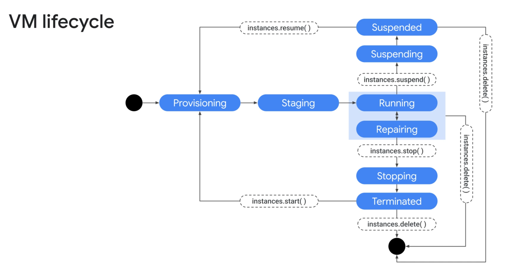
> `VM Lifecycle`

| State | Detailed Description | Billing (CPU/RAM)? |
| :--- | :--- | :--- |
| **PROVISIONING** | GCP is allocating hardware resources (CPU, RAM, Network) for the VM. The VM is not yet running. | **No** |
| **STAGING** | Resources are allocated. GCP is preparing basic configurations and boot setup for the VM. | **No** |
| **RUNNING** | The VM is booting the Operating System (OS) or running normally. SSH/RDP connections are available. | **Yes** |
| **SUSPENDING** | The system is saving the full memory state (RAM) of the VM to disk to prepare for suspension. | **Yes** (until process completes) |
| **SUSPENDED** | The VM is fully suspended (similar to Hibernate). Memory state (RAM) is preserved on disk. | **No** (only charged for disk storage & RAM image) |
| **PENDING_STOP** / **STOPPING** | The VM is undergoing a graceful OS shutdown process. | **Yes** (while in PENDING_STOP) |
| **TERMINATED** | The VM has completely stopped. CPU/RAM resources are released, but VM configurations and Persistent Disks are retained. | **No** (only charged for attached storage disks) |
| **REPAIRING** | The VM encountered a hardware fault or is being automatically repaired/recovered by GCP. | **No** |

## Compute Engine machine families 
### 1.General-purpose machine family

| Series | Workload | Applications |
| :--- | :--- | :--- |
| **E2** | (Cost-optimized) Day-to-day computing at a lower cost | • Web serving • App serving • Back office apps • Small-medium databases • Microservices • Virtual desktops • Development environments |
| **N2, N2D, N1** | (Balanced) Balanced price/performance across a wide range of VM shapes | • Web serving • App serving • Back office apps • Medium-large databases • Cache • Media/streaming |
| **Tau T2D, Tau T2A** | (Scale-out optimized) Best performance/ cost for scale-out workloads | • Scale-out workloads • Web serving • Containerized microservices • Media transcoding • Large-scale Java applications |

### 2.Compute-optimized machine family

| Series | Workload | Applications |
| :--- | :--- | :--- |
| **C2** | Ultra high performance for compute-intensive workloads | • Compute-bound workloads • High-performance web serving • Gaming (AAA game servers) • Ad serving • High-performance computing (HPC) • Media transcoding • AI/ML |
| **C2D** | Ultra high performance for compute-intensive workloads | • Memory-bound workloads • Gaming (AAA game servers) • High-performance computing (HPC) • High-performance databases • Electronic Design Automation (EDA) • Media transcoding |
| **H3** | Ultra high performance for compute-intensive workloads | • High-performance computing (HPC) • Electronic Design Automation (EDA) |

### 3.Memory-optimized machine family

| Series | Workload | Applications |
| :--- | :--- | :--- |
| **M1** | Ultra high-memory workloads | • Medium in-memory databases such as SAP HANA • Tasks that require intensive use of memory with higher memory-to-vCPU ratios than the general-purpose high-memory machine types. • In-memory databases and in-memory analytics, business warehousing (BW) workloads, genomics analysis, SQL analysis services. • Microsoft SQL Server and similar databases. |
| **M2** | Ultra high-memory workloads | • Large in-memory databases such as SAP HANA • In-memory databases and in-memory analytics, business warehousing (BW) workloads, genomics analysis, SQL analysis services, etc. |
| **M3** | Ultra high-memory workloads | • OLAP and OLTP SAP workloads • Memory Intense Electronic Design Automation |

### 4.Accelerator-optimized machine family

| Series | Workload | Applications |
| :--- | :--- | :--- |
| **A2** | Optimized for high-performance computing workloads | • CUDA-enabled ML training and inference • HPC • Massive parallelized computation |
| **G2** | Optimized for high-performance computing workloads | • Video transcoding • Remote visualization workstation |

## Pricing
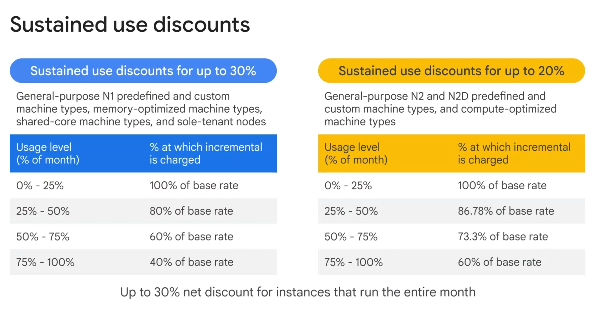
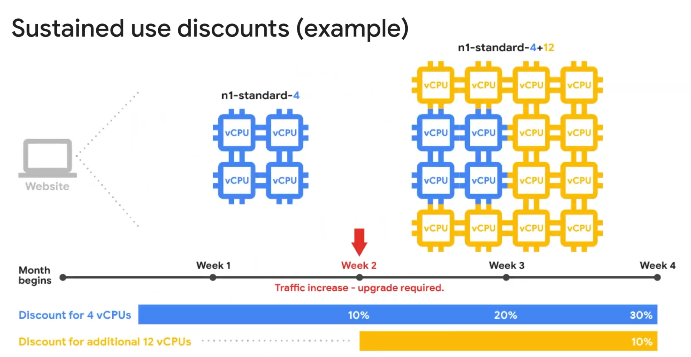

- A **Preemptible VM** (or **Spot VM** in modern GCP terminology) is a short-lived, cost-effective Compute Engine virtual machine instance. GCP offers these instances at a **60% to 90% discount** compared to standard on-demand pricing by utilizing excess capacity in their data centers.

- A **Sole-Tenant Node** in GCP Compute Engine is a dedicated physical Compute Engine server allocated exclusively for your use. It allows you to run VM instances on hardware isolated from other Google Cloud customers.

- A **Shielded VM** is a Compute Engine instance hardened by cryptographic security features. It protects workloads from enterprise-level threats such as rootkits, bootkits, and unauthorized firmware modification by verifying the boot integrity of the Virtual Machine.

- A **Confidential VM** is a GCP Compute Engine instance built on hardware-based Confidential Computing technology (such as AMD SEV) that automatically encrypts all memory (RAM) in real time while data is actively being processed (Data-in-Use), preventing unauthorized access from hypervisors, cloud admins, or co-located workloads without requiring any code changes.

# Disk
- A **Persistent Disk (PD)** is a durable, high-performance network-attached block storage service provided by Google Cloud Platform for Virtual Machines (Compute Engine and GKE). It exists independently of the VM lifecycle, ensuring data remains intact even if the VM is stopped, restarted, or deleted.

- A **Local SSD** is a high-performance, temporary block storage drive physically attached to the host server hosting a GCP Compute Engine instance. It provides ultra-high IOPS and extremely low latency for demanding workloads, but its data is ephemeral and does not persist when the VM is stopped or deleted.

- RAM disk use **tmpfs** is a temporary virtual file system in Linux that stores files directly in volatile memory (RAM and dynamic swap space). It provides ultra-fast read/write operations with near-zero latency, making it ideal for temporary or ephemeral data, though all contents are lost when the system powers off or reboots.

# Storage service
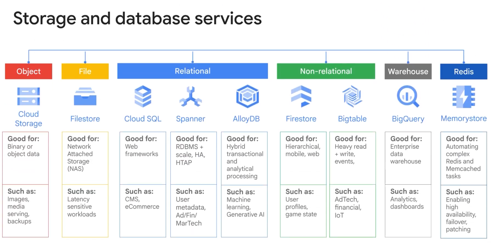
> overview of storage service

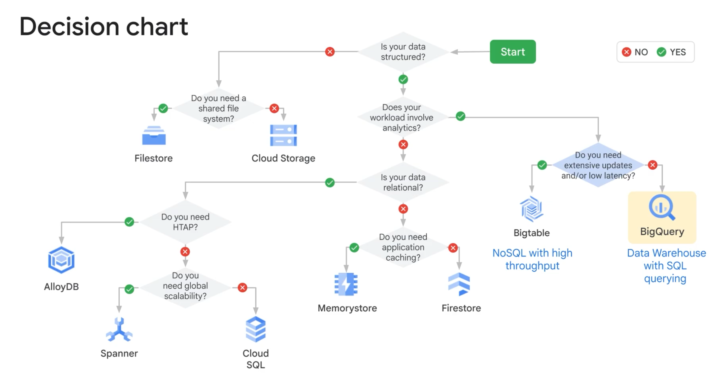
> how to choose service

## Cloud Storage
Cloud SQL is a fully managed relational database service supporting MySQL, PostgreSQL, and Microsoft SQL Server, eliminating the need to manually install, patch, and manage SQL servers on virtual machines.

* **Database Engine Support:** Fully managed MySQL, PostgreSQL, and Microsoft SQL Server (Web, Express, Standard, and Enterprise editions).
* **Performance & Scale:** High performance with up to 64 TB storage, 60,000 IOPS, 624 GB RAM per instance, and up to 96 vCPUs. Supports vertical scaling (requires restart) and horizontal scale-out via read replicas.
* **High Availability & Backups:** Regional HA configurations use synchronous disk replication between primary and standby instances across zones with automatic failover. Features automated/on-demand backups with point-in-time recovery and CSV/SQL dump import/export options.
* **Connectivity Options:**
  * **Private IP (Recommended):** Best performance and security for resources within the same region/project; traffic stays off the public internet.
  * **Cloud SQL Auth Proxy:** Preferred method for cross-region, cross-project, or external connections—automatically handles authentication, encryption, and key rotation.
  * **Manual SSL/TLS Certificates:** For manual management of SSL keys and connection encryption.
  * **Authorized External Networks:** Unencrypted public IP connections restricted to specific authorized IPs.
* **Relational Service Decision Tree:**
  * **Memorystore:** Microsecond response times and high-troughput caching (In-Memory).
  * **BigQuery:** Relational data used primarily for analytical workloads (OLAP).
  * **Spanner:** Global availability and massive horizontal scaling across regions/continents.
  * **Cloud SQL:** Cost-effective relational database choice when global consistency and horizontal scaling are not required (OLTP).
Cloud Storage offers several advanced features for data management, protection, automated lifecycle actions, compliance, and large-scale data migration.

* **Core Object Characteristics:** Objects in Cloud Storage are **immutable** (cannot be modified in place). Overwriting or changing an object actually deletes the older version and creates a new one. All read, write, update, delete, and listing operations across Cloud Storage feature **strong global consistency** (no stale data or 404 errors for read-after-write operations).
* **Data Protection Features:**
  * **Soft Delete (Recommended):** Enabled by default with a 7-day retention period (configurable from 0 to 90 days). Preserves recently deleted or overwritten objects to protect against accidental or malicious data loss before permanent deletion.
  * **Object Versioning:** Keeps archived versions of overwritten or deleted objects identified by unique generation numbers (`g1`). Google recommends Soft Delete over Versioning for accidental loss protection. Note: archived versions incur standard storage charges.
  * **Customer-Supplied Encryption Keys (CSEK):** Allows supplying custom encryption keys to encrypt data instead of standard Google-managed keys.
* **Lifecycle & Compliance Management:**
  * **Object Lifecycle Management:** Rules-based automation applying actions based on object criteria (e.g., downgrading objects to Coldline after 1 year, deleting objects created before a date, keeping only the top 3 versions). Changes take up to 24 hours to take effect.
  * **Object Retention Lock:** Enables strict data retention configurations to prevent retention times from being reduced or removed, fulfilling regulatory compliance (SEC, FINRA, CFTC).
  * **Autoclass:** Automatically manages storage classes for a bucket to optimize costs.
  * **Directory Sync & Notifications:** Enables directory synchronization with VMs and triggers Pub/Sub object change notifications.
* **Mass Data Transfer Services:**
  * **Transfer Appliance:** Hardware appliance used to physically migrate large volumes of data (hundreds of TBs up to 1 PB) to GCP.
  * **Storage Transfer Service:** High-performance online data import service to transfer data from external sources (AWS S3, HTTP/HTTPS endpoints, or other Cloud Storage buckets).
  * **Offline Media Import:** Third-party service where physical media (tapes, hard drives, USBs) are sent to a partner provider for upload.

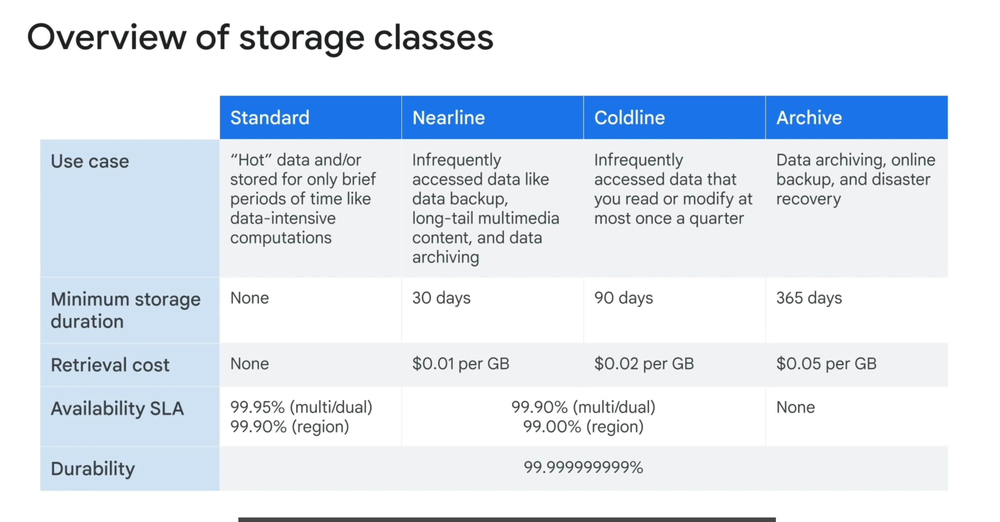

- Cloud Storage provides four primary storage classes, three location types, and an automated management feature (Autoclass) to balance access frequency, latency, availability, and cost.

* **Storage Classes by Access Frequency:**
  * **Standard:** Best for hot data with frequent reads and writes.
  * **Nearline:** Best for data accessed less than once every 30 days.
  * **Coldline:** Best for data accessed less than once every 90 days.
  * **Archive:** Best for cold data accessed less than once a year.
* **Location Types:**
  * **Region:** Optimizes latency and bandwidth for co-located compute resources and analytics pipelines in a single region.
  * **Dual-region:** Combines low latency with high availability and geo-redundancy across two specific regions.
  * **Multi-region:** Optimizes content delivery to consumers distributed across large geographic areas outside the Google network while providing high geo-redundant availability.
* **Autoclass (Automated Tiering):**
  * **Purpose:** Automates cost optimization for buckets with unpredictable or varying access patterns.
  * **Behavior:** All newly added objects start in Standard storage. Unaccessed objects are automatically moved to colder storage classes; reading an object transitions it back to Standard storage.
  * **Cost Benefits:** Eliminates early deletion fees, retrieval charges, and storage class transition fees when enabled on a bucket.
* **File Storage Note:** Cloud Storage handles unstructured object data; for high-performance, fully managed file storage (NFS/POSIX), Google Cloud offers **Filestore**.

### Syntax

| Operation | Command Syntax |
| --- | --- |
| Create Bucket | `gcloud storage buckets create gs://BUCKET_NAME --location=asia-southeast1` |
| List Buckets | `gcloud storage buckets list` |
| Get Bucket Info | `gcloud storage buckets describe gs://BUCKET_NAME` |
| Delete Bucket | `gcloud storage buckets delete gs://BUCKET_NAME` |
| Upload Single File | `gcloud storage cp file.txt gs://BUCKET_NAME/` |
| Upload Directory | `gcloud storage cp -r /path/to/folder gs://BUCKET_NAME/` |
| Download Single File | `gcloud storage cp gs://BUCKET_NAME/file.txt ./` |
| Download Directory | `gcloud storage cp -r gs://BUCKET_NAME/folder/ ./` |
| List Files | `gcloud storage ls gs://BUCKET_NAME/` |
| Rename / Move File | `gcloud storage mv gs://BUCKET_NAME/old.txt gs://BUCKET_NAME/new.txt` |
| Delete Single File | `gcloud storage rm gs://BUCKET_NAME/file.txt` |
| Delete Directory on Bucket | `gcloud storage rm -r gs://BUCKET_NAME/folder/` |
| Synchronize Data (Sync) | `gcloud storage rsync -r /path/local gs://BUCKET_NAME/` |
| View IAM Policy | `gcloud storage buckets get-iam-policy gs://BUCKET_NAME` |
| Grant Read Permission to User | `gcloud storage buckets add-iam-policy-binding gs://BUCKET_NAME --member="user:email@gmail.com" --role="roles/storage.objectViewer"` |
| Grant Write Permission to User | `gcloud storage buckets add-iam-policy-binding gs://BUCKET_NAME --member="user:email@gmail.com" --role="roles/storage.objectAdmin"` |
| Make Bucket Public | `gcloud storage buckets add-iam-policy-binding gs://BUCKET_NAME --member="allUsers" --role="roles/storage.objectViewer"` |
| Check Total Size | `gcloud storage du -s gs://BUCKET_NAME/` |
| Generate Temporary Link (1h) | `gcloud storage sign-url gs://BUCKET_NAME/file.txt --duration=1h` |
| Enable Object Versioning | `gcloud storage buckets update gs://BUCKET_NAME --versioning` |

## Filestore
Google Cloud Filestore is a fully managed Network Attached Storage (NAS) service designed for applications that require a file system interface (NFSv3) and a shared file system for data across compute instances.

* **Core Features:**
  * **Native NFS Compatibility:** Supports any NFSv3-compatible client without needing specialized plug-ins or client-side software.
  * **Compute Integration:** Provides seamless shared storage for Compute Engine VMs and Google Kubernetes Engine (GKE) clusters.
  * **Performance & Scale:** Delivers predictable, low-latency performance with independent tuning of capacity (up to hundreds of terabytes) and performance, including built-in file locking.
* **Key Use Cases:**
  * **Enterprise App Migration:** Simplifies lift-and-shift migrations for legacy on-premises workloads that depend on shared file systems.
  * **Media Rendering:** Enables collaboration for visual effects artists and scales across large Compute Engine fleets processing rendering jobs.
  * **Electronic Design Automation (EDA):** Supports compute-intensive semiconductor design workloads running across thousands of cores.
  * **Data Analytics:** Provides low-latency file operations for complex financial modeling and environmental data analysis without time-consuming data loading/offloading.
  * **Life Sciences & Genomics:** Manages massive datasets (billions of data points per sample) for scientific research with high speed, scalability, and predictable pricing.
  * **Web Hosting:** Serves shared content and media assets for high-traffic websites and CMS platforms like WordPress.

## Cloud SQL
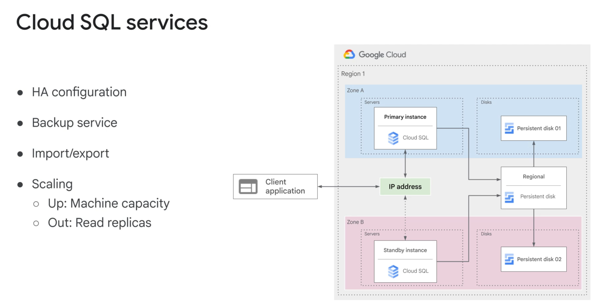
> cloud sql HA configuration

Cloud SQL is a fully managed relational database service supporting MySQL, PostgreSQL, and Microsoft SQL Server, eliminating the need to manually install, patch, and manage SQL servers on virtual machines.

* **Database Engine Support:** Fully managed MySQL, PostgreSQL, and Microsoft SQL Server (Web, Express, Standard, and Enterprise editions).
* **Performance & Scale:** High performance with up to 64 TB storage, 60,000 IOPS, 624 GB RAM per instance, and up to 96 vCPUs. Supports vertical scaling (requires restart) and horizontal scale-out via read replicas.
* **High Availability & Backups:** Regional HA configurations use synchronous disk replication between primary and standby instances across zones with automatic failover. Features automated/on-demand backups with point-in-time recovery and CSV/SQL dump import/export options.
* **Connectivity Options:**
  * **Private IP (Recommended):** Best performance and security for resources within the same region/project; traffic stays off the public internet.
  * **Cloud SQL Auth Proxy:** Preferred method for cross-region, cross-project, or external connections—automatically handles authentication, encryption, and key rotation.
  * **Manual SSL/TLS Certificates:** For manual management of SSL keys and connection encryption.
  * **Authorized External Networks:** Unencrypted public IP connections restricted to specific authorized IPs.
* **Relational Service Decision Tree:**
  * **Memorystore:** Microsecond response times and high-throughput caching (In-Memory).
  * **BigQuery:** Relational data used primarily for analytical workloads (OLAP).
  * **Spanner:** Global availability and massive horizontal scaling across regions/continents.
  * **Cloud SQL:** Cost-effective relational database choice when global consistency and horizontal scaling are not required (OLTP).

## Spanner 
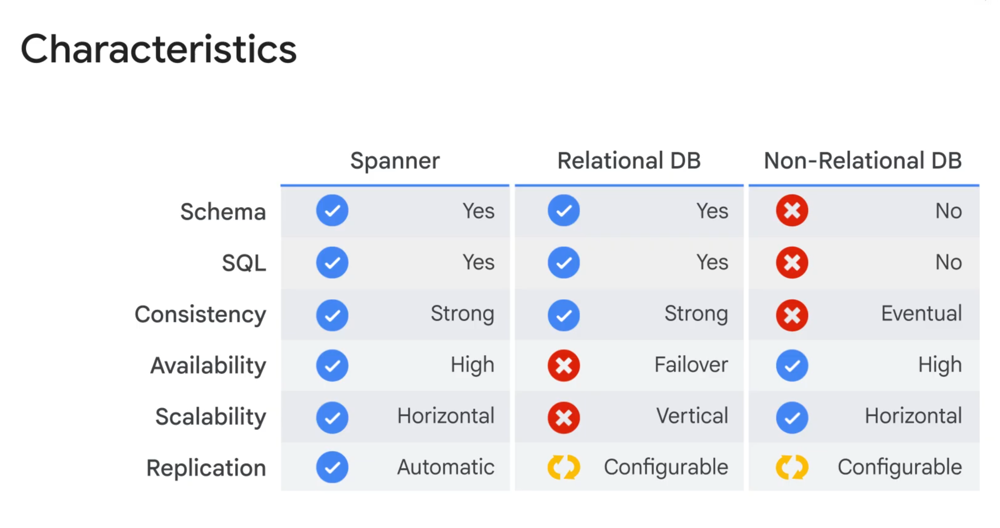
> cloud spanner HA configuration 
- Google Cloud Spanner bridges the gap between traditional relational databases and high-scale NoSQL systems by providing relational capabilities combined with horizontal scalability and global consistency.

* **Core Capabilities:**
  * **Relational Features:** Supports schemas, SQL queries, and full ACID transactions.
  * **NoSQL Features:** Delivers petabyte-scale capacity, automatic horizontal scalability, and high availability.
  * **Global Consistency:** Uses Google’s private global fiber network and hardware atomic clocks (TrueTime API) to ensure synchronous, external transactional consistency across zones and regions.
  * **High Availability SLA:** Provides up to **99.99%** availability for regional instances and **99.999%** (five nines) availability for multi-region instances.
* **Architecture & Replication:**
  * Data is automatically replicated across $N$ cloud zones within a single region or across multiple regions depending on the configuration.
  * Data placement is fully configurable to balance low-latency reads with geo-redundancy.
* **Key Use Cases:**
  * Mission-critical transactional applications like financial services, banking systems, and retail inventory management.
  * Modernizing applications that have outgrown traditional relational databases (avoiding complex manual database sharding).
* **Decision Tree Guidelines:**
  * **Use Spanner if:** You need relational features (SQL, schemas, ACID), global availability, strong consistency, or have outgrown Cloud SQL and want to avoid database sharding.
  * **Use NoSQL (e.g., Firestore) if:** You need scale and flexibility but do not require full relational capabilities or complex SQL joins.

## AlloyDB
Google Cloud **AlloyDB for PostgreSQL** is a fully managed, enterprise-grade relational database service built for demanding transactional and hybrid transactional and analytical processing (HTAP) workloads.

* **Core Architecture & Performance:**
  * **Google-Built Engine:** Combines a specialized database engine with a multi-node, cloud-native storage architecture.
  * **Transactional Speed:** Delivers **>4x faster** transactional processing performance compared to standard PostgreSQL.
  * **Analytical Speed:** Provides real-time analytical query execution up to **100x faster** than standard PostgreSQL.
* **Automated & ML-Driven Operations:**
  * Automates administrative tasks, including backups, capacity management, patching, and replication.
  * Uses adaptive algorithms and machine learning for storage/memory management, data tiering, analytics acceleration, and automated PostgreSQL vacuum management.
* **High Availability & AI Integration:**
  * Features a **99.99% uptime SLA**, inclusive of planned maintenance windows.
  * Native integration with Google Cloud AI platforms enables direct model execution and machine learning calls within database workflows.
* **Key Use Cases:**
  * High-throughput enterprise transactional applications requiring large data sizes and multiple read replicas.
  * Hybrid Transactional and Analytical Processing (HTAP) workloads that require real-time business insights on transactional data.

## Firestore
Google Cloud Firestore is a serverless, highly scalable NoSQL document database designed for mobile, web, and IoT applications requiring live synchronization and strong consistency.

* **Core Features:**
  * **Serverless & Scalable:** Automatically scales to zero and handles terabytes of storage with low maintenance overhead.
  * **ACID Transactions & Consistency:** Supports multi-document ACID transactions alongside automatic multi-region replication and strong consistency.
  * **Real-time Sync & Offline Mode:** Client SDKs provide offline data persistence and dynamic live data synchronization for mobile and web apps.
* **Operating Modes:**
  * **Native Mode:** Introduces collection/document models, real-time listeners, and mobile/web SDKs. Recommended for new web and mobile applications.
  * **Datastore Mode:** Provides backward compatibility with legacy Cloud Datastore APIs while using Firestore's updated storage engine. Recommended for backend server projects.
* **Datastore Improvements Resolved in Firestore:**
  * Queries are **strongly consistent** (removes Datastore's eventual consistency).
  * Removes the 25 entity group limit on transactions.
  * Removes the 1 write-per-second limit on entity groups.
* **Decision Tree Guidelines:**
  * **Choose Firestore if:** You need adaptable schemas, true serverless scale-to-zero capability, low-overhead scaling, real-time syncing, or ACID transactional consistency in a NoSQL database.
  * **Choose Bigtable if:** You do not require transactional consistency and need high-throughput, massive analytical or operational NoSQL storage (petabyte scale).
## Bigtable
Google Cloud Bigtable is a fully managed, petabyte-scale NoSQL wide-column database delivering single-digit millisecond latency and high read/write throughput for operational and analytical workloads.

* **Core Features & Integrations:**
  * **Scale & Performance:** Seamlessly handles petabytes of data with linear throughput scaling as nodes are added (a 3-node minimum cluster handles ~30,000 operations/sec).
  * **Proven Infrastructure:** Powers core Google services such as Search, Analytics, Maps, and Gmail.
  * **Ecosystem Compatibility:** Supports the open-source **HBase API** and integrates natively with big data tools like Dataflow, Hadoop, and Dataproc/Spark.
* **Data Model & Architecture:**
  * **Sparse Wide-Column Model:** Data is structured as a sorted key-value map consisting of row keys, column families, column qualifiers, and timestamped cell versions. Empty cells consume zero space.
  * **Decoupled Compute & Storage:** Compute nodes (frontend server pool) are separate from underlying storage (**Colossus** using immutable SSTable files). Data is sharded into contiguous row blocks called **tablets**.
  * **Dynamic Workload Balancing:** Bigtable automatically rebalances indexes and tablet assignments across nodes based on changing access patterns.
* **Key Use Cases:**
  * Time-series data, IoT/telemetry, financial analysis, user analytics, and storage engines for machine learning pipelines.
* **Decision Tree Guidelines:**
  * **Choose Bigtable if:** You have >1 TB of structured data, require high-volume write throughput, need sub-10ms latency with linear scale, or require HBase API compatibility.
  * **Choose Firestore if:** You need a database that scales down to zero for lower baseline costs, or require multi-document ACID transactions and live real-time synchronization.

## Memorystore
- in memory datastore service

# Resource Management
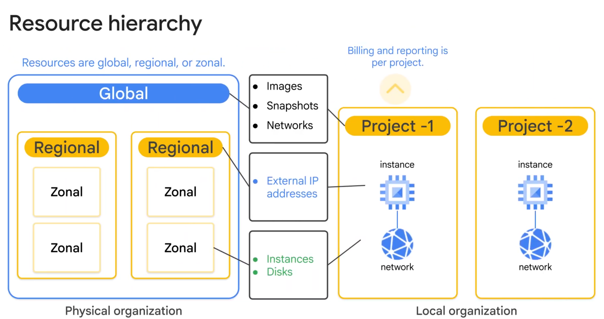

## Quotas
- Google Cloud quotas limit resource creation, API request rates, and regional capacity per project to protect against cost spikes, errors, and supply overruns—though having a quota does not guarantee physical hardware availability.
- In GCP, a label is a key-value pair attached to resources to help organize, filter, and track billing across projects and departments
- Google Cloud budgets allow you to track project spending against fixed or historical targets, triggering email alerts or Pub/Sub notifications—which can integrate with Cloud Run functions for automated cost control—when actual or forecasted costs cross defined thresholds.

## Monitoring
Google Cloud Monitoring helps manage, monitor, and maintain system reliability based on SRE (Site Reliability Engineering) principles.

* **Metrics Scope:** Acts as a 'single pane of glass' that allows monitoring up to 375 GCP projects and connected AWS accounts. Actual data remains in each original project, but access permissions apply to all projects within the scope.
* **Dashboards & Charts:** Automatically configures and displays network traffic, CPU utilization, and sent/received/dropped packets. Data can be filtered, grouped, or aggregated to reduce noise.
* **Alerting Policies:** Automatically sends notifications (via Email, SMS, etc.) when system thresholds are reached (e.g., exceeding bandwidth limits or approaching billing thresholds).
* **Alerting Best Practices:**
  * Alert on symptoms rather than causes.
  * Use multiple notification channels to avoid single points of failure.
  * Customize alert details to provide actionable guidance for the recipient.
  * Avoid alert fatigue by reducing noise so critical alerts aren't ignored.
* **Uptime Checks:** Evaluates the availability of public services (HTTP, HTTPS, TCP) from multiple global locations at set intervals (e.g., checked every minute, with responses over 10 seconds marked as failures).
* **Ops Agent:** Installed on Compute Engine VMs to collect internal telemetry data (such as RAM usage) inaccessible to the hypervisor, as well as data from third-party applications.
* **Custom Metrics & Autoscaling:** Enables custom metrics (like active game user counts) beyond standard CPU/network usage. The autoscaler uses these metrics alongside utilization targets to dynamically add or remove VMs in a Managed Instance Group.

## Logging
Cloud Logging is a fully managed log management service within Google Cloud Observability, allowing you to store, search, analyze, monitor, and alert on log data at scale from both GCP and AWS.

* **Core Components:** Includes log storage, the **Logs Explorer** user interface for searching/filtering logs, and an API for programmatic management. Users can also create log-based metrics.
* **Retention:** Logs are retained for **30 days** by default.
* **Log Routing & Export:** For long-term storage or advanced processing, logs can be routed to other services:
  * **Cloud Storage:** Ideal for long-term retention (longer than 30 days) at a lower cost.
  * **BigQuery:** Enables large-scale log analysis using high-speed SQL queries (from gigabytes to petabytes). 
    * *Use Cases:* Analyze network traffic for capacity forecasting, cost optimization, or incident forensics—such as identifying top IP addresses to optimize server placement or block malicious traffic.
    * *Visualization:* Connect BigQuery tables to **Looker Studio** (formerly Data Studio) to transform raw log data into intuitive dashboards and reports.
  * **Pub/Sub:** Used to stream log data to third-party applications or custom endpoints in real time.

## Error Reporting
Error Reporting is a feature of Google Cloud Observability that counts, analyzes, and aggregates errors from running cloud services into a centralized management interface with real-time alerting.

* **Core Features:** Centralized dashboard for sorting and filtering application errors, complete with real-time notification setup when new errors are detected.
* **Supported Environments:** App Engine (Standard and Flexible), Apps Script, Compute Engine, Cloud Run, Cloud Run functions, Google Kubernetes Engine (GKE), and Amazon EC2.
* **Supported Programming Languages:** Exception stack trace parser natively supports Go, Java, .NET, Node.js, PHP, Python, and Ruby.

## Tracing
Cloud Trace is a distributed tracing system within Google Cloud Observability that collects and displays latency data to help manage application response times and performance at scale.

* **Core Features:** Tracks request propagation across microservices and applications, delivering detailed, near real-time performance insights and automated latency analysis to surface performance degradations.
* **Supported Sources:** Automatically captures trace data from App Engine, global external Application Load Balancers, and applications instrumented directly via the Cloud Trace API.
* **Background:** Built on the internal distributed tracing tools used by Google to maintain high performance across large-scale infrastructure.

## Profiling
Cloud Profiler is a continuous, low-overhead profiling tool within Google Cloud Observability designed to identify performance bottlenecks in production applications.

* **Core Purpose:** Continuously analyzes the performance of CPU-intensive and memory-intensive functions to help developers lower latency and reduce computing costs.
* **Production-Safe Instrumentation:** Uses statistical sampling and extremely low-impact instrumentation to profile all running production instances simultaneously without introducing noticeable performance degradation.
* **Multi-Cloud & On-Premises Support:** Profiles application code running in Google Cloud, hybrid environments, third-party cloud platforms, or on-premises servers.
* **Supported Languages:** Provides native profiling support for **Java**, **Go**, **Node.js**, and **Python**.

## Cloud VPN
Google Cloud offers two IPsec Cloud VPN gateway options—Classic VPN and HA VPN—to securely connect on-premises or cross-cloud networks over the public internet using encrypted IPsec tunnels.

* **Classic VPN Gateway:**
  * **SLA & Target:** 99.9% availability SLA; suitable for lower-volume data connections.
  * **Features:** Supports site-to-site connectivity, static or dynamic routes, and IKEv1/IKEv2 ciphers.
  * **Limitations:** Does not support client-to-site ("dial-in") VPN connections. Requires an MTU of $\le 1460$ bytes for on-premises gateways due to packet encapsulation overhead.

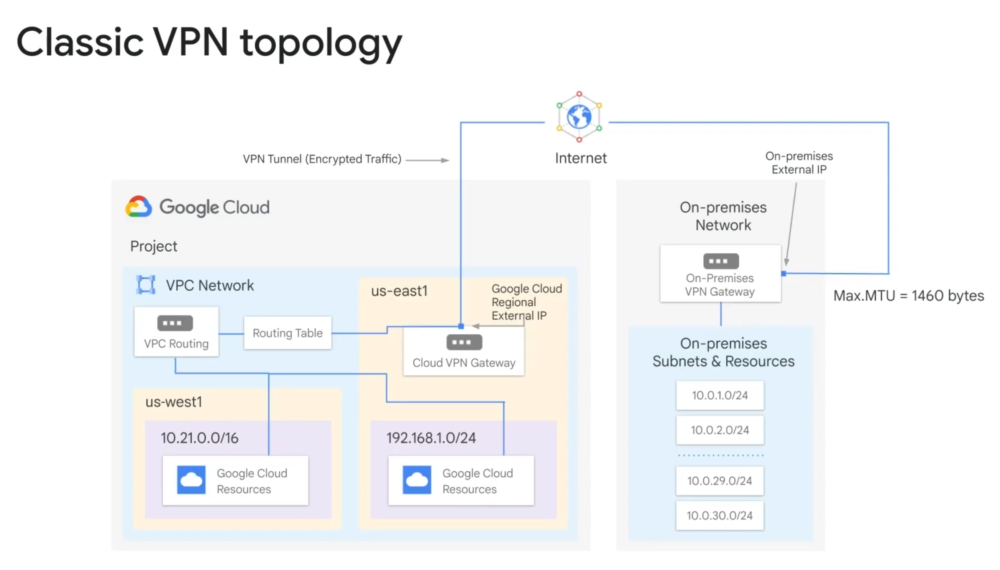
> Classic VPN diagram
* **HA (High Availability) VPN Gateway:**
  * **SLA & Target:** High availability SLA of **99.99%** (requires proper multi-tunnel design across interfaces).
  * **Architecture:** Automatically assigns two fixed interfaces, each backed by an external IP address from distinct pools.
  * **Routing Requirement:** Mandates **dynamic (BGP) routing** using Cloud Router. Supports active/active or active/passive traffic flows.

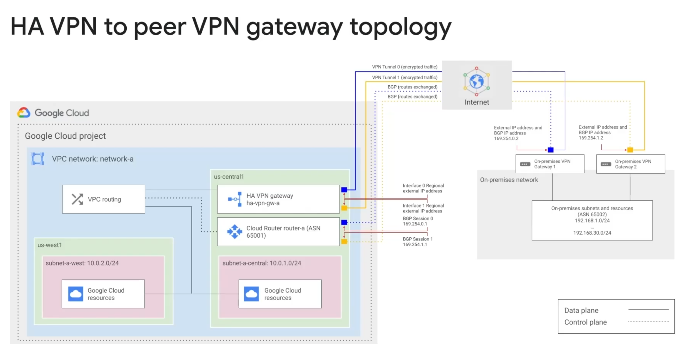
> HA VPN diagram

  * **Supported Topologies:**
    * **Peer On-Premises Devices:** Connects to 1 or 2 peer gateways (e.g., `TWO_IPS_REDUNDANCY` for physical gateway redundancy).
    * **Multi-Cloud (AWS):** Connects to AWS Transit Gateway (supports ECMP for traffic distribution) or Virtual Private Gateway via 4 BGP tunnels.
    * **VPC-to-VPC:** Connects two Google Cloud VPC networks across regions using two inter-linked HA VPN gateways.

    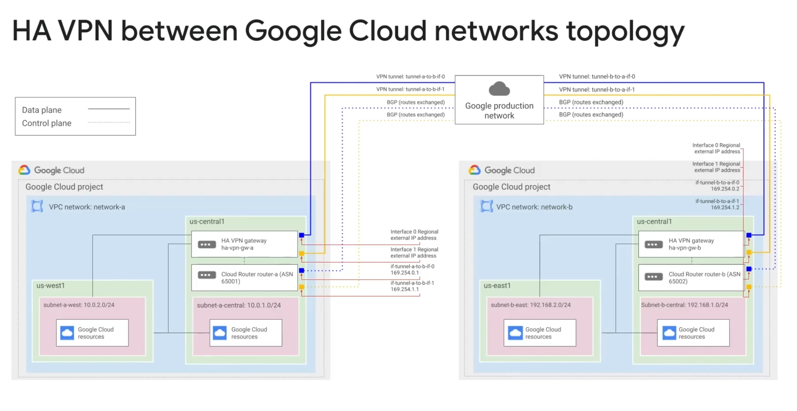
    > Connect 2 VPC through HA VPN

* **Dynamic Routing with Cloud Router:**
  * Uses Border Gateway Protocol (BGP) to dynamically exchange and automatically propagate subnet route changes without recreating tunnels.
  * Requires allocating **link-local IPv4 addresses** (`169.254.0.0/16`) to both ends of the VPN tunnel specifically for the BGP session.

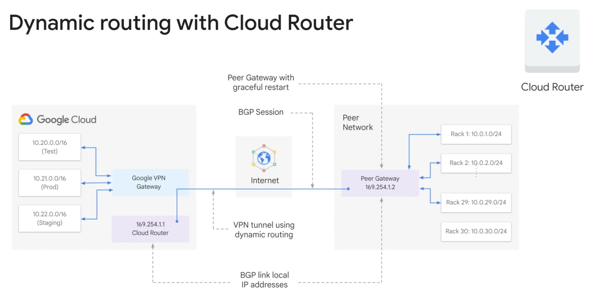
> Cloud Router diagram